# Applied Microeconomics — Master Notes

by Jakob V. Stangel

> One running document for the whole course, organised **by lecture (= textbook chapter)**.
> Format per lecture: **Résumé → ★ Heart of it → Key concepts → Section-by-section → Cases → Key terms → Exam pointers.**
> Textbook: **Richard Friberg, *A Free Introduction to Microeconomics*** · Lecturer: **Luigi Butera** (lbu.eco@cbs.dk).
> *Exam: written sit-in, **open book, No AI**, Week 50 (9 Dec 2026).*

## Overview — where everything is
*(Everything below is clickable.)*

- **[Lecture 1: Principles of Economics (Ch. 1)](#lecture-1-micro)** — [what is economics?](#micro-what) · [the three principles](#micro-principles) · [opportunity cost & marginal thinking](#micro-optimization) · [models: positive vs normative](#micro-empiricism) · [★ Fun facts](#ff-micro1)
- **[Lecture 2: Supply and Demand (Ch. 2)](#lecture-2-micro)** — [demand & the demand function](#micro2-demand) · [supply & the supply function](#micro2-supply) · [★ solving market equilibrium](#micro2-equilibrium) · [shifts & comparative statics](#micro2-shifts) · [price ceilings & floors](#micro2-controls) · [★ Fun facts](#ff-micro2)
- **[Lecture 3: Elasticities & Taxes (Ch. 2 recap · §6.4)](#lecture-3-micro)** — [why elasticity?](#micro3-why) · [★ price elasticity of demand](#micro3-ped) · [computing & the point-elasticity trick](#micro3-computing) · [elastic / inelastic / unit-elastic](#micro3-naming) · [cross-price](#micro3-cross) · [income elasticity & Engel curves](#micro3-income) · [supply elasticity](#micro3-supply) · [elasticity over time](#micro3-time) · [★ taxes: the wedge, incidence & equivalence](#micro3-taxes) · [formula sheet](#micro3-formulas) · [★ Fun facts](#ff-micro3)

---

# Lecture 1: Principles of Economics (Chapter 1)

**Required reading:** Friberg, ch. 1 (*Introduction*).

**Theme of the lecture (Butera):** the **"economic way of thinking"** — economics studies how people **allocate scarce resources** among competing needs, using **three principles** (optimization · equilibrium · empiricism) and **models** (simplified, testable) to understand and predict behaviour.

★ <strong>The heart of the chapter:</strong> economics = <strong>doing the best you can with scarce resources.</strong> The toolkit is <strong>three principles — Optimization · Equilibrium · Empiricism</strong>; the two workhorses of optimization are <strong>opportunity cost</strong> and <strong>marginal thinking</strong>; and the method is building <strong>positive (testable) models</strong>, not making normative judgments. <em>"All models are useful, but all models are wrong."</em>

**The red thread.** Everything starts from **scarcity** — without it we wouldn't need economics. From scarcity flows: you must **choose** (optimize) → every choice has an **opportunity cost** and is decided **at the margin** → many people choosing interact until no one wants to move (**equilibrium**) → and we test our claims about all this with **models + data** (empiricism). For any decision ask: *what's scarce · what's the best alternative given up (opportunity cost) · what does one more unit give me (marginal) · is this claim positive (testable) or normative (a value judgment)?*

### Key concepts / "modes" to use
- **Scarcity** — limited resources vs unlimited wants; the reason economics exists.
- **The three principles:** **Optimization · Equilibrium · Empiricism.**
- **Opportunity cost** — the value of the *best alternative* you give up.
- **Marginal thinking** — decide by the value of *one more* unit; **law of diminishing marginal returns**.
- **Model** — a simplified representation of relationships between variables ("all models are wrong, but useful").
- **Positive vs normative** — a *testable* cause-effect claim vs a *value judgment*.

### Section-by-section main points

#### What is economics?

***Core:*** economics = **the study of how people allocate *scarce* resources over competing needs** — "people (try to) do the best they can for themselves with what they have."
- **Scarcity of two things:** the **things we want** (goods, services, jobs, education, relationships, recognition…) *and* the **means to get them** (money, **time, attention**, information, patience, willpower). Air to breathe isn't scarce → not an economic question.
- Every decision is shaped by **scarcity** (can't have it all), **other people** (you're not an island), and **the rules of the game** (you can't do whatever you want).
- **How societies allocate:** **central planners** (someone at the top decides who gets what — parents, government) vs **markets** (value set by supply & demand — from job markets to dating markets). Economics gives tools to predict how we decide and when markets do (or don't) allocate *efficiently*.

#### The three principles of economics

***Core:*** the whole course rests on three ideas.

| Principle | Meaning |
|---|---|
| **① Optimization** | We choose the **best feasible option** given our limited resources (money, time, attention, willpower are all scarce). |
| **② Equilibrium** | A situation in which **no one would benefit** from changing their *own* behaviour, given the choices of everyone else. |
| **③ Empiricism** | We build **models** → models generate **predictions** → we use **data/experiments** to test (falsify) them. |

#### Optimization — opportunity cost + marginal thinking

***Core:*** to optimise, use two tools — **opportunity cost** (weigh each use against its best alternative — "apples to apples") and **marginal thinking** (what does *one more* unit give me?).

**Opportunity cost = the value of the best alternative you give up** — nothing "free" is free if it uses a scarce resource.

Opportunity costOC(action) = benefit(action) − value of the best alternative given up

*Reads:* the true cost of a choice is what it gives you **minus** what you gave up to get it. — **OC(action)** = the opportunity cost of doing it · **benefit(action)** = the gain the action delivers · **value of the best alternative given up** = the payoff of the *next-best* option you sacrificed by choosing this one.

- *Social media:* 1 hr/day on TikTok isn't free — you give up sport, study, work. Monetise the time with the hourly wage (avg **118 DKK** in Denmark):

Yearly time-cost of 1 hr/day on TikTok118 DKK/hr × 1 hr/day × 365 days = <strong>43,070 DKK / year</strong>

*Reads:* price the time you *could* have been earning, added up over a year. — **118 DKK/hr** = Denmark's average hourly wage (i.e. the value of one hour of your time) · **1 hr/day** = the time you spend · **365 days** = a full year → **43,070 DKK** of wages forgone.

- *Trip to Berlin (worked example):* drive = 1,280 DKK & 14 h; fly = 1,930 DKK & 3 h. Flying frees **11 h** you could work:

Opportunity cost of driving instead of flyingOC(drive) = (1,930 − 1,280) − (118 × 11) = 650 − 1,298 = <strong>−648 DKK</strong> &nbsp;⟹&nbsp; <strong>fly</strong>

*Reads:* the money you save by driving, minus the value of the time driving wastes. — **(1,930 − 1,280)** = the extra *ticket* cost of flying (650 DKK) · **(118 × 11)** = the value of the **11 hours** flying saves you, priced at the 118 DKK/hr wage (1,298 DKK) · a **negative** result means driving is **648 DKK worse** than flying → **fly**.

  *(Still a model — what if you enjoy the drive?)*

**Marginal thinking:** decide by the value of the **next** unit — keep going while marginal benefit exceeds marginal cost; stop where they meet. That point is the **optimum**:

Optimum conditionchoose the quantity where &nbsp;<strong>Marginal Benefit = Marginal Cost</strong>&nbsp; (MB = MC)

*Reads:* keep going until one more unit's benefit exactly equals its cost. — **Marginal Benefit (MB)** = the *extra* benefit from **one more** unit · **Marginal Cost (MC)** = the *extra* cost of that unit · at the **optimum** MB = MC (while **MB > MC** do more; once **MC > MB** you've gone too far).

- *Night before the exam:* total benefit of studying rises then flattens; the **marginal benefit of each extra hour falls** (**law of diminishing marginal returns**). Optimal hours = where MB of one more hour just equals its MC.

**How to read it (illustrative diagram — the graph the book draws in a later chapter).** *Left:* **total benefit** rises but each extra hour adds less — the curve **flattens** (diminishing returns). *Right:* that flattening means **marginal benefit slopes down**; **marginal cost** slopes up. Left of the crossing, **MB > MC** so one more unit is worth it (*do more*); right of it, **MC > MB** (*do less*). The best you can do is the quantity where they meet — **the optimum Q\*, where MB = MC.**

#### Equilibrium

***Core:*** an **equilibrium** is a resting point — given what everyone else is doing, **no individual can make themselves better off by changing their own behaviour.** Market prices are the classic example (later lectures): they adjust until quantity supplied = quantity demanded and no one wants to move.

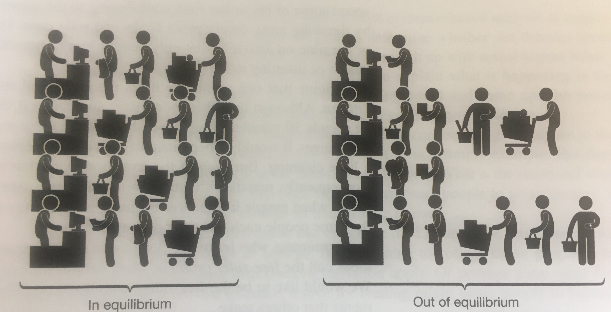

**How to read it (equilibrium = supermarket queues, from the lecture).** Each lane is a checkout; the queue length is how many people are waiting. **Out of equilibrium** (right) the lanes are uneven, so anyone in a long line can still gain by switching to a shorter one — people keep moving. **In equilibrium** (left) all lanes are equal, so **no one can do better by changing lane on their own** — that "no incentive to move" resting point is exactly what equilibrium means (and why market prices settle where supply meets demand).

#### Empiricism — models, and positive vs normative

***Core:*** economics reasons with **models** and tests them against **data** — and it deals in **positive** (testable) statements, not **normative** (value) ones.
- **A model** expresses relationships between variables and makes **simplifying assumptions** (abstracts from reality). *"All models are useful, but all models are wrong"* — the art is choosing the right model (Keynes).

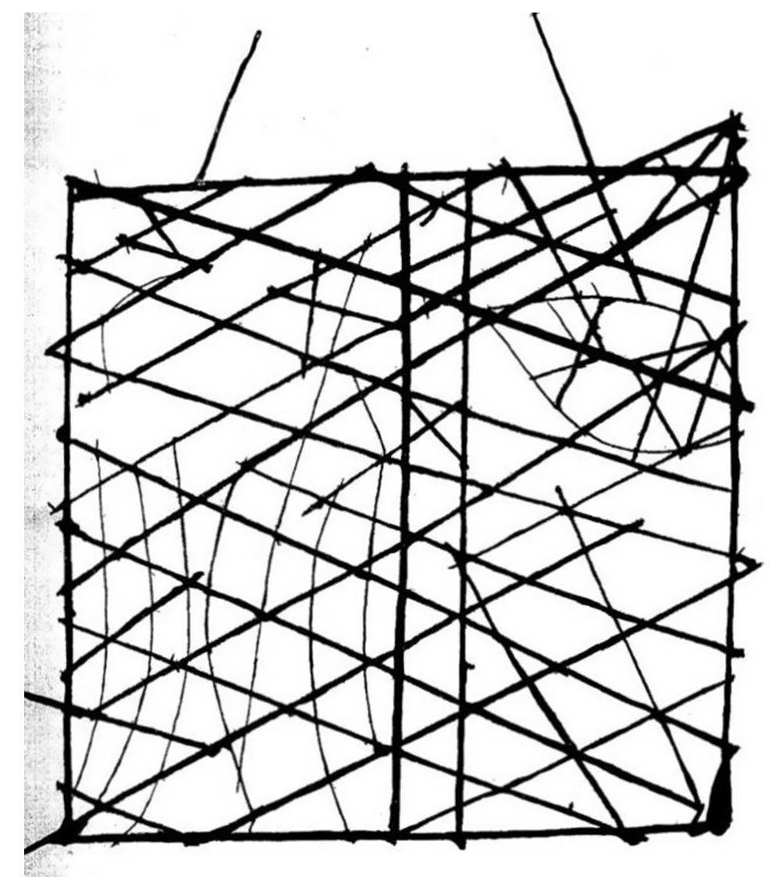

**How to read it (Friberg Fig. 1.1 — what a "model" is).** This is a Polynesian **stick chart**: sticks map the ocean's swell patterns, shells mark islands. It's not a literal picture of the Pacific — it **strips reality down to just the features you need to navigate.** That's the book's metaphor for an economic model: deliberately simplified, "wrong" as a full description, yet **good enough to steer decisions by.**
- **Positive vs normative:**
  - **Positive** = a **testable/falsifiable** cause-effect claim — *"each additional Starbucks in a ZIP code is associated with a 0.5% rise in housing prices"* (Glaeser et al. 2018).
  - **Normative** = a **value judgment** — *"gentrification is bad because it forces the poor out."*
  - **Economics is about positive statements**, not normative ones.
- **Correlation ≠ causation:** in summer people eat more ice-cream *and* drown more — ice-cream doesn't cause drowning (a hidden cause: heat). A theory is only useful if it's **empirically falsifiable**.
- **Expanding models to fit data:** "people only give to charity because they care about others' well-being" fails the data (public spending doesn't crowd out giving 1-for-1 — Andreoni 1990; people give to *inefficient* charities). So we add **"joy of giving"** (utility from the act of giving itself).

#### Friberg's framing — allocation mechanisms (Ch. 1's example)

***Core:*** a scarce good (e.g. **university places**) can be allocated many ways — and each has different effects on **efficiency** and **equity**. This is the book's opening illustration of "the role of economics."
- **Non-price mechanisms:** aptitude tests/interviews · secondary-school grades · open entry + hard exams · **waiting lists** · **queues** ("camp on the sidewalk") · **lotteries** · social class/legacy.
- **Price mechanisms:** everyone pays the **same fee** (set high enough to clear demand) · **auction** places to the highest bidders.
- Real systems **combine** several (fees + tests + interviews). Micro gives the tools to analyse the **trade-offs** (who gets in, how tied to parents' income, effect on effort).

### Cases & examples
Each: *the example* → *the concept it teaches.*
- **1 hr/day of TikTok** → **opportunity cost** (≈43,070 DKK/yr at the average wage) — nothing using scarce time is free.
- **Drive vs fly to Berlin** → opportunity cost done properly: include the *value of time*, and driving turns out to *cost* 648 DKK more.
- **Studying the night before an exam** → **marginal thinking + diminishing returns**; optimise where MB = MC.
- **Ice-cream & drowning** → **correlation ≠ causation.**
- **Starbucks & house prices** (Glaeser 2018) → a **positive** statement; **gentrification "is bad"** → a **normative** one.
- **Charitable giving** (Andreoni 1990) → models must be **expanded to fit data** ("joy of giving").
- **University admissions** (Friberg) → **allocation mechanisms** (price vs non-price) and their equity/efficiency trade-offs.

### Key terms
| Term | Meaning |
|---|---|
| Scarcity | Limited resources vs unlimited wants — the basis of economics |
| Optimization | Choosing the best feasible option given constraints |
| Equilibrium | No one gains from changing their own behaviour, given others' |
| Empiricism | Build models → predict → test with data |
| Opportunity cost | Value of the best alternative given up |
| Marginal thinking | Deciding by the value of one more unit |
| Law of diminishing marginal returns | Each extra unit adds less than the last |
| Model | Simplified representation of relationships between variables |
| Positive statement | A testable/falsifiable cause-effect claim |
| Normative statement | A value judgment (good/bad, should/ought) |
| Allocation mechanism | Rule that decides who gets a scarce good (price/lottery/queue…) |

### Exam pointers
- State the **three principles** (Optimization · Equilibrium · Empiricism) and define each.
- **Compute an opportunity cost** properly (include the value of time) — the Berlin example is the model answer.
- Use **marginal thinking + MB = MC** to find an optimum, and name the **law of diminishing marginal returns**.
- Classify a statement as **positive vs normative**, and remember **economics = positive**; watch for **correlation ≠ causation**.
- Explain why economists use **models** ("all models are wrong, but useful") and give an **allocation-mechanism** trade-off (Friberg's university example).

---

## ★ Fun facts & memorable details

> Sticky lines from Lecture 1.

- Keynes: *"Economics is a science of thinking in terms of models joined to the art of choosing models which are relevant to the contemporary world."*
- The course mantra: ***"All models are useful, but all models are wrong."***
- **1 hour of TikTok a day ≈ 43,070 DKK a year** in forgone wages (at Denmark's ~118 DKK average hourly wage).
- Driving to Berlin *looks* cheaper (1,280 vs 1,930 DKK) but, once you price the 11 lost hours, it actually **costs 648 DKK more** than flying.
- *"During the summer people eat more ice-cream and also drown more"* — the classic **correlation-≠-causation** trap (the hidden cause is heat).
- **"Joy of giving"** (Andreoni 1990): we don't donate only for others' welfare — we get utility from the *act* of giving, which is why public spending doesn't crowd out private giving 1-for-1.
- Learning micro is *"a first course in a new language"* — a bit hard, not immediately intuitive, needs practice.

---

# Lecture 2: Supply and Demand (Chapter 2)

**Required reading:** Friberg, ch. 2 (*Supply and Demand*). · Lecturer: **Luigi Butera.**

**Theme of the lecture (Butera):** build **tractable models of demand and supply**, then use them to find the **market equilibrium** — the price at which *"no one would benefit from changing their own behaviour given the choices of others."* The whole of micro is understanding that equilibrium: what sets prices and quantities, and how they move.

★ <strong>The heart of the chapter:</strong> a market is one picture — a <strong>downward-sloping demand curve</strong> and an <strong>upward-sloping supply curve</strong> that cross at <strong>exactly one point, the equilibrium (p*, q*)</strong>, where <strong>quantity demanded = quantity supplied</strong>. Three skills: <strong>①</strong> write demand & supply as <strong>functions</strong>; <strong>②</strong> set them equal to <strong>solve for p* and q*</strong>; <strong>③</strong> <strong>shift</strong> a curve and read off the new equilibrium. <em>Price is set by BOTH blades of the scissors (Marshall) — never demand or supply alone.</em>

**The red thread.** For *every* question ask the one diagnostic that trips people up: **is this a *movement ALONG* a curve (only the good's *own price* changed) or a *SHIFT of* the whole curve (something *else* changed — income, other prices, costs, tastes, tech)?** Own price → slide along. Anything else → the curve moves. Get that right and the rest is algebra.

### Key concepts / "modes" to use
- **Demand function** `Q_D = D(p, pₛ, p_c, Y, τ)` → its 2-D **demand curve**; **inverse demand** (p as a function of q).
- **Supply function** `Q_S = S(p, p_o)` → **supply curve**; **inverse supply**.
- **Movement along vs shift** of a curve (the core distinction); **shifters** of each curve.
- **Substitutes / complements**; **normal / inferior** goods; **Giffen** good (the rare exception).
- **Market equilibrium** `Q_D = Q_S` → solve for **p\*, q\***; **excess demand (shortage)** / **excess supply (surplus)**.
- **Comparative statics** (shifts) & how the **slope** of the other curve sizes the effect.
- **Price ceiling / floor**; **perfect competition** assumptions; **Marshall's scissors**.

### Section-by-section main points

#### 2.1 Demand — the demand function

***Core:*** demand answers *"how much do buyers want at each price?"* The **law of demand:** all else equal, **lower price → higher quantity demanded** (the curve slopes **down**).
- *In plain terms — why it slopes down:* two reasons. **① Scarcity** — you don't have infinite money, so a lower price lets you afford more. **② Diminishing marginal utility** — the *first* slice of pizza is worth a lot to you; the 30th almost nothing, so you'll only buy more if it's cheaper.
- **The demand function** describes quantity demanded `Q_D` as a function of price **and everything else**:

Demand functionQ_D = D( p , pₛ , p_c , Y , τ )

*Reads:* how much buyers want depends on the good's own price **and** a handful of other factors. — **Q_D** = quantity demanded (what we're solving for) · **D( · )** = "is a function of" · **p** = the good's **own price** · **pₛ** = price of a **substitute** · **p_c** = price of a **complement** · **Y** = consumers' **income** · **τ** = **taxes**.

- **How the 2-D curve appears — "flush" the other variables into a constant.** A demand *curve* plots `Q_D` against **own price only**, so you **fix** everything else at set numbers; they collapse into the intercept. The book's worked reduction — start from a specific form and plug in temperature T=20°, substitute price pᵣ=2, income I=5:

Collapsing to a linear demand curveQ_D = 1 − p + 0.25·T + 0.75·pᵣ + 0.5·I = 1 − p + <strong>5 + 1.5 + 2.5</strong> = <strong>10 − p</strong>   (intercept a = 10 bundles all the non-price factors)

*Reads:* plug fixed numbers into every non-price factor and they merge into one constant. — **T** = temperature (=20) · **pᵣ** = price of raspberries (=2) · **I** = income (=5); the **coefficients** (0.25, 0.75, 0.5) say how strongly each shifts demand · adding the constant pieces (1 + 5 + 1.5 + 2.5) gives the **intercept a = 10**, so only **p** is left as a variable → **Q_D = 10 − p**.

Linear demand & its inverse (for graphing)Q_D = a − b·p   →   e.g. <strong>Q_D = 10 − p</strong>  (a = 10, b = 1).  Solve for p ⟹ <strong>inverse demand:  p = 10 − Q_D</strong>   ·  <em>(deck's version: Q_D = 20 − 2p ⟹ p = 10 − ½·Q_D)</em>

*Reads:* a straight-line demand — quantity falls as price rises. — **a** = the **intercept** (quantity demanded if price were 0; it bundles income, other prices, tastes — *shift it and the whole curve moves*) · **b** = the **slope** (how many units demand drops per +1 in price) · **p** = price. The **inverse** just rearranges it to put **p** alone on the left, because graphs put price on the vertical axis.

*Check:* p = 7 → Q_D = 3; p = 6 → Q_D = 4. **a** = the intercept (shift it and the whole curve moves); **b** = how many units demand falls per +1 in price.

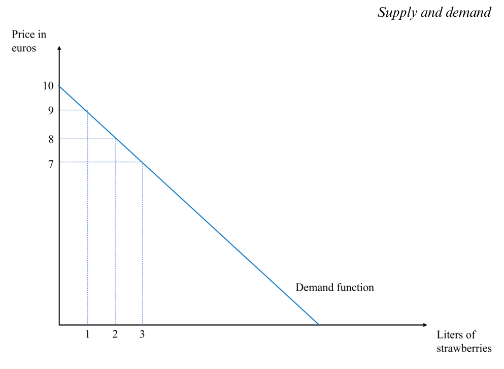

**How to read it (the demand curve).** By convention **price is on the vertical axis, quantity on the horizontal** (blame Alfred Marshall). Each point answers *both* questions: "at price p, how much is bought?" *and* "for quantity q, what's the most a buyer will pay?" Here the line hits **p = 10 when q = 0** (nobody buys above €10) and slides down to more litres as price falls.

- **★ Movement ALONG vs SHIFT — the make-or-break distinction:**
  - **Own price changes → MOVE ALONG** the existing curve (you slide to a new point).
  - **Anything else changes → the whole curve SHIFTS** (a *new* curve).

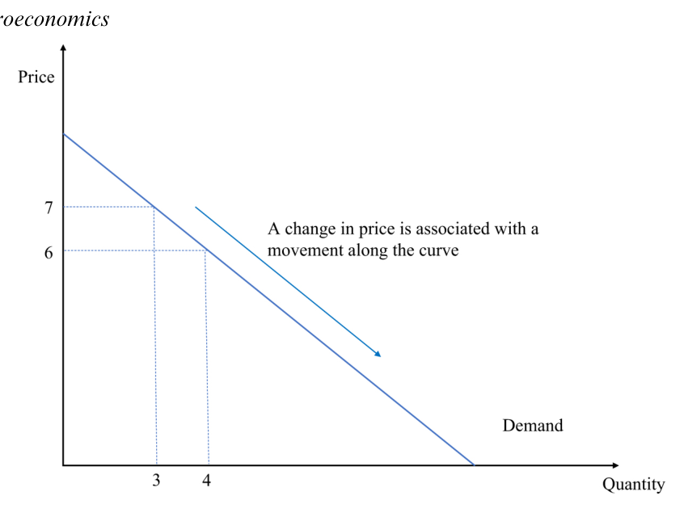

**How to read it (movement along).** Only the **own price** moved (7→6), so you **stay on the same curve** and just slide to a new point (q 3→4). No new curve is drawn. Contrast the shifts below, where the curve itself jumps.

- **Demand shifters (each moves the *whole* curve = changes the intercept a):**

| Shifter | Direction | Why |
|---|---|---|
| **Income ↑** (normal good) | shift **out** (right) | richer → buy more at every price |
| **Income ↑** (inferior good, e.g. instant noodles) | shift **in** (left) | richer → buy *less* of it |
| **Price of a substitute ↑** (raspberries ↑ → strawberry demand) | shift **out** | switch toward the now-relatively-cheaper good |
| **Price of a complement ↑** (cereal ↑ → milk demand) | shift **in** | the pair is consumed together |
| **Tastes / expectations** (heatwave → ice-cream; COVID → toilet paper) | out or in | common-sense direction |

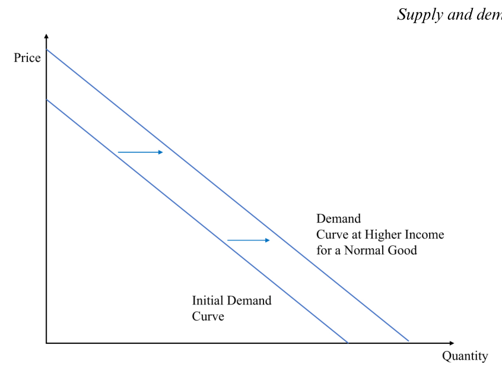

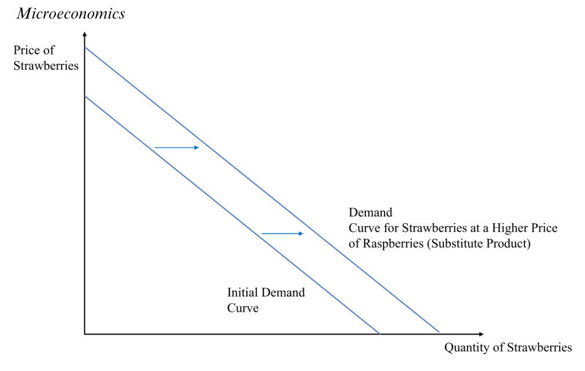

**How to read them (shifts).** The whole line moves **right (out)** = more demanded at *every* price. Fig 2.4: higher **income** (normal good). Fig 2.6: a **substitute** (raspberries) got dearer, so buyers swing to strawberries. Note you are *not* sliding along the old curve — a brand-new curve sits to the right.

- **Substitutes vs complements (definitions):** **substitutes** — demand for good 1 **rises** when good 2's price rises (raspberries ↔ strawberries). **Complements** — demand for good 1 **falls** when good 2's price rises (milk ↔ cereal).
- **From individual to aggregate demand (deck).** Market demand = **horizontal sum** of every buyer's demand — *add the quantities at each price*:

Aggregate (market) demandQ(p) = q₁ + q₂ + … = D₁(p) + D₂(p) + …   <em>(add quantities across buyers at the same price)</em>

*Reads:* market demand = every individual's demand added up **at each price**. — **Q(p)** = total quantity the whole market wants at price p · **q₁, q₂, …** = the quantities buyer 1, buyer 2, … each want at *that same* price · **D₁(p), D₂(p)** = each buyer's own demand function. (It's a **horizontal** sum — fix the price, add the quantities.)

  *Deck example:* Mike's inverse demand p = 100 − 2q_M, Linda's p = 100 − ½q_L → invert each to q(p), then add: at each price, total q = q_M + q_L. *(Watch for a **kink** where one buyer drops out at high prices.)*
- **The T-shirt trap (don't confuse products):** seeing pricey Gucci shirts outsell cheap generics is **not** an upward-sloping demand curve — those are **different goods**. A demand curve compares a good **to itself** (Gucci cutting *its own* price sells *more*). Real upward-sloping demand = the very rare **Giffen good** (Irish-famine potatoes; poor Chinese rice households — Jensen & Miller 2008).

#### 2.2 Supply — the supply function

***Core:*** supply answers *"how much do firms bring to market at each price?"* Firms are **price-takers** (they choose *quantity*, not the price). The curve usually slopes **up** — higher price → more supplied.
- *In plain terms — why upward:* a higher price (i) makes it worth producing more even as costs rise, and (ii) draws in higher-cost producers who couldn't profit at the low price.
- **The supply function** (quantity supplied depends on price and input/other factors):

Supply function & its inverseQ_S = S( p , p_o )   ·   linear example: <strong>Q_S = −2 + p</strong>  ⟹  inverse supply <strong>p = 2 + Q_S</strong>

*Reads:* how much firms bring to market depends on the price they get and their costs. — **Q_S** = quantity supplied · **S( · )** = "is a function of" · **p** = the good's **price** · **p_o** = price of **inputs** (wages, materials — higher costs shift supply in). In the example the **"−2"** is the price-intercept read backwards: **price must exceed 2 before any is supplied** (at p = 2, Q_S = 0).

- **Why the "−2" (a negative intercept that isn't weird):** read it in **inverse** form — **price must clear €2 before *any* is supplied** (at p = 2, Q_S = 0). *Check:* p = 3 → Q_S = 1; p = 4 → Q_S = 2.

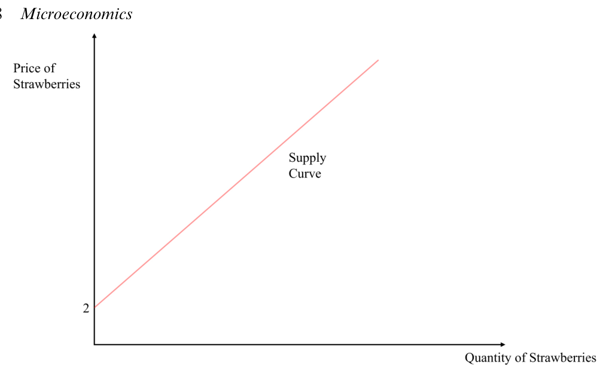

**How to read it (the supply curve).** Start at the **€2 price-intercept** (below it, zero supply) and climb: each extra euro of price brings one more litre to market. Like demand, an **own-price** change = **move along**; anything else = **shift**.
- **Supply shifters (move the whole curve):** **input/cost ↑** (wages, transport) → shift **in** (need a higher price for the same quantity); **cheaper inputs / new tech / more sellers / market opens to foreign suppliers** → shift **out**; **disruptions** (strikes, extreme weather, mine closures) → shift **in**.
- **From individual to aggregate supply (deck):** market supply = **horizontal sum** of each firm's supply — add quantities across firms at each price.

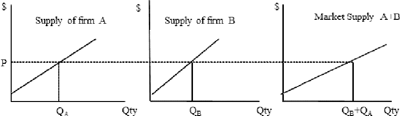

**How to read it (aggregate supply).** At any price **P**, read each firm's quantity off its own curve (Q_A, Q_B) and **add them across** — the market curve is the sum, so it's **flatter** (more responsive) than any single firm's.

#### ★ 2.3 Market equilibrium — solving for p\* and q\*

***Core:*** equilibrium = the **one price where quantity demanded = quantity supplied** (`Q_D = Q_S`), the **market-clearing** price — no shortage, no glut, nobody wants to move. **This is the calculation to master.**
- **The recipe (memorise these three steps):**

Step 1 — set demand = supplyQ_D = Q_S   ⟹   10 − p = −2 + p

Step 2 — solve for the equilibrium price p*10 + 2 = p + p   ⟹   12 = 2p   ⟹   <strong>p* = 6</strong>

Step 3 — put p* back into EITHER curve for q*Q* = 10 − 6 = <strong>4</strong>   (check: Q_S = −2 + 6 = 4 ✓)   ⟹   <strong>equilibrium (p*, q*) = (6, 4)</strong>

*Reads:* find the price where the two plans agree, then the quantity that trades there. — **Q_D** = quantity demanded · **Q_S** = quantity supplied · setting **Q_D = Q_S** solves for **p\*** = the market-clearing **price**; substituting p\* back into either curve gives **q\*** = the **quantity** traded. The star (**\***) just marks "equilibrium value." (Both curves must give the *same* q\* — that's the ✓ check.)

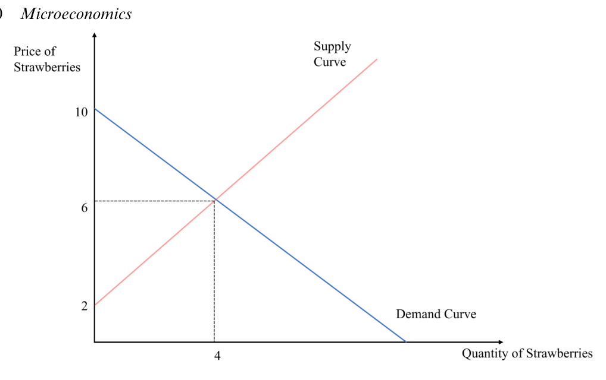

**How to read it (equilibrium).** The **crossing point** is the only place the two plans agree — buyers want exactly what sellers offer (4 litres at €6). Everywhere else, one side is frustrated and price gets pushed toward the cross.
- **Off-equilibrium: excess demand & excess supply** (this is also *exactly* how you handle price controls below):

Excess demand (SHORTAGE) — price below p*at p = 4:  Q_D = 10−4 = <strong>6</strong>,  Q_S = −2+4 = <strong>2</strong>  ⟹  shortage = Q_D − Q_S = <strong>4</strong>  → upward pressure on price

*Reads:* below equilibrium, buyers want more than sellers will supply. — plug the low price (**p = 4**) into **both** curves → **Q_D = 6** wanted, **Q_S = 2** offered; the gap **Q_D − Q_S = 4** is the **shortage**, which pushes the price **up** toward p\*.

Excess supply (SURPLUS) — price above p*at p = 8:  Q_D = 10−8 = <strong>2</strong>,  Q_S = −2+8 = <strong>6</strong>  ⟹  surplus = Q_S − Q_D = <strong>4</strong>  → downward pressure on price

*Reads:* above equilibrium, sellers offer more than buyers want. — plug the high price (**p = 8**) into **both** curves → **Q_S = 6** offered, **Q_D = 2** wanted; the gap **Q_S − Q_D = 4** is the **surplus**, which pushes the price **down** toward p\*.

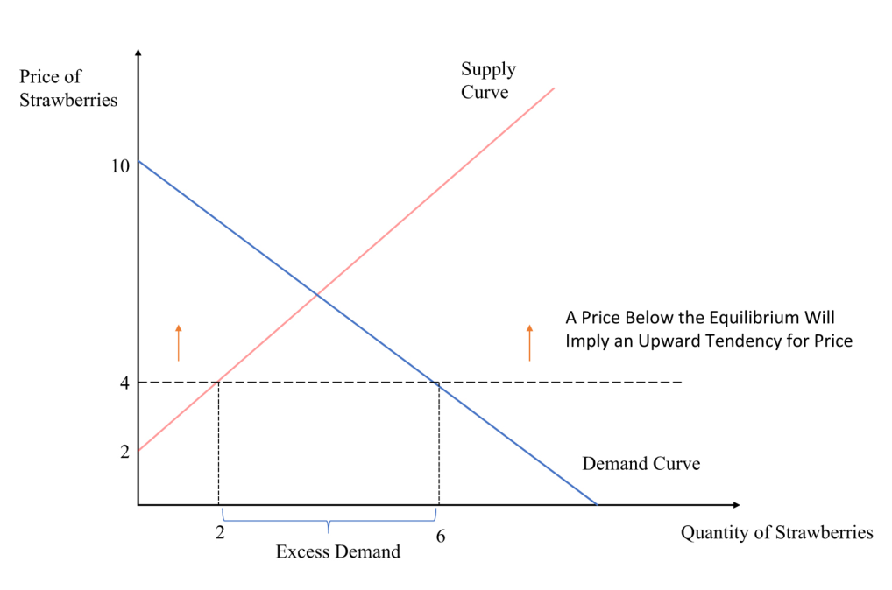

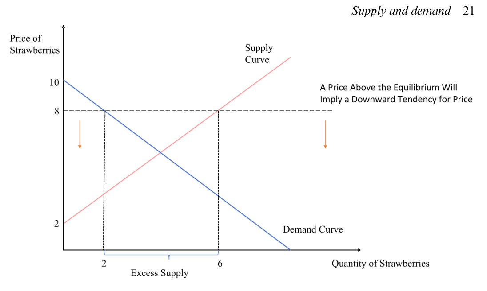

**How to read them.** Pick the off-equilibrium price, drop a vertical line, and read **both** curves: the **horizontal gap** between them is the shortage (demand side wider) or surplus (supply side wider). The gap is what pushes price back toward p\*.
- **Marshall's scissors:** asking whether *demand or supply* sets the price is like asking *which blade of a scissors cuts* — **both do.** This dissolves the **diamond–water paradox**: water is cheap not because it's little wanted but because it's **abundant in supply**; diamonds are dear because they're **scarce**.
- *(Who actually "sets" the price if everyone's a price-taker? The theoretical **Walrasian auctioneer** — and **Vernon Smith's 1962 experiments** showed real people reach the equilibrium price fast.)*

#### 2.4 Shifts in the equilibrium — comparative statics

***Core:*** to analyse any shock, **don't jump to price/quantity.** First figure out **which curve moves and which way**; the effect on p\* and q\* follows.
- **The method (Butera/Marshall — one change at a time, *ceteris paribus*):** ① **Demand or supply?** (falling incomes/other-good prices → demand; input costs/disruptions → supply). ② **Which direction** does it move *at a given price*? ③ *Then* read the new crossing. ④ **Reminder:** a *shift* is not a movement along — so a demand shift giving **both** higher price **and** higher quantity does **not** break the law of demand.

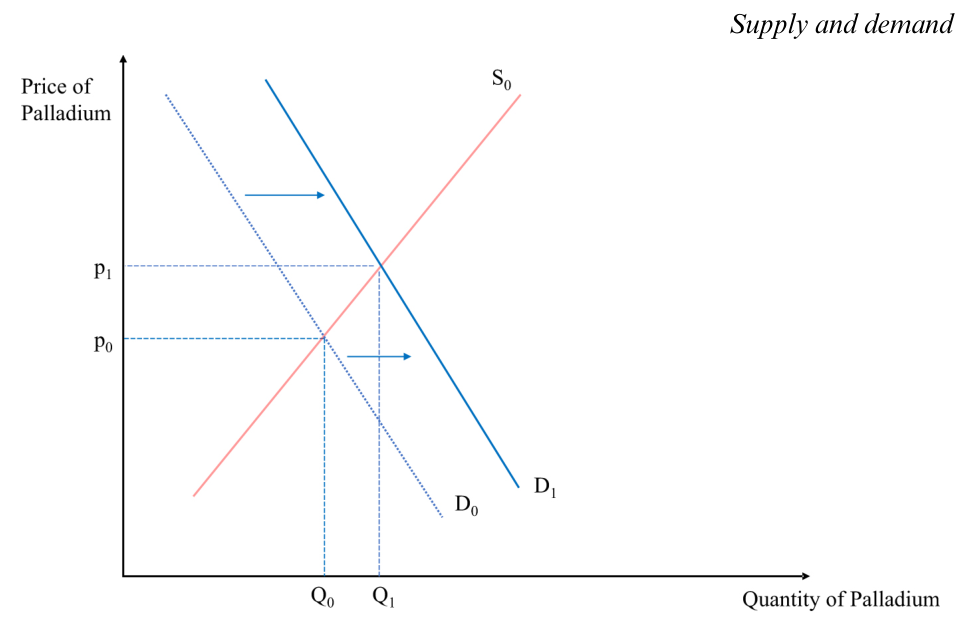

**How to read it (a demand shock).** Demand shifts **out** (D₀→D₁); supply is unchanged, so producers **move along** supply to the new cross — **both p and q rise**. (Add a simultaneous supply **fall** and price rises *unambiguously*, but the **quantity effect becomes ambiguous** — it depends which shift is bigger.)
- **★ Slope decides the *size* of the effect.** A **demand** shock's impact depends on the **slope of the *supply* curve**:

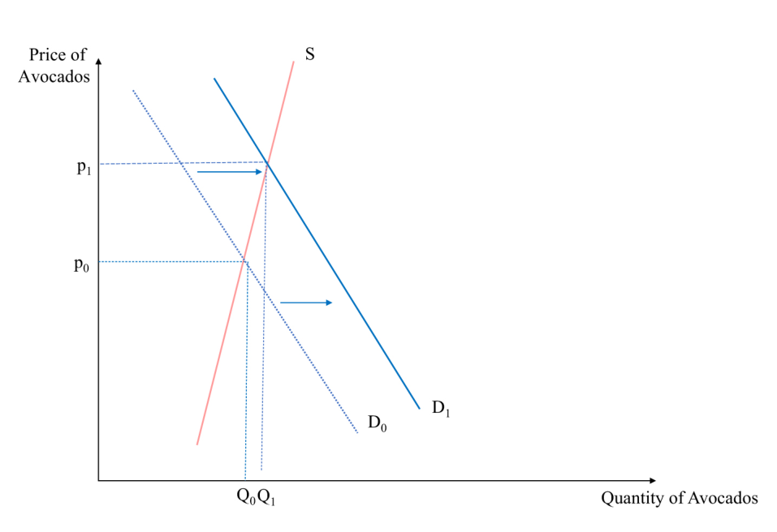

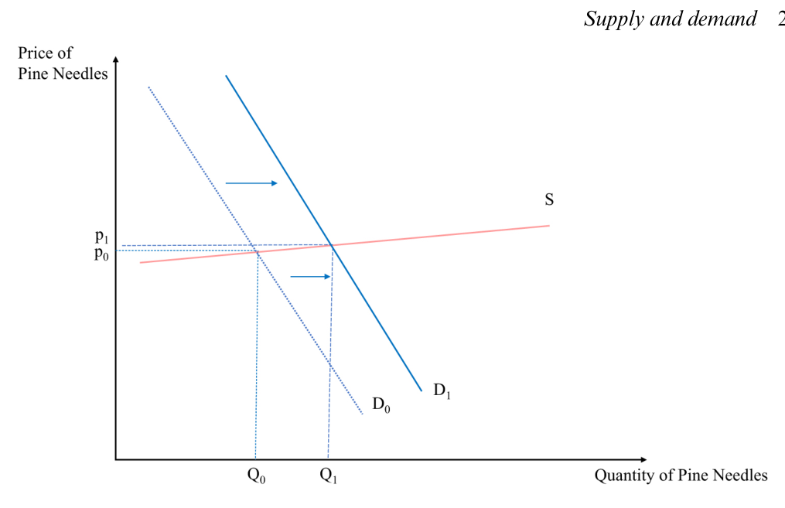

**How to read them.** Same outward demand shift, opposite results. **Steep supply** (avocados — trees take years, stock is fixed short-run): price jumps, quantity barely moves. **Flat supply** (pine needles — anyone can gather more): quantity jumps, price barely moves. *The flatter the other curve, the more a shock shows up as **quantity**; the steeper, the more it shows up as **price**.*

#### Price ceilings & floors — when the government fixes the price (deck)

***Core:*** a **binding price control** stops the market clearing, and you find the resulting gap with the **exact excess-demand/supply calculation above** — just set p to the controlled price.
- **Price ceiling** = a legal **maximum** (e.g. **rent control**). To bind it must be **below p\***, so **Q_D > Q_S → a shortage** (queues, waiting lists, black-market resale). *Compute:* plug the capped p into both curves; shortage = Q_D − Q_S.
- **Price floor** = a legal **minimum** (e.g. the **minimum wage** in the labour market). To bind it must be **above p\***, so **Q_S > Q_D → a surplus** (unsold goods; in the labour market, **unemployment** — more people want to work than firms will hire). *Compute:* surplus = Q_S − Q_D.
- **The trade-offs (positive, not normative):** *ceilings* — **pro:** keep essentials affordable for the less-well-off; **con:** shortages, quality decline, and markets "find a way around" (rent control can even be **regressive**; Venezuela's caps produced empty shelves). *floors* — **pro:** a living wage; **con:** firms substitute **capital for labour** (self-checkout at Føtex), cut hours, or make jobs temporary. *"Good economics generates **positive** statements — evidence on costs and benefits — to inform the **normative** political choice."*

#### Is the model realistic? — perfect competition (deck)

***Core:*** the supply-demand model assumes **perfect competition** — *"every model is wrong, but useful."*
- **Assumptions:** ① every agent is a **price-taker**; ② goods are **homogeneous** (perfect substitutes — one farm's wheat = another's; Shell petrol = Exxon petrol); ③ **perfect information** about prices/quality; ④ **low transaction costs**; (and many buyers & sellers). **Break these** and you need refinements — **monopoly, market failures** (later chapters).

### Cases & examples
Each: *the example → the concept it teaches.*
- **Strawberries (the running example)** → the whole toolkit: `Q_D = 10 − p`, `Q_S = −2 + p`, equilibrium **(6, 4)**, and the €4/€8 shortage/surplus.
- **Diamond–water paradox** → price is set by **supply *and* demand** (Marshall's scissors), not usefulness — water's cheap because it's abundant.
- **Palladium** (tighter emission rules → catalytic-converter demand ↑; S. African mine disruptions → supply ↓) → **comparative statics** with one and two curves moving.
- **2008 world rice spike & Haiti riots** (India's export ban cut supply; panic stockpiling shifted demand out) → a real **double shift**; prices later fell as stockpiles released + the financial crisis hit demand.
- **Instant noodles** → **inferior good**; **raspberries** → **substitute**; **cereal & milk** → **complements**.
- **Giffen goods** (Irish-famine potatoes; poor Chinese rice households) → the rare **upward-sloping demand** exception.
- **COVID toilet-paper stockpiling** → an **expectations** shift of demand.
- **Avocados vs Swedish pine-needle tea** → **steep vs flat supply** sizing a demand shock.
- **Rent control / Venezuela** → **price ceiling → shortage**; **minimum wage** → **price floor → surplus (unemployment)**.

### Formula sheet — quick reference
| Object | Formula | Note |
|---|---|---|
| Demand function | Q_D = D(p, pₛ, p_c, Y, τ) | many variables; curve fixes all but p |
| Linear demand / inverse | Q_D = a − b·p  /  p = (a − Q_D)/b | a = intercept (shifters), b = slope |
| Supply function / inverse | Q_S = −2 + p  /  p = 2 + Q_S | negative intercept = min price to supply |
| Aggregate (market) | Q(p) = Σ Dᵢ(p) ; Σ Sᵢ(p) | **horizontal** sum (add quantities) |
| **Equilibrium** | **set Q_D = Q_S → p\*, then q\*** | the market-clearing point |
| Excess demand (shortage) | Q_D − Q_S at p < p\* | → upward price pressure; price ceiling |
| Excess supply (surplus) | Q_S − Q_D at p > p\* | → downward pressure; price floor |

### Exam pointers
- **Solve a market from scratch:** given a linear demand and supply, **set them equal**, get **p\***, back-substitute for **q\*** — the strawberry case (p\*=6, q\*=4) is the model answer.
- **Compute a shortage/surplus:** plug a below- or above-equilibrium price into *both* curves and take the gap (**Q_D − Q_S** or **Q_S − Q_D**) — and know a **ceiling→shortage**, **floor→surplus**.
- **Diagnose movement vs shift**, and for a shock say **which curve moves, which way**, and the effect on p\* & q\* (incl. the **ambiguous-quantity** double-shift and the **slope** point).
- Explain **why demand slopes down** (scarcity + diminishing marginal utility) and **Marshall's scissors** / the diamond–water paradox.
- Name the **perfect-competition** assumptions and why the model is still "useful though wrong."

---

## ★ Fun facts & memorable details (Lecture 2)

> Sticky bits from Supply & Demand.

- **Marshall's scissors:** asking whether demand or supply sets the price is like asking **which blade of the scissors** does the cutting — both do.
- The **diamond–water paradox** is only a paradox if you forget supply: water is life-or-death yet cheap **because it's abundant**.
- **Giffen goods** really exist: when their staple got dearer, poor Chinese rice households bought **more** rice, not less (Jensen & Miller 2008) — they could no longer afford anything else.
- A negative supply intercept (**Q_S = −2 + p**) isn't a mistake — it just means **price must top €2 before anyone supplies a drop.**
- **Vernon Smith** won a Nobel (2002) for showing that real people in a lab **converge on the equilibrium price** startlingly fast — the "Walrasian auctioneer" made flesh.
- Rent control's dirty secret: it can be **regressive** and spawn black-market "key money" — a "tale of good intentions" (cf. Venezuela's empty shelves).
- Minimum wage as a price floor nudges firms toward **capital over labour** — the **self-checkout at Føtex** is a supply-and-demand diagram in the wild.

---

# Lecture 3: Elasticities & Taxes — the Supply & Demand model II (Ch. 2 recap · §6.4)

**Required reading:** Friberg, **§6.4 Elasticities** (own-price, cross-price, income; supply elasticity) — building on the **Chapter 2** supply-and-demand model (see [Lecture 2](#lecture-2-micro)). *The lecture deck also teaches **taxes on goods & services** — that part draws on the textbook's **§7.5** (unit tax, tax incidence), covered here because the deck foregrounds it.*

**Theme of the lecture (Butera — from the deck, titled *"Supply and Demand model"*).** Chapter 2 taught us to **move the curves around**; this lecture adds **precision**. The **"shape" of a demand or supply curve — its elasticity — decides how much a shock (or a tax) shows up as a change in *price* versus a change in *quantity*.* The deck's three goals: **(1)** understand what demand & supply **elasticities** mean, **(2)** **derive** them from demand/supply curves, and **(3)** use them to analyse the **effects of taxes**.

★ <strong>The heart of the lecture:</strong> <strong>elasticity = % responsiveness</strong> — "by what % does quantity change when price rises 1%." It's a <strong>unit-free</strong> number that summarises a curve's <strong>shape</strong>, so it's comparable across markets and time. The <strong>shape decides how a shock splits into price vs quantity</strong>: with <strong>inelastic</strong> demand a shock/tax hits <strong>price</strong>; with <strong>elastic</strong> demand it hits <strong>quantity</strong>. And a <strong>tax</strong> drives a <strong>wedge</strong> between the price buyers pay and sellers receive — <strong>who bears it depends on the relative elasticities</strong>, and (in perfect competition) <strong>it doesn't matter who is legally taxed.</strong>

**The red thread.** For any market ask: *how responsive is quantity to price (elastic or inelastic)?* — because that single question answers **how a supply shock moves the market**, **how a firm should price**, and **who really pays a tax.** Elasticity is the "shape" number that ties all three together.

### Key concepts / "modes" to use
- **Elasticity** — the **% change in one variable ÷ % change in another** (a unit-free number).
- **Price elasticity of demand (E_D)** — % change in quantity demanded ÷ % change in own price (**negative**).
- **Elastic / inelastic / unit-elastic** — |E| > 1 / |E| < 1 / |E| = 1.
- **Point-elasticity trick** — `E_D = (dQ/dp)·(p/Q)`; on a linear curve elasticity **changes along the curve** (constant-elastic curves don't).
- **Cross-price elasticity** — substitutes (+) vs complements (−).
- **Income elasticity** — normal (+) vs inferior (−); **Engel curves / Engel's law**.
- **Supply elasticity** — % change in quantity supplied ÷ % change in price (positive).
- **Tax wedge & tax incidence** — `p_b = p_s + t`; who bears the burden depends on **relative elasticities**; **legal ≠ economic** incidence; unit vs ad-valorem tax; **deadweight loss**.

### Section-by-section main points

#### Why do we care about elasticity? (deck)

***Core:*** the **shape** of demand/supply curves determines **how much a shift in one moves the equilibrium** — and "shape" is summarised by **elasticity.** A steep (inelastic) curve and a flat (elastic) curve respond to the *same* shock very differently.
- **The motivating questions (deck):** Do **"sin taxes"** (cigarettes, sugar) hurt the poor? Why do firms **raise prices** even when it looks crazy (Netflix, Amazon Prime)? To what extent are **taxes on producers "passed on"** to consumers? Every answer runs through elasticity.
- **The visual intuition:** how far a **supply shift** moves price vs quantity depends entirely on the **slope/elasticity of demand** — see the figure below (perfectly inelastic demand → only price moves; perfectly elastic demand → only quantity moves).

**How to read it (why elasticity matters).** All three panels apply the **same supply shift** `S¹→S²`. The **only** thing that differs is the **demand curve's shape**:
- **(a) Ordinary downward-sloping demand:** the shock splits into **both** a higher price *and* a lower quantity.
- **(b) Perfectly inelastic demand (vertical):** quantity can't respond, so the shock lands **entirely on price** (3.30→3.675). *This is the "necessity with no substitutes" case.*
- **(c) Perfectly elastic demand (horizontal):** price can't move, so the shock lands **entirely on quantity** (220→205).
- **Take-away:** the **more inelastic** the demand, the more a shock (or tax) shows up as **price**; the **more elastic**, the more it shows up as **quantity.** *This one picture is the whole reason we measure elasticity.*

#### ★ Price elasticity of demand — definition

***Core:*** the **price elasticity of demand** measures how sensitive quantity demanded is to the good's own price — the **% change in quantity ÷ % change in price.** It is a **pure (unit-free) number** and is **negative** (demand slopes down: price up → quantity down).

Price elasticity of demand<em>ED</em> = ( Δ<em>Q</em>/<em>Q</em> × 100 ) ÷ ( Δ<em>p</em>/<em>p</em> × 100 ) = <strong>%ΔQ ÷ %Δp</strong>

*Reads:* **how responsive quantity demanded is to a price change** — "a **1% rise in price** *p* leads to an **E_D % change in quantity** *q*." — **Δ*Q*/*Q*×100** = the **percentage change in quantity demanded** · **Δ*p*/*p*×100** = the **percentage change in price** · **E_D** = the ratio (a **unit-free** number, **negative** for a normal good). The ×100s cancel, so it's just **%ΔQ over %Δp**.

- **Why unit-free matters (the point of the whole concept):** raw slopes aren't comparable — "1,000 tons less rice" means something different in **Vietnam** vs **Bhutan**, and depends on the currency. A **percentage** measure is **comparable across markets, currencies and time.**
- **Why negative:** demand curves slope **down**, so Δ*Q* and Δ*p* have opposite signs → the ratio is negative. *(When people say a "higher" elasticity they usually mean a bigger **absolute value** |E_D|.)*

#### Computing elasticity — and the point-elasticity trick

***Core:*** plug the two percentage changes into the formula. **On a linear demand curve the elasticity is *not* constant** — it depends on *where* you evaluate it, via `E_D = (dQ/dp)·(p/Q)`.
- **Simple example (textbook Table 6.2):** quantity falls **6 → 4** while price rises **1 → 2**. Then

Worked — simple example<em>ED</em> = ( (4−6)/6 ) ÷ ( (2−1)/1 ) = ( −2/6 ) ÷ ( 1 ) = <strong>−1/3</strong>

*Reads:* a demand that is **inelastic** — **(4−6)/6 = −0.33** = the **% fall in quantity** (−33%) · **(2−1)/1 = 1** = the **% rise in price** (+100%) · **−1/3** = quantity falls **only ⅓ as fast** as price rises → **inelastic** demand.

- **A policy-style example (soda, Allcott et al. 2019):** own-price elasticity of sugary soda ≈ **−1.37.** *If price rises 5%*, quantity changes by `E_D × 5% = −1.37 × 5 = −6.85%` (a ~7% fall). *To cut demand 15%*, price must rise `−15 ÷ −1.37 ≈ 11%`. → *this is exactly the sum a policymaker designing a **soda tax** needs.*
- **The point-elasticity trick (linear demand):** rewrite the formula as

Point elasticity<em>ED</em> = (Δ<em>Q</em>/Δ<em>p</em>) · (<em>p</em>/<em>Q</em>) = (d<em>Q</em>/d<em>p</em>) · (<em>p</em>/<em>Q</em>)

*Reads:* elasticity = **slope of the demand function × the price-to-quantity ratio at your chosen point** — **dQ/dp** = the **slope** (how many units Q changes per €1 of price; constant for a straight line) · **p/Q** = the **price-to-quantity ratio** where you evaluate it (this is what varies along the curve).

- **Worked (Q = 10 − 2p):** here `dQ/dp = −2` (always). But the **elasticity varies**:
  - at **p = 2.5** (so Q = 5): `E_D = −2 × 2.5/5 = −1` (**unit elastic**).
  - at **p = 4** (so Q = 2): `E_D = −2 × (p/Q) = −2 × 4/2 = −4` → **elastic.** *(⚠ The textbook misprints this as `−2 × 2/2 = −2` — it accidentally puts Q=2 in the numerator instead of p=4; the correct p/Q is **4/2 = 2**, so **E_D = −4**.)*
  - **The pattern:** **demand is more elastic at higher prices** — at p=2.5 it's unit-elastic (−1), at p=4 it's elastic (−4). A fixed unit change is a bigger *percentage* change when Q is small and p is large.
- **Constant-elasticity demand (contrast):** the form `Q = a·p^ϵ` has the **same** elasticity **ϵ** at *every* price (used in empirical estimation via `ln Q = ln a + ϵ·ln p + error`). *So: **linear → elasticity changes along the curve; constant-elastic → it doesn't.***

#### Elastic, inelastic, unit-elastic — and why it matters

***Core:*** we **name** the ranges of elasticity, and each has a sharp economic meaning for **how supply shocks split into price vs quantity.**
| Name | Level (of E_D) | Meaning | Curve looks… |
|---|---|---|---|
| **Inelastic** | −1 < E_D < 0 (|E| < 1) | %ΔQ **smaller** than %Δp | relatively **steep** |
| **Unit elastic** | E_D = −1 | %ΔQ **equals** %Δp | — |
| **Elastic** | E_D < −1 (|E| > 1) | %ΔQ **bigger** than %Δp | relatively **flat** |

- **Why it matters (the punchline):** with **inelastic** demand, **supply shocks translate into big *price* changes** (little quantity response) — critical for e.g. **cocoa** growers in Ghana/Côte d'Ivoire (world cocoa elasticity ≈ −0.19 to −0.96; policy point estimate −0.34). With **elastic** demand, shocks translate into **quantity** changes.
- **What makes demand elastic — substitutes.** The single biggest driver is **availability of close substitutes**: pharmaceuticals with few substitutes are **inelastic** (people pay whatever for a needed medicine); goods with many substitutes are **elastic**.
- **Aggregation level matters:** a *specific brand* is more **elastic** than the *category* (more substitutes for one brand). US beer: **product-level** median elasticity ≈ **−4.74**, but beer **overall** ≈ **−0.60.**

#### Cross-price elasticity — substitutes vs complements

***Core:*** the **cross-price elasticity** measures how demand for good **A** responds to the price of a *different* good **B** — and its **sign** tells you the relationship.

Cross-price elasticity<em>Ecross</em> = %Δ<em>QA</em> ÷ %Δ<em>pB</em> &nbsp;&nbsp;→&nbsp;&nbsp; <strong>&gt; 0 = substitutes</strong> · <strong>&lt; 0 = complements</strong>

*Reads:* how the quantity of **A** responds to a price change in **B** — **%ΔQ_A** = percentage change in demand for good A · **%Δp_B** = percentage change in the price of good B · **sign**: **positive → substitutes** (Heineken dearer → more Carlsberg bought), **negative → complements** (phones dearer → fewer phone cases). *The larger the positive value, the closer the substitutes.*
- **Why it's used:** gauging **competitive pressure** and evaluating **mergers** (competition authorities ask how closely two products substitute). *(Deck aside: cross-price elasticity of cigarettes & alcohol ≈ −1 — strong complements, Krauss et al. 2014.)*

#### Income elasticity — normal vs inferior goods, Engel curves

***Core:*** the **income elasticity** measures how demand responds to **income** — its **sign** distinguishes **normal** from **inferior** goods.

Income elasticity<em>Eincome</em> = %Δ<em>Q</em> ÷ %Δ<em>I</em> &nbsp;&nbsp;→&nbsp;&nbsp; <strong>&gt; 0 = normal good</strong> · <strong>&lt; 0 = inferior good</strong>

*Reads:* how quantity demanded responds to an income change — **%ΔQ** = percentage change in quantity · **%ΔI** = percentage change in income · **sign**: **positive → normal** (demand rises with income), **negative → inferior** (demand falls as income rises — e.g. instant noodles, store-brand goods).
- **Nuance:** a good can be **normal at low incomes and inferior at higher** ones (hostels for a student: more nights as income rises, then switch to hotels). Tastes vary by person.
- **Uses:** long-term **projections** (healthcare, appliances in low-income countries) and predicting the **business cycle** (pharma is income-insensitive → "**defensive stock**").
- **Engel curves / Engel's law (Ernst Engel, 1800s Prussian statistician):** plot demand (vertical) against income (horizontal) — **positive slope for normal goods, negative for inferior.** **Engel's law:** the **share of income spent on food *falls* as income rises** → the income elasticity of food is **less than 1.**

#### Supply elasticity — same principle

***Core:*** the **price elasticity of supply** measures how sensitive quantity *supplied* is to price — same formula, but **positive** (supply slopes up).

Price elasticity of supply<em>ES</em> = %Δ<em>QS</em> ÷ %Δ<em>p</em> &nbsp;&nbsp;(<strong>positive</strong>)

*Reads:* how responsive quantity supplied is to a price change — **%ΔQ_S** = percentage change in quantity supplied · **%Δp** = percentage change in price · **E_S** = the ratio (**positive**: higher price → more supplied). A **steep** supply curve is **inelastic** (hard to expand output quickly); a **flat** one is **elastic**.

#### Elasticity over time — short run vs long run

***Core:*** demand (and supply) are usually **more elastic in the long run** than the short run, because people have **more time to adjust / find substitutes.**
- **Electricity (Labandeira et al. 2017):** ≈ **−0.24 short-run** vs **−0.6 long-run** — over time consumers buy more efficient equipment, change habits.
- **The deck's cases:** a drop in **gas** prices does little in the short run but more in the long run; likewise **computers**. *Exam framing: "in the short run demand is inelastic (people are locked in); given time they substitute, so long-run demand is more elastic."*

#### ★ Taxes on goods & services — the wedge, incidence & equivalence (deck; textbook §7.5)

***Core:*** a tax **drives a wedge** between the price **buyers pay** (`p_b`) and the price **sellers receive** (`p_s`): **`p_b = p_s + t`.** It raises the buyer price, lowers the seller price, cuts the quantity traded, and creates a **deadweight loss.** The split of the burden — **tax incidence** — depends on the **relative elasticities**, and (under perfect competition) **not** on who is legally taxed.
- **Two types of tax (deck):**
  - **Unit (specific) tax** — a fixed **amount *t* per unit** (per litre of petrol, per cigarette).
  - **Ad valorem tax** ("sales tax"/VAT) — a **fraction α of the price/spend** (government keeps a share of each euro spent).
- **The wedge (worked unit-tax example, t = €3):** with `Q_D = 23 − p_b`, `Q_S = −1 + p_s/2`, and `p_b = p_s + 3`, solving gives **p_s = 14, p_b = 17, Q = 6.** Buyers pay **€3 more** than sellers receive; quantity falls from the no-tax equilibrium.
  - **Tax revenue** = `t × Q` = `3 × 6 = €18`. The rest of the surplus lost is **deadweight loss** (here `3 × (7−6)/2 = €1.5`) — trades that *would* have happened but now don't.
- **Legal incidence ≠ economic incidence (the key result).** It **doesn't matter** whether the tax is collected from **firms** (supply shifts up by *t*) or **consumers** (demand shifts down by *t*) — the quantity, the prices actually paid/received, and the DWL are **identical.** *All that matters is that the tax drives a wedge.* (Perfect-competition assumptions make this exact: no transaction costs, perfect information.)

**How to read it (tax equivalence).** Both panels impose the **same $0.55 tax** on avocados. **(a)** collects it from **firms** → the supply curve shifts **up** by *t*; **(b)** collects it from **consumers** → the demand curve shifts **down** by *t*. In **both** cases the result is identical: **Q falls to 74**, **buyers pay 2.15**, **sellers receive 1.60**, and the wedge between them is exactly **$0.55.** → *The economics doesn't care who writes the cheque.*

- **What *does* decide the split: relative elasticities.** The **more inelastic** side of the market bears **more** of the tax (it can't escape by changing quantity). The **more price-sensitive (elastic)** side is affected **less** on price, **more** on quantity.

**How to read it (incidence & elasticity).** The tax raises the supply curve to `S + tax`. The **new higher price P2** is what **consumers** pay; **P3** is what **suppliers** keep. The split of the rectangle between them is the **incidence**:
- **Left — elastic demand (PED > 1):** consumers easily cut back, so firms **can't raise the price much** → the **supplier absorbs most** of the tax.
- **Right — inelastic demand (PED < 1):** consumers keep buying regardless, so the firm **passes most of the tax through** → the **consumer bears most** of it.
- **Policy take-aways:** (1) **"sin taxes"** on inelastic goods (cigarettes, alcohol) fall mostly on **consumers** and raise a lot of revenue with **little DWL** (quantity barely moves) — which is *why* governments like them, and why they can be **regressive** (hit the poor). (2) We **prefer taxes on inelastic bases** — they distort choices least.
- **Subsidies are the mirror image:** `p_s = p_b + s` — a subsidy lowers the buyer price, raises the seller price, **expands** quantity above the efficient level, and also creates a **deadweight loss** (units produced that cost more than consumers value them). Its incidence, too, depends on elasticities (inelastic demand — e.g. emergency care, primary education — → small DWL).

### Cases & examples
*Read each as a worked use of an elasticity number (or a tax result).*
- **Sugary-soda tax (Allcott et al. 2019).** Own-price elasticity ≈ **−1.37** (elastic). A 5% price rise → ~**7% fall** in quantity; to cut demand 15% you'd raise price ~11%. → *Illustrates: elasticity as the **design tool for a corrective ("sin") tax**.*
- **World cocoa demand.** Inelastic (≈ −0.19 to −0.96; policy estimate −0.34). → *Illustrates: **inelastic demand → supply shocks hit price**, so bad harvests swing incomes for growers in Ghana / Côte d'Ivoire.*
- **US beer — brand vs category (Miller et al. 2021).** Product-level elasticity ≈ **−4.74**, category ≈ **−0.60.** → *Illustrates: **aggregation** — a single brand has close substitutes (elastic), the category doesn't (inelastic).*
- **Sweden–Denmark cross-border alcohol (Asplund et al. 2007).** Swedes drive to Denmark for cheaper drink. Estimated for spirits: **own-price −1.3** (elastic), **cross-price (Danish price) +0.3** (substitute), **income +1.4** (normal good). → *Illustrates: **all three elasticities at once** — own, cross, income — from real data.*
- **Electricity demand (Labandeira et al. 2017).** ≈ −0.24 short-run vs −0.6 long-run. → *Illustrates: demand is **more elastic in the long run** (time to adjust equipment/habits).*

### Formula sheet — quick reference
| Quantity | Formula | Sign / meaning |
|---|---|---|
| **Price elasticity of demand** | `E_D = %ΔQ_D ÷ %Δp` | **negative**; |E|>1 elastic, |E|<1 inelastic |
| **Point elasticity (linear)** | `E_D = (dQ/dp)·(p/Q)` | varies along the curve; more elastic at higher p |
| **Constant-elastic demand** | `Q = a·p^ϵ` → `ln Q = ln a + ϵ ln p` | elasticity = **ϵ** everywhere |
| **Cross-price elasticity** | `E_cross = %ΔQ_A ÷ %Δp_B` | **+ substitutes**, **− complements** |
| **Income elasticity** | `E_income = %ΔQ ÷ %ΔI` | **+ normal**, **− inferior**; food < 1 (Engel) |
| **Supply elasticity** | `E_S = %ΔQ_S ÷ %Δp` | **positive** |
| **Tax wedge** | `p_b = p_s + t` | buyers pay more, sellers get less; DWL |
| **Tax revenue** | `t × Q_taxed` | rectangle; rest of loss = deadweight loss |
| **Subsidy wedge** | `p_s = p_b + s` | expands Q above efficient; also a DWL |

### Exam pointers
- **Compute an elasticity** from two (p, Q) points and **name** it (elastic/inelastic/unit) — the **[−1/3 example](#micro3-computing)**.
- Use the **[point-elasticity trick](#micro3-computing)** `E_D=(dQ/dp)(p/Q)` on a **linear demand** and show elasticity **changes along the curve** (more elastic at higher price).
- Give the **sign rules** for **[cross-price](#micro3-cross)** (substitutes/complements) and **[income](#micro3-income)** (normal/inferior) elasticities, with an example each.
- **Solve a unit-tax** market (`p_b = p_s + t`) for `p_b, p_s, Q`, compute **revenue** and **deadweight loss** — the **[t=€3 example](#micro3-taxes)**.
- State and **explain** the two big tax results: **legal ≠ economic incidence** (doesn't matter who's taxed) and **incidence depends on relative elasticities** ([inelastic side pays more](#micro3-taxes)); use the **[sin-tax](#case-soda-tax)** application.
- Explain **why elasticity is unit-free** and why demand is **more elastic in the [long run](#micro3-time)** and for **[narrower product categories](#case-beer-aggregation)**.

**Bridge.** Lecture 3 turns the [Chapter 2 model](#lecture-2-micro) from *qualitative* ("the curve shifts left") into *quantitative* ("by how much, and split how between price and quantity"). Elasticity is also the hinge to later chapters: **firm pricing** (a monopolist's markup depends on E_D), **tax policy & deadweight loss** (Ch. 7), and **who gains from trade.**

---

## ★ Fun facts & memorable details (Lecture 3)

> Sticky bits from Elasticities & Taxes.

- **It doesn't matter who you tax.** In a competitive market the burden of a tax is **identical** whether the government bills the shop or the shopper — "all that matters is that the tax drives a wedge." (This is why arguing about *who* a tax is "on" often misses the point.)
- **Why cigarette & alcohol taxes raise so much money:** demand is **inelastic**, so people keep buying — the tax is **passed to consumers** with little drop in quantity (and is often **regressive**).
- **The soda-tax number:** the own-price elasticity of sugary drinks (≈ **−1.37**) is a real input to real policy — a 5% price rise cuts consumption ~7%.
- **Engel's law (1857):** the **richer** you get, the **smaller** the share of income you spend on **food** — one of the oldest empirical regularities in economics, and still used to gauge living standards.
- **Pharma = "defensive stock":** demand for medicine barely moves with income (income-inelastic), so drug companies hold up in recessions.
- **Elasticity has a time dimension:** when petrol jumps, you can't do much *this week* (inelastic), but over years you buy a smaller car and move closer to work (elastic) — the "short-run vs long-run" split.
- **Brand vs category:** demand for *a* beer is wildly elastic (≈ −4.7 — switch brands!), but demand for *beer* is inelastic (≈ −0.6) — same drink, opposite elasticity, just different zoom level.
- **Swedes really do drive to Denmark for cheap booze** — enough that economists measured the cross-border **cross-price elasticity** of spirits (+0.3) from the data (Asplund et al. 2007).
