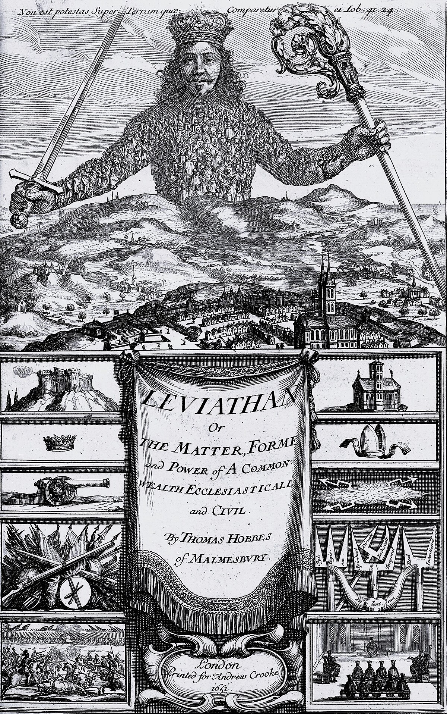

# Political & Economic Thought — Master Notes

by Jakob V. Stangel

> One running document for the whole course, organised **by module**.
> Format per reading: **Résumé → ★ Heart of it → Key concepts → Section-by-section → Cases → Key terms → Exam pointers.**

## Overview — where everything is
*(Everything below is clickable — jump straight to a week, reading, case, or fun-facts box.)*

- **[Module 1: Antiquity & the Middle Ages — Greeks & Romans](#module-1-pet)** — [★ Lecture 1 (BAP/JL)](#week36-lecture) · [Reeve: Plato](#reeve--plato) · [McClelland: Aristotle](#mcclelland--aristotle) · [Galbraith intro](#galbraith--a-look-at-the-landscape) · [★ Reading questions (answered)](#week36-questions) · [★ Fun facts](#ff-week36)
- **[Module 2: Renaissance & Early-Modern — from Cosmopolis to Stato to Social Contract](#module-2-pet)** — [McClelland: Hobbes](#m2-hobbes) · [Hobbes's social contract / covenant](#hob-covenant) · [Grotius: natural law & the world system of states](#m2-grotius) · [Hobbes vs Grotius](#m2-compare) · [★ Fun facts](#ff-module2-pet)
- **[Exercise Class 1: The Pros & Cons of a Central Political Authority](#ex1-pet)** — [Cicero: *On the Commonwealth*](#ex1-cicero) · [the cycle of constitutions](#cic-anacyclosis) · [the mixed constitution](#cic-mixed) · [Hobbes: *Leviathan* Part 2 (chs 17–20)](#ex1-hobbes) · [the generation of the commonwealth](#hob2-generation) · [rights of the sovereign](#hob2-rights) · [Machiavelli (supplementary)](#ex1-machiavelli) · [Cicero vs Hobbes](#ex1-compare) · [★ Reading-question answers](#ex1-questions) · [★ Fun facts](#ff-ex1)
- **[Module 3: The Roots of Modern Economics — Mercantilism to Economic Liberalism (1500–1790)](#module-3-pet)** — [Mercantilism](#m3-mercantilism) · [quantity theory of money (Salamanca/Bodin)](#m3-salamanca) · [The Physiocrats & the *Tableau économique*](#m3-physiocracy) · [laissez-faire (Gournay/Turgot)](#m3-laissezfaire) · [Adam Smith](#m3-smith) · [division of labour & the invisible hand](#m3-invisiblehand) · [Smith & laissez-faire](#m3-smith-laissezfaire) · [*Is Mercantilism Back?*](#m3-article) · [★ Fun facts](#ff-module3-pet)
- **[Module 4: Enlightenment and Political Liberalism (1660–1790)](#module-4-pet)** — [the Enlightenment frame](#m4-frame) · [Locke (Waldron)](#m4-locke) · [social contract & consent](#loc-contract) · [equality & natural law](#loc-natural) · [property](#loc-property) · [rule of law & revolution](#loc-revolution) · [Montesquieu (McClelland)](#m4-montesquieu) · [spirit of the laws / *esprit général*](#mon-spirit) · [types & principles of government](#mon-types) · [separation of powers](#mon-separation) · [Wollstonecraft](#m4-wollstonecraft) · [Rousseau (optional)](#m4-rousseau) · [general will](#rou-generalwill) · [who are "the people"?](#m4-compare) · [★ Reading-question answers](#m4-questions) · [★ Fun facts](#ff-module4-pet)

---

# Module 1: Antiquity and the Middle Ages — Greeks and Romans

**Readings:** Reeve on **Plato** · McClelland on **Aristotle** · Galbraith intro (**pp. 1–8**)

**Theme of the module:** the two founders of Western political thought — **Plato** (the ideal state built on knowledge of the Good) and **Aristotle** (the empirical, "natural" study of the *polis*) — paired with Galbraith's framing of *how to read the history of economic ideas* (ideas as products of their time). Plato gives the **normative/idealist** pole, Aristotle the **empirical/naturalist** pole; both anchor every later debate.

★ <strong>The red thread — each text in ONE idea</strong> (keep these three in view; all the detail below hangs off them):
 • <strong>Reeve → Plato:</strong> rule belongs to those who <strong>KNOW the Good</strong> — politics is <em>derived from metaphysics</em> (the philosopher-king in the kallipolis).
 • <strong>McClelland → Aristotle:</strong> the <strong>polis is natural</strong>, studied <strong>empirically</strong> — judge every constitution by <strong>whose interest it serves</strong> (good vs corrupt; <strong>politeia</strong> = the best <em>practicable</em>).
 • <strong>Galbraith:</strong> <strong>economic ideas are products of their own time and place</strong> — read ideas against the world that made them.

---

## ★ Lecture 1 (BAP/JL) — The roots of political philosophy

> The lecture (**Benjamin Ask Popp-Madsen · Joachim Lund**) frames the whole field, then walks the ancient arc **Greece → Rome → early Christianity**. The readings below give the Plato/Aristotle/economics detail; this section adds the lecture's **framing** and the **Roman/Christian** material it covers beyond the readings. *(Course/exam: written sit-in on CBS computers, Jan 2027; 7-step scale; two internal examiners.)*

#### What is Political & Economic Thought? — theory vs. ideology

***Core:*** both **theory** and **ideology** are "frameworks of explanation," but theory *aims at objectivity* (a **positive**, not normative, starting point — though never value-free), while ideology is openly **normative** — a programme for action.
- **Ideology** (Heywood): a coherent set of ideas grounding organised political action — it ① describes the existing order (a "world-view"), ② pictures a "good society," ③ says how to get from ①→②.
- **Theory:** rigorous concepts + logic aiming at some **objectivity**; a relatively rigorous (not strictly scientific) form of knowledge.
- So both sit on a **continuum between science and ideology** / positive vs normative. *(Watch words like "right" and "just" — they sound like theory but smuggle in norms.)*

#### Why study the history of ideas? — do ideas change the world?

***Core:*** the course's central puzzle — do **ideas** move history, or do **material interests**?
- **Hegel:** "Philosophy comes too late to teach the world what it should be." · **Marx:** "philosophers have only *interpreted* the world; the point is to *change* it." · **Weber:** interests govern conduct, but the "world-images" created by ideas act like **switchmen** on the tracks. · **Gramsci** (*cultural hegemony*): the dominant ideas decide how socio-economic structures *can* be changed.

#### Three kinds of social theory

- **Political theory** — the **authoritative distribution of scarce resources** / the monopoly of violence.
- **Sociological theory** — human behaviour in and between groups.
- **Economic theory** — the **creation & distribution of wealth** (→ close to politics at the macro level, to sociology at the micro level).

#### Ancient Greece — the polis (context)

***Core:*** the setting is the **polis** — the small, self-governing city-state — at its height ~500–400 BC, then eclipsed by Macedonian empire from **338 BC**.
- ~**1,500 Greek city-states**; typically **500–2,000** free adult male citizens each; **Athens** ~40,000 citizens (~200,000 total incl. women, children, slaves, metics).
- Democracy's arc: **Solon (594 BC)** & **Cleisthenes (508 BC)** extend citizenship → **Persian Wars** → **Peloponnesian War (431–404 BC, Athens defeated)** → **338 BC** Philip of Macedon ends Athenian democracy → **322 BC** Athens no longer independent (Aristotle dies that year).

#### Plato & Aristotle — the lecture's framing

*(Full detail in the [Reeve](#reeve--plato) and [McClelland](#mcclelland--aristotle) notes; here are the lecture's sharp contrasts.)*
- **Plato** (427–347 BC): scarred by Athens' defeat (404) and **Socrates' execution (399)** → *unimpressed by democracy.* The **kallipolis** realises the Good; 3 soul-parts / 3 classes (producers = money-lovers · guardians = honour-lovers · philosopher-rulers = wisdom-lovers = "aristocracy").
- **Aristotle** (384–322 BC): a **foreigner (metic)** in Athens; **empiricist** — studied **150+ constitutions**; aims at **eudaimonia** (the good life); "identify those aspects of political life which operate **as nature intended**." Natural law reflected in human law; **natural pairs** (master–slave, husband–wife, father–child, ruler–ruled); some are "slaves by nature."
- **Aristotle's constitutions — *in whose interest?*** (the good/corrupt test):

| Rule by… | **Common** interest (just) | **Rulers'** interest (corrupt) |
|---|---|---|
| **One** | Monarchy | Tyranny |
| **A few** | Aristocracy | Oligarchy |
| **Many** | **[Politeia](#ar-politeia)** | Democracy |

- **Plato vs Aristotle in one line:** Plato asks *"which men are most able to govern?"* (from assumptions about human nature → rule by **sophia/wisdom**); Aristotle asks *"what would it take to be a good ruler?"* (from observation → **phronesis/practical wisdom**, plus **taking turns, accountability, legitimacy**). Aristotle distrusts rule by pure *sophia*.

#### Politeia — Aristotle's best *practicable* constitution

***Core:*** ***politeia*** (polity) = the **good, common-interest form of rule by the many**, and Aristotle's **best constitution actually achievable** for ordinary cities (a perfectly-virtuous monarch or aristocracy being rare). It is his real answer to *"who should rule?"*
- **A "mixed" constitution:** it **blends democracy and oligarchy** and rests on a strong **middle class**, which makes it **stable** — the middle moderates between rich and poor, so neither extreme captures the state.
- **Its three principles (the lecture's framing):**
  - **Phronesis over sophia** — good rule needs **practical wisdom from experience**, not abstract wisdom alone (Aristotle's implicit critique of Plato's philosopher-king).
  - **Taking turns → accountability** — citizens rule *and are ruled* in turn.
  - **Everyone shares in lawmaking → legitimacy.**
- **Vs Plato:** Plato — *"which men are most able to govern?"* → rule by the knowing few (**sophia**). Aristotle — *"what makes a good ruler?"* → **shared, accountable** rule by the many (**phronesis**). **Politeia is Aristotle's real-world answer to "who should rule."**
- **Terminology watch:** *politeia* also means **"constitution" in general** (and gives us the word "politics") — here it names the *specific* good form of majority rule (the just counterpart of **democracy**, which for Aristotle is the *corrupt* form).

#### Rome — republic, law & clientelism

***Core:*** Rome adds the **mixed constitution** and the **rule of law** — but on a **weak civil state** riddled with **clientelism**.
- **Polybius & Cicero:** Republican Rome was best because it **mixed** monarchy (two **consuls**), aristocracy (the **Senate**) and democracy (the **People's Assembly / tribunes**).
- **Rule of law:** Cicero brings **Natural Law** ("the true law of reason according to Nature") to Rome; expressed in **ius gentium** (law of peoples) & **ius civile** (law of citizens). Roman law = codified **protection of life & property** from government abuse; introduces **contracts & corporations**. But a **weak state** (no police, no public prosecutor — only the wealthy could bring a case) → power rested on the **strongest army** and on **clientelism** (patron–client bonds of power, dependency & obligation — *not* rights).
- Arc: kingdom (753 BC) → **Republic (509–49 BC)** → Caesar assassinated (44 BC) → **Augustus**, first emperor (27 BC); **Caracalla (AD 212)** grants citizenship to all free men.

#### From Stoicism to Christianity

***Core:*** the **Stoics** universalise natural law — everyone is born with equal **logos** (reason) — the first hint that **all are in principle equal**, later carried into Christianity.
- **Stoicism:** equal *logos* → slavery & the suppression of women are *unnatural*; **Seneca:** a citizen may be legally free yet morally a slave — seek **spiritual** freedom. Transferred to Christianity: freedom = **submission to faith**; all equal **in God's eyes** (created in His image).
- **Augustine (354–430):** **two states** (God's and Man's); Natural Law = Divine Law; true freedom only in Paradise; slavery = God's punishment for sin.
- **Aquinas (1224–74):** peace & God's **Cosmopolis**; man submits to divine authority (God & pope); a **moral economy**.

#### Ancient economic thinking

***Core:*** economics = **household (*oikos*) management** on land & slavery; **trade is inferior/"unnatural,"** and **usury (money-lending) is immoral**.
- **Xenophon's *Oikonomikos*:** wealth from good **estate management**. Exchange was **hierarchical**, only partly market-based; distribution via **gifts, plunder, tribute, prizes, local markets**.
- **Just prices vs artificial prices**; money-lending = **usury** = immoral. Ideal: *"rich enough to pursue virtue"* (Greeks: no excess; Romans: wealth = responsibility). *(This is where Galbraith's & Backhouse's "ancient world" economics begins.)*

#### Greek & Roman terms we still use

- **Greek:** *politeia* (affairs of the city) → **politics** · *monos+archo* → **monarchy** · *aristos+kratos* → **aristocracy** · *demos+kratos* → **democracy** · *tyrannos* → **tyranny** · *oikos+nemein* (household + manage) → **economy**.
- **Latin:** *res publica* → **republic** · *imperium* → **empire** · *dictator* → **dictatorship** · *civitas* → **citizen/city** · *populus* → **people/populism** · **constitution** (how things are constituted).

#### Take-away — ancient political philosophy

- It debated **natural law vs the laws of the state**; reflected on **justice, rule of law, and forms of constitution/government**; and weighed **duty to the family (*oikos*)** against **duty to the polis** and religion → the enduring question of **individual freedom vs. obligation to society.**

---

## Reeve — 'Plato'
**In:** David Boucher & Paul Kelly (eds), *Political Thinkers* (2003), **ch. 4**, by **C.D.C. Reeve** (pp. 55–72). Main text: Plato, *Republic*.

### Chapter résumé
An analytic tour of Plato's political philosophy, built almost entirely on the **Republic**. Reeve shows how Plato's **metaphysics** (the Theory of **Forms**, crowned by the **Form of the Good**) grounds his **politics**: since only the philosopher *knows* the Good, only the **philosopher-king** should rule. He walks through the ideal city (**kallipolis**): its origin in the division of labour, its tripartite structure mirroring the **tripartite soul**, and **justice** as everyone "doing their own" job. He then confronts the notorious features — the **noble lie**, abolition of family and property for the guardians, equality of women, eugenics, exposure of infants, slavery, and **censorship of art** — before ending on the clash with modern **liberal freedom**: Plato restricts liberty because he aims at citizens' *real* good, which (he thinks) requires being ruled by knowledge.

★ <strong>The heart of the chapter:</strong> Plato's politics falls straight out of his <strong>metaphysics</strong> — because only the philosopher <em>knows</em> the Form of the Good, only the <strong>philosopher-king</strong> should rule; and <strong>justice = each class doing its own job</strong> in the kallipolis.

### Key concepts / "modes" to use
- **Theory of Forms** & the **Form of the Good** (the "good-itself") — the metaphysical foundation.
- **Philosopher-king** — rule belongs to those who *know* the Good.
- **Tripartite soul / city:** appetitive → producers (money-lovers); spirited → guardians/auxiliaries (honour-lovers); rational → rulers (wisdom-lovers).
- **Justice = specialization** ("doing one's own work"), the principle that structures the whole city.
- **Sun / Line / Cave** analogies — how we know the Good.
- **The three cities:** City-1 (healthy/"true"), City-2 (luxurious/"feverish"), City-3 (purified = **kallipolis**).
- **Genuine lie vs verbal lie** (the "noble lie" / myth of the metals).

### Section-by-section main points

#### Biography & framing

- Plato **c. 429–347 BC**, from a leading aristocratic Athenian family (related to Solon; brothers **Glaucon & Adeimantus** appear in the *Republic*). Founded the **Academy**. The **execution of Socrates (399 BC)** turned him away from a political career toward philosophy.
- **Key texts:** the *Republic* is central; Plato's dialogues are grouped into four chronological sets (early/Socratic → late).

#### An overview of the *Republic*

- **Book 1** — [Thrasymachus](#pl-thrasymachus): "justice is the **interest of the stronger**." Socrates' refutation (*elenchus*) is inadequate; **Glaucon & Adeimantus** renew the challenge, demanding justice be shown **intrinsically** (not just instrumentally) good.
- Plato's answer: the just city ruled by **philosopher-kings** who possess **knowledge of the Form of the Good** (not mere opinion). Political rule should go to those *best fitted by knowledge*.
- The city's three classes are produced by **eugenics + the "noble lie."** Guardians live under a form of **communism** (no private property or family) so that no private interest competes with the city's good. **Censorship** shapes character.
- **Justice** = each person/class performing the **one social role** they are naturally best fitted for.

#### Forms and the good-itself

- Discussion of poetry (Books 2–3) leads to **Forms** as eternal **patterns/blueprints** (of virtues, of a good city).
- **[Sun analogy](#pl-sun):** the **Good** is to the intelligible realm what the sun is to the visible — the source both of things' **being** and of their **knowability**. Rational order = goodness = intelligibility.
- Knowing the **good-itself** is what lets the philosopher make the kallipolis genuinely good (it is the "cause" of a thing's good order).

#### The structure of the *kallipolis*

- The ideal city is developed in **[three stages](#pl-three-cities)**: **City-1** (the healthy "true" city), **City-2** (the luxurious/"feverish" city, once appetites expand), **City-3** (the purified city = **kallipolis**).
- The kallipolis is a **real possibility**, not an idle utopia — but only if **philosopher-kings** rule.

#### Specialization

- **Principle of specialization / unique-aptitude doctrine:** each does the single job their nature suits them for. This is the foundation of **justice**.
- Reeve notes Plato really relies on **quasi-specialization** — three broad natural types (money-lovers, honour-lovers, wisdom-lovers), not a unique craft per person.

#### The lies of the rulers

- **Genuine ("true") lie** = a false belief in the soul about the most important things — *always* bad.
- **Verbal lie** = words that mislead — can be a useful "**medicine**," legitimately used by rulers (like the **[myth of the metals](#pl-metals)**) for the city's good.
- Only the **philosopher-kings**, who *know* the good, are entitled to deploy such lies.

#### Private life and private property

- Guardians have **no private property and no private family** — a "communism" of the ruling classes — to remove competing private interests.
- **Women guardians** are trained and rule alongside men: the principle of specialization applies to individuals regardless of sex (though child-bearing is noted). Plato is **not a feminist**, but the implication is radical for its time.
- Reproduction managed by a **[rigged lottery](#pl-lottery)** / community of wives & children (a eugenics programme).

#### Invalids, infants, slaves

- **Medicine** should restore people to a worthwhile life, **not prolong** lives too ill to function; deformed **infants** are (controversially) exposed — Reeve flags this as debated.
- **Slavery**: the kallipolis probably contains slaves (barbarian, not Greek), but Plato's position is ambiguous and less central than Aristotle's.

#### Censorship of the arts

- Poetry and art are **censored** because they misrepresent gods and virtue, feed the **appetitive** (not rational) part of the soul, and weaken character. Art must **serve education**. This is Plato's famous **quarrel with poetry**.

#### Freedom and autonomy

- Modern **liberal** objection: the kallipolis crushes individual freedom.
- Reeve's reconstruction of Plato's reply: distinguish a person's **real interests** (what truly fulfils their nature → real happiness) from mere **desires**. Liberal **instrumental/negative freedom** (satisfy whatever desires you happen to have) may not serve real interests; **deliberative freedom** requires the right education and knowledge.
- Because the kallipolis aims at citizens' **real good**, Plato claims it delivers *more* real freedom (fulfilment) even while restricting license. Liberal **neutrality among conceptions of the good** is itself a contestable value.

### Cases & examples
Plato argues through **thought-experiments and images**, not country cases — but you're expected to know these cold, so here's *what each one actually says*.

- **Thrasymachus's challenge (Book 1).** The sophist Thrasymachus asserts that **"justice is the interest of the stronger"** — rulers simply make laws that serve themselves and call it "just." Socrates' on-the-spot refutation (the *elenchus*) is weak, so **Glaucon and Adeimantus** re-pose the challenge: show that justice is good **in itself**, not just for its rewards. → *Sets up the entire argument of the Republic* — everything after is Plato's answer.
- **The three cities.** Plato builds the ideal city in stages: **City-1**, the "healthy"/"true" city of simple needs; **City-2**, the "luxurious"/"feverish" city once appetites and luxuries balloon (now it needs a guardian/soldier class); and **City-3**, the **purified** city — the **kallipolis** — once reason (the philosopher-kings) governs the whole. → *Shows the kallipolis is reached by purifying a realistic city, not conjured from nothing.*
- **The Sun analogy.** Just as the sun both lets us **see** objects and makes them **grow**, the **Form of the Good** makes the other Forms both **knowable** and gives them their very **being**. → *Illustrates why the Good is the highest object of knowledge and the source of the city's goodness — the metaphysical root of rule by philosophers.*
- **The Allegory of the Cave.** Prisoners chained facing a wall take flickering **shadows** for reality; one is freed, dazzled by the sunlight, and slowly comes to see real things and finally the sun itself. → *Illustrates education as turning the soul from appearances toward the Good — and why the enlightened philosopher must (reluctantly) go back down to rule.*
- **The myth of the metals (the noble lie).** Citizens are told a "needful" story: that god mixed **gold** into the rulers, **silver** into the auxiliaries, and **bronze/iron** into the producers at birth. → *Illustrates the "lies of the rulers" — a **verbal** lie used to legitimate the class structure and secure loyalty to the city.*
- **The rigged marriage lottery.** Guardian reproduction is arranged by a lottery that is secretly **fixed** so the "best" breed with the "best," while the couples believe the pairing was pure chance. → *Illustrates Plato's eugenics and the abolition of the private family among the guardians.*

### Key terms
| Term | Meaning |
|---|---|
| Form / Theory of Forms | Eternal, intelligible patterns; the true objects of knowledge |
| Form of the Good (good-itself) | Highest Form; source of being & knowability (Sun analogy) |
| Philosopher-king | Ruler who *knows* the Good; only they should rule |
| Tripartite soul | Rational / spirited / appetitive parts |
| Three classes | Rulers (wisdom) / guardians-auxiliaries (honour) / producers (money) |
| Justice | Each part/class doing its own proper work (specialization) |
| Kallipolis | Plato's ideal ("beautiful") city |
| Noble lie / myth of the metals | Verbal lie used to legitimate the class structure |
| Genuine vs verbal lie | False belief in the soul (always bad) vs misleading words (can be useful) |
| Real interests vs desires | What truly fulfils us vs what we happen to want |

### Exam pointers
- Be able to trace the **metaphysics → politics** move: Form of the Good → philosopher-king → kallipolis.
- Know the **soul ↔ city** parallel and **justice = specialization** cold.
- Distinguish **genuine vs verbal lie** and explain why the noble lie is (for Plato) permissible.
- Be ready to state Plato's **anti-liberal** account of freedom (real interests vs desires).

---

## McClelland — Aristotle
**Book:** J.S. McClelland, *A History of Western Political Thought* (1996), **pp. 52–68** (chapter section "Aristotle and the Science of Politics", in Part "The Greeks").

### Chapter résumé
McClelland presents Aristotle as the **empirical, scientific** counterpart to Plato. After a biographical sketch (the Macedonian connection, the Lyceum), he tackles the textual "**problem**" — the *Politics* is a jumbled, probably lecture-derived text (Jaeger's developmental thesis). His central claim: Aristotle's political science is **empirical in the way his biology is** — it studies the *polis* as a natural organism, takes **received opinion** seriously, and asks what **nature intends**. The reading then maps the eight books of the *Politics*, and develops two big Aristotelian doctrines: the **naturalness of rulership** (natural hierarchies, the household, slavery) and the **naturalness of the polis** (man as a *political animal*, the *polis* as the *telos* of human community, and the classification of constitutions).

★ <strong>The heart of the chapter:</strong> Aristotle studies politics <strong>empirically, like biology</strong> — the <strong>polis exists by nature</strong> (man is a political animal), and regimes are judged <strong>good vs. corrupt</strong> by whether they serve the <strong>common interest</strong> (the six-fold classification of constitutions).

### Key concepts / "modes" to use
- **Teleology** — everything has an *end* (telos); "nature does nothing in vain."
- **Empirical method** — study politics like biology; give **received opinion** (endoxa) a hearing.
- **Naturalness of the polis** — man is by nature a **political animal**; the *polis* exists by nature and is **prior** to the individual.
- **Natural rulership** — some rule / some are ruled by nature (master–slave, husband–wife, parent–child).
- **Classification of constitutions** — 3 good vs 3 corrupt forms.
- **Phronesis** (practical wisdom) vs **sophia** (theoretical wisdom); **rule of law vs rule of men**.

### Section-by-section main points

#### Biography

- Born **384 BC in Stageira** (Macedonian Thrace); father was court physician to the Macedonian king. Studied ~20 years at **Plato's Academy**. Tutored the young **Alexander the Great**. Founded his own school, the **Lyceum** (covered walk = *peripatos* → "**Peripatetics**"), with a vast curriculum — "the first real university." Left Athens twice amid **anti-Macedonian** feeling; died at **Chalcis, 322 BC**.

#### The Problem of Aristotle's *Politics*

- Aristotle was Plato's pupil but **broke away**; the *Politics* is famously **disorganised** — possibly a compilation of **lecture notes**.
- **Jaeger's thesis:** distinguish the "**Original Politics**" (Books 2, 3, 7, 8 — Platonic, about the ideal/best state) from the truly "**Aristotelian Politics**" (Books 4, 5, 6 — empirical), with **Book 1** written last as a general introduction.
- Aristotle's political science is **empirical like his biology**: study how politics actually works, and give **common/received opinion** ("even the mistakes of the past can be instructive") a sympathetic hearing.
- **"Nature does nothing without a purpose."** Political science is **useful**: identify what nature *intends* and amend what frustrates it — Aristotle is **not** merely the theorist of the second-best.

#### A Map of the *Politics*

- **Book 1** — the *polis* exists by nature (against the Sophist "convention only" view); defence of natural **slavery**; the household & the acquisition of wealth (original meaning of "**economics**"); natural rule based on possession of **reason**.
- **Book 2** — ideal communities; critique of **Plato's *Republic*** (community of wives/children, property); property best held **privately but used in common**.
- **Book 3** — definitions: *What is the polis?* = its **constitution**; *What is a citizen?* (one who shares in office/justice); the **[classification of constitutions](#ar-constitutions)** — three **good** forms (**monarchy, aristocracy, *politeia***) and their **corrupt** counterparts (**tyranny, oligarchy, democracy**); on kingship.
- **Books 4, 5, 6** — the **empirical** heart: the **morphology and pathology** of states; five key questions (how many kinds of constitution; which is best in normal circumstances; which suits which population; how to organise them; **how constitutions are preserved and destroyed**). **Book 5** = political **pathology and preventive medicine** (causes of revolution; how regimes are preserved — obedience to law).
- **Books 7, 8** — "Platonic": Aristotle on the **best state** (ideal population size, territory, and **education**).

#### The Naturalness of Rulership

- Aristotle's **teleological biology** drives the politics. Some things naturally **rule**, others are naturally **ruled**; the natural pairs are **master–slave, husband–wife, father–children**, combining into the **household**, then village, then *polis*.
- **Ends:** the *polis* is the *end* toward which lesser communities develop — "prior" in the sense of **completion**, not in time (the acorn/oak analogy).
- **Slavery:** the "[natural slave](#ar-slave)" lacks the **deliberative/directive faculty** (reason); the master's intelligence directs him, as mind directs body. But Aristotle is **uneasy/embarrassed** — he concedes many actual slaves are enslaved by mere **convention/conquest** (the Sophist objection), so his defence is **weak** and applies only to a hypothetical "natural" slave.
- **Kingship** = rule of **intelligence over desire**, like soul over body; legitimate if the king rules in the interest of all.

#### The Naturalness of the *Polis*

- **Phronesis** (practical wisdom for contingent human affairs) is distinct from **sophia** (theoretical wisdom); politics needs *phronesis*.
- The ***polis* exists by nature** as the *telos* of [household → village → *polis*](#ar-household); **man is by nature a political animal**; the *polis* is **prior to the individual** (only in it can we live the "good life," not mere life).
- **Rule of law vs rule of men:** law should be supreme **in general**, with men deciding **particular** cases law can't foresee.
- Constitutions judged by whether rulers serve the **common interest** (good) or their **own** (corrupt); Aristotle allows that the **"many," collectively**, may be wiser than the few.

**Notes on Sources** (p. 68) — reading recommendations (Penguin *Politics*; Jaeger; Barker; Ross; MacIntyre's *After Virtue*).

### Cases & examples
Aristotle reasons from **analogies and a classification scheme** — know these in semi-depth.

- **The six-fold classification of constitutions.** Aristotle sorts every regime along two axes — *who rules* (one / few / many) × *in whose interest* (the **common good** = correct; the **rulers' own** = corrupt): **monarchy → tyranny** (one), **aristocracy → oligarchy** (few), **polity (*politeia*) → democracy** (many). → *The core exam item:* a regime is "good" when it serves the common interest, "corrupt" when rulers serve themselves; note "democracy" is the *corrupt* form of majority rule (its good form is *politeia*).
- **The acorn and the oak (teleology).** As an acorn's *end* (*telos*) is to become an oak, the *end* of human association is the **polis**. So the polis is "prior" to the household and village not in *time* but as their **completion**. → *Illustrates why the polis is "natural" and why studying it means asking what it is **for**.*
- **Household → village → polis.** The natural pairs (**master–slave, husband–wife, parent–child**) form the **household** (*oikos*); households cluster into the **village**; villages combine into the self-sufficient **polis**, where the "good life" — not mere survival — first becomes possible. → *Illustrates the naturalness of the polis and the claim that man is by nature a **political animal**.*
- **The natural slave.** Aristotle claims some people are "slaves by nature": lacking the **deliberative faculty**, they are rightly directed by a master's reason, as the body is by the mind. But he immediately concedes that many *actual* slaves were enslaved only by **conquest or convention** (the Sophist objection) — so his own defence comes out **uneasy and weak**. → *Illustrates the clash between his tidy teleology and messy observed reality.*

### Key terms
| Term | Meaning |
|---|---|
| Telos / teleology | The natural *end* or purpose of a thing |
| Political animal (*zoon politikon*) | Humans are by nature made to live in a *polis* |
| Polis prior to the individual | The whole (city) is prior in nature to its parts |
| Natural slave | One lacking the deliberative faculty (Aristotle's uneasy doctrine) |
| Household (*oikos*) | Basic natural unit; root of "economics" |
| Constitution (*politeia*) | The arrangement of offices; defines the *polis* |
| Good vs corrupt constitutions | Monarchy/aristocracy/polity vs tyranny/oligarchy/democracy |
| Phronesis / sophia | Practical wisdom / theoretical wisdom |
| Rule of law | Law supreme in general; men decide particular cases |

### Exam pointers
- Frame Aristotle as **empirical/naturalist** vs Plato's **idealist** — the key contrast of the week.
- Reproduce the **[six-fold classification of constitutions](#ar-constitutions)** (3 good / 3 corrupt) and the good-vs-corrupt test (common vs self-interest).
- Explain **man as political animal** + **polis prior to the individual** via the *telos* argument.
- Be able to state *and criticise* Aristotle's **[natural slavery](#ar-slave)** argument (the convention/conquest objection).

---

## Galbraith — 'A Look at the Landscape'
**Book:** John Kenneth Galbraith, *A History of Economics: The Past as the Present* (1987), **ch. I, pp. 1–8**.

### Chapter résumé
Galbraith's opening chapter is a **manifesto for reading economics historically**. His central claim: **economic ideas are always a product of their own time and place**, so they can't be understood apart from the world they interpret — and as that world changes, ideas must **transform or lose relevance**. He explains what his history will and won't do (central ideas over exhaustive detail; heavy focus on the last century's money/banking/trade debates), attacks the **vested interest** that makes economics resist change, and names the discipline's **two central subjects**: the **theory of value** (prices) and the **theory of distribution** (wages, interest, profit, rent). He notes a historical shift of emphasis from **value/prices** toward **distribution** and the **aggregate performance** of the economy (employment, growth). Finally he defends writing a **critical** (not detached) history and warns against economic **forecasting**.

★ <strong>The heart of the chapter:</strong> <strong>economic ideas are always a product of their own time and place</strong> — to understand economics you must read its ideas against the world that produced them; when the world changes, the ideas must change too.

### Key concepts / "modes" to use
- **History-of-ideas approach** — you cannot understand economics without its history.
- **Ideas as products of time & place** — the book's organising thesis.
- **Theory of value (prices)** vs **theory of distribution (wages/interest/profit/rent)** — the two great subjects.
- **Shift from scarcity/value to affluence/distribution/aggregate** — how the subject's centre of gravity moved.
- **Vested interest & resistance to change** — why comfortable ideas persist.
- **Limits of forecasting** — economists can't reliably predict.

### Section-by-section main points

#### Why the history matters

- "There can be no understanding of economics without an awareness of its history." Economic ideas' authors owe a huge debt to predecessors; the "controlling ideas" are often lost in the mass of writing.
- **Core thesis:** *economic ideas are always and intimately a product of their own time and place; they cannot be seen apart from the world they interpret.* As the world changes, ideas are **transformed** — or become irrelevant.

#### What this history will do

- Not merely a history of ideas: he ties ideas to the **events that shaped them**, and emphasises **central ideas** over exhaustive detail — with special attention to the **last century** (intense debate over **banking, money, monetary policy, international trade, tariffs**).
- Change in economics is **resisted** — those who benefit from the *status quo* resist change; established ideas persist because they serve a **vested interest**.
- Two great organising reference points: **Adam Smith** and the modern era (Ricardo, the Industrial Revolution, **Keynes**, the Great Depression). *(In the book, Part I = "before Adam," Ch. II = "After Adam.")*

#### The two central subjects of economics

- **Theory of value** — what determines **prices** (and the value of goods).
- **Theory of distribution** — how the proceeds are shared: **wages, interest, profit, rent** (returns to labour, capital, land).
- Historically, **prices/value** were the very centre of the subject (esp. 18th c.). In modern, more affluent times, **distribution of income** and the **aggregate performance** of the economy — employment, growth, fluctuations, depressions — have become the more urgent, "most sensitive" questions.
- Beyond value & distribution lie the questions of **institutions** (banks, firms, government) and the larger **political and social framework** (capitalism, the welfare state, socialism/communism) — and when these change, economics undergoes "rather major change."

#### On method and forecasting

- The history should be told in **clear, agreeable English**, and can legitimately be written for **enjoyment** as well as instruction.
- Galbraith writes a **critical** history (he'll exercise judgment, not feign detachment) — economics is a "theater of avowed and strongly expressed argument."
- **Beware forecasting:** economists cannot reliably predict; the future is unknowable. (Keynes: *"In the long run we are all dead."*) A forecaster who truly *knew* the future would use the knowledge himself, not sell it.
- **Marshall's definition** (quoted): "Political Economy or Economics… is a study of mankind in the ordinary business of life."

### Key terms
| Term | Meaning |
|---|---|
| History of economic ideas | Studying economics through the development of its ideas |
| Ideas as product of time & place | Galbraith's central thesis |
| Theory of value | What determines prices / the value of goods |
| Theory of distribution | How income is shared: wages, interest, profit, rent |
| Aggregate performance | Economy-wide employment, growth, fluctuations |
| Vested interest | Why comfortable/status-quo ideas resist change |
| Critical history | History written with judgment, not feigned detachment |

### Exam pointers
- Nail Galbraith's **thesis** in one line: *economic ideas are products of their time and place; when the world changes, ideas must change too.*
- Know the **value vs distribution** distinction — and the historical **shift** toward distribution and aggregate performance.
- Use the **forecasting** warning (Keynes) and the **vested-interest** point as ready critiques.

### Bridge across the week
Plato and Aristotle set the **normative-ideal** vs **empirical-natural** poles of political thought; Galbraith adds the meta-lesson that **all** such ideas — political and economic alike — must be read against the world that produced them. Aristotle's own "economics" (household management, Book 1 of the *Politics*) is a nice link to Galbraith's story of where economic thought *begins*.

---

## ★ Reading questions — worked answers

> Study answers to Module 1's reading questions (Reeve on **Plato** · McClelland on **Aristotle** · Galbraith). Each: a one-line ***Answer***, then the depth for Plato and Aristotle.

### 1 · What is the best city/state — for Plato and Aristotle? Why?
***Answer:*** **Plato** — the **[kallipolis](#pl-three-cities)**, *one* ideal city ordered by knowledge of the Good. **Aristotle** — *it depends*: an ideal polis of the "good life," but the best **achievable** is the **[politeia](#ar-politeia)** (a mixed, middle-class constitution).
- **Plato (Reeve):** the best city is the **[kallipolis](#pl-three-cities)** — the purified "City-3" ruled by **philosopher-kings** who know the **[Form of the Good](#pl-sun)**. It is best because it is ordered by **knowledge, not opinion**: the rational element rules, each class does the one job its nature fits (**[justice = specialization](#specialization)**), and the city mirrors the well-ordered soul. It's a *single* ideal, reachable only by reason.
- **Aristotle (McClelland):** refuses one blueprint. He separates the **ideal** state (*Politics* Books 7–8 — the "good life," right size/territory, citizens with leisure for virtue) from the **best practicable** — the **politeia** ("polity"), a **"mixed" / middle-class constitution**, because it is the most **stable** (the middle moderates between rich and poor). A regime is *good* when it rules in the **common interest**, and the **many collectively** may be wiser than the few.
- **Why they differ:** Plato the **idealist** derives the best city from the **Forms**; Aristotle the **empiricist** makes "best" plural and fitted to circumstances, and **criticises Plato's *Republic*** (Book 2) for abolishing family/property — which he says destroys natural affection and the household.

### 2 · Who should rule? Why?
***Answer:*** **Plato** — the **philosopher-kings** (those who *know* the Good). **Aristotle** — whoever rules **in the common interest**, ideally the **virtuous**, but checked by the **rule of law** and often the **middle/many**.
- **Plato:** rule goes to those **best fitted by knowledge** — the **philosopher-kings**. Only knowledge of the Good (not opinion) can order the city rightly, just as **reason** should rule the soul. They rule **reluctantly** (they'd rather contemplate but must "return to the Cave") and **in the interest of all**.
- **Aristotle:** on "should **man or law** be supreme?" → **law supreme in general**, men deciding the particular cases law can't foresee. The **good** constitutions (monarchy, aristocracy, **[politeia](#ar-politeia)**) rule for the **common interest**; their corrupt twins (tyranny, oligarchy, democracy) rule for the rulers. A truly **kingly man** of outstanding virtue may rule — but only if for all; otherwise the **collective wisdom of the many** and the middle class are safer.
- **Contrast:** Plato = rule by the **one/few who *know***; Aristotle = rule by the **virtuous serving the common good, constrained by law.**

### 3 · How are freedom and privacy protected in the kallipolis?
***Answer:*** In the modern liberal sense they mostly **aren't** — privacy is *abolished* for the guardians and individual license is heavily restricted. Plato's defence: **true freedom = living by your *real interests* under the rule of knowledge**, and private property/family are competing interests that corrupt the rulers.
- **Privacy is removed, deliberately:** guardians have **[no private property and no private family](#private-life-and-private-property)** (a "communism" of the rulers), plus a **[rigged marriage lottery](#pl-lottery)**, controlled education, and **[censorship of the arts](#censorship-of-the-arts)** — all to delete competing **private** interests so nothing rivals the good of the city.
- **Individual freedom is restricted, not protected:** the **[noble lie](#pl-metals)**, fixed class roles and censorship constrain what citizens may do, believe and hear.
- **Plato's reply (Reeve, "Freedom and autonomy"):** distinguish **real interests** (what truly fulfils your nature → real happiness) from mere **desires**. Liberal *negative* freedom (do whatever you want) may not serve your real interests; **deliberative freedom** needs knowledge and the right education. So the kallipolis claims to deliver *more* **real** freedom — each person fulfilling their nature — precisely by restricting **license**. Privacy is sacrificed for the **unity** of the city.
- **The lecture's phrasing (BAP):** *"Freedom is preserved, since everybody is made equal and secure by the state and enabled to realize his/her potentials"* — i.e. freedom as **fulfilment**, not license (the same move as Reeve's real-interests defence).
- **Exam framing:** don't answer "freedom is protected." Say: *the kallipolis subordinates privacy and license to the city's unity and the citizens' real good; Plato redefines freedom as fulfilment under the rule of knowledge* — the anti-liberal move.

### 4 · What is honour? What is virtue?
***Answer (the lecture's civic definitions — BAP):*** **Honour** = the ability & willingness to **defend the city/country against its enemies.** **Virtue** = a sense of **obligation & responsibility toward society**, to keep it from falling apart. Together: **Honour + Virtue = protection against anarchy or conquest by others — and the way to stay in power.**
- **Deeper — Plato (the soul):** in the **tripartite soul**, the **spirited** part seeks **honour, victory, reputation** (its people = the **honour-lovers**/guardians; a city ruled by them = a *timocracy*). Plato's four cardinal virtues map onto the parts — **wisdom** (rulers), **courage** (guardians), **temperance** (agreement on who rules), and **justice = each part doing its own work**; virtue is grounded in **knowledge** of the Good.
- **Deeper — Aristotle (the good life):** the **polis exists so citizens can live "the good life"** (*eudaimonia*) — a life of **virtue** built by **habit** and guided by **phronesis**. Honour is sought as a *sign* of virtue, but virtue is the higher, **intrinsic** end.

### 5 · What is idealism? What is materialism?
***Answer:*** **Idealism** = reality is grounded in **ideas / forms / mind** (the intelligible is more real than the physical). **Materialism** = reality is grounded in **matter** (the physical/economic base is primary; ideas are derived). Plato is the classic **idealist**; the week's other pole leans **materialist/empirical**.
- **Idealism (Plato):** the truly real is the **Forms** — eternal intelligible patterns; the **[Form of the Good](#pl-sun)** is the highest reality, and the physical world is a mere **shadow/copy** (the **[Cave](#pl-cave)**). Knowledge is of Forms, not the changing senses — so rule belongs to those who *know* the Forms.
- **Materialism:** the **material/economic** world is primary; ideas and institutions are shaped by material conditions. The key political-economy example is **Marx's historical materialism** (the economic *base* determines the *superstructure* of ideas).
- **Aristotle sits between:** a **naturalist/empiricist** who studies the *actual* world (the polis as a natural organism, teleology in nature) — a counterweight to Platonic idealism, though not a strict materialist.
- **Galbraith tie-in:** his thesis that **economic ideas are products of their own time and place** is a *materialist* reading of ideas — fitting the week's **idealist (Plato) vs materialist/empirical (Aristotle, Marx, Galbraith)** contrast.
- **The lecture crystallises it (BAP):** **Ideas (Plato) vs Matter (Aristotle)** — as in **Raphael's *School of Athens*** (Plato points *up* to the eternal Forms; Aristotle gestures *down/out* toward the observed world).

---

## ★ Fun facts & memorable details

> The sticky examples, witty asides and quotable lines from this week — great for essays, exam colour, or just remembering who's who.

**Aristotle trivia (McClelland is full of it)**
- McClelland says Aristotle was **"a snappy dresser"** who **"affected an aristocratic lisp."**
- The **Lyceum**'s covered walk was the *peripatos* — which is exactly why Aristotle's followers are called the **Peripatetics** (the "walking-about" philosophers).
- Aristotle's kinsman **Callisthenes** went east with Alexander to write the campaign history and recite Homer whenever Alexander got drunk and thought he was **Achilles** — possibly planted as **Aristotle's spy**. He was later executed.
- **The banquet at Opis (324 BC):** Alexander reconciled Macedonians and Persians, married **10,000** of his veterans to Asian concubines, and pleaded for *omonoia* (concord between the races). McClelland calls it *"the supremely anti-Aristotelian moment"* — it dissolved the Greek/barbarian distinction Aristotle's reason had so carefully drawn.
- In Aristotle's scheme of kingship, McClelland dryly notes, *"there are no queens."*
- The word **"economics"** comes from Greek *oikonomikos* — **household management** (*Politics* Book 1).
- The historian **Polybius** later coined **"ochlocracy"** (mob-rule) for Aristotle's corrupt form of "democracy."
- The ***Politics* may literally be a bundle of students' lecture notes** — which is why scholars agree "the book is a mess."

**Plato trivia**
- Plato came from top-drawer Athenian aristocracy (related to **Solon**); his brothers **Glaucon and Adeimantus** are characters in the *Republic*.
- The **noble lie / myth of the metals:** citizens are told they were born with **gold, silver, or bronze** in their souls, to justify the class system.
- The ideal city runs a **rigged marriage lottery** (eugenics) and gives its guardians **no private property and no family** — a "communism" of the rulers.
- Plato would **expose deformed infants** and refuse to treat the incurably ill: medicine should restore people to a *worthwhile* life, not merely prolong it.
- Plato's three great images for knowing the Good: the **Sun**, the **Divided Line**, and the **Cave**.

**Galbraith / economics**
- Galbraith's one-line thesis: *"economic ideas are always and intimately a product of their own time and place."*
- **Marshall's** still-quoted definition: economics is *"a study of mankind in the ordinary business of life."*
- The **forecaster's paradox:** anyone who truly knew the economic future would quietly use the knowledge to get rich — not sell it in a newsletter. *(Hence Keynes: "In the long run we are all dead.")*
- Galbraith subtitled his book **"A Critical History"** — he refuses to pose as a detached, dispassionate scientist.

---

# Module 2: Renaissance and Early-Modern Political Theory — from Cosmopolis to *Stato* to the Social Contract

**Readings:** McClelland, *A History of Western Political Thought*, **ch. 11 (Hobbes, pp. 191–228)** · **Grotius** (Boisen, *Political Thinkers*-style chapter)
**Focus:** *Thomas Hobbes: Leviathan and the social covenant* · *Hugo Grotius and the world system of states.*

**Theme of the module:** the long shift from the medieval **Cosmopolis** (one universal Christian moral-legal order — Module 1's Aquinas) to the modern world of **sovereign states**. Three moves: **Machiavelli** frees politics from morality and invents the autonomous ***stato*** → **Hobbes** gives that state a **contractual foundation** and a *science* of absolute **sovereignty** → **Grotius** builds the **world system of states** bound by **natural law** (the birth of international law).

★ <strong>The heart of the module — each thinker in one idea</strong> (keep these in view):
 • <strong>Machiavelli → the <em>stato</em>:</strong> politics is its own domain, freed from ethics; built on a fixed, pessimistic view of human nature.
 • <strong>Hobbes → the social covenant:</strong> from a <strong>state of nature</strong> ("war of all against all") rational egoists <strong>covenant with each other</strong> to authorise an <strong>absolute sovereign</strong> (Leviathan) — anything less collapses back into war.
 • <strong>Grotius → the world system of states:</strong> a <strong>natural law</strong> of universal rights & duties (binding "even if God did not exist") governs sovereigns too — grounding property, the free sea, and a <strong>just-war</strong> international order.

**Lecture frame (Popp-Madsen — from the deck).** *(The deck is the skeleton; the readings below add the flesh.)*

- **The big story — how political power kept being re-grounded:** **Greek antiquity** = politics is part of **ethical life** (the *zoon politikon*, the good life) → **Middle Ages** = the **Church** is the authority, religion supplies the rules, **God is the ultimate sovereign** → **17th-century early modernity** = the ground shifts to **power, conflict and self-interest**, and to **political institutions and the *state*.** Hobbes and Grotius are the thinkers of that last shift.
- **The Westphalian system** (the world Hobbes & Grotius write into): after 1648 Europe becomes a set of **sovereign states**, each with **① exclusive sovereignty over its own territory**, **② non-interference** in others, and **③ legal equality** of states — and crucially **no supranational authority** above them (a rejection of the Catholic Church and Holy Roman Empire). *In plain terms:* the map stops being one Christendom and becomes a patchwork of independent states that recognise **no boss above them.**
- **The hinge between the two thinkers:** Hobbes solves order *inside* the state (domestic anarchy → sovereign). **But what governs the space *between* sovereign states**, where there is no super-sovereign? That gap is exactly what **Grotius** tries to fill with international law.

**How to read it (the Westphalian map).** Each colour is a sovereign state after **1648**. The takeaway isn't the individual borders but the **pattern**: Europe is now a **mosaic of many independent sovereigns** — the fragmented **Holy Roman Empire** (centre) is a jumble of statelets — with **no emperor or pope ruling over the whole.** This is the "international anarchy" Hobbes says has no cure and Grotius says can be tamed by a **law of nations.**

---

## McClelland — Hobbes: *Leviathan* and the Social Covenant

### Chapter résumé
McClelland reads Hobbes's ***Leviathan* (1651)** as *"the first masterpiece of social-contract theory"* — yet a deeply **untypical** one: contract language was invented to justify *resistance*, but Hobbes turns it into an argument **for absolute government**, "driving a coach and four through all the libertarian conclusions." Written amid the **English Civil War**, it builds the state **geometrically** from a bleak view of human nature: from a **state of nature** ("war of every man against every man," life "solitary, poor, nasty, brutish, and short"), self-interested **rational egoists** reason their way to a **covenant** transferring their unlimited **Right of Nature** to a **Sovereign** who is *not himself a party* to the contract — and whose power must therefore be **absolute and undivided**, because anything less slides back into the state of nature.

★ <strong>The heart:</strong> Hobbes's chain — <strong>state of nature</strong> (war of all against all) → the <strong>Right of Nature</strong> is a curse everyone would shed → reason's <strong>Law of Nature</strong> says "seek peace" → so men <strong>covenant with each other</strong> to authorise one <strong>Sovereign</strong> (who stays outside the deal) → sovereignty must be <strong>absolute & undivided</strong>, or you're back in the war.

**The red thread.** Read the whole argument as a **geometry**: the *axiom* is man as a **rational egoist**; the *theorems* are the Laws of Nature, the Social Contract, and absolute Sovereignty. For any step ask: *how does self-interested fear drive it, and why does it force the conclusion that the sovereign must have everything?*

### Key concepts / "modes" to use
- **State of nature** — no government → "war of all against all."
- **Right of Nature** (a *permission*: unlimited liberty to preserve yourself) vs **Law of Nature** (a *command* of reason: **seek peace**).
- **The social contract / covenant** — every man with every man; the sovereign is **beneficiary, not party**.
- **Sovereign / Leviathan** — the "mortal god"; **authorisation** ("what my agent does, I do"); **absolute & undivided**.
- **Iniquity vs injury** · **sovereignty by institution vs acquisition** · the **efficiency constraint**.

### Section-by-section main points

#### The Machiavelli bridge — the autonomous *stato*

***Core:*** Machiavelli supplies the ground Hobbes builds on — **politics as its own domain**, cut loose from morality and religion, resting on a fixed, pessimistic view of human nature.
- *The Prince*: no natural law, no scripture — Machiavelli simply "treats those assumptions as if they were not there." He wants **axioms that always work**, so he assumes men are "always very bad" ("heads he wins, tails he doesn't lose").
- **Fear over love** — *"treat everybody as a potential assassin"*; better to be feared than loved (Caligula's *Oderint dum metuant* — "let them hate, provided they fear"). **Virtù vs Fortuna**: skill meeting luck. *(McClelland: "Machiavelli anticipates Hobbes.")*

#### Hobbes's method — a geometry of man

***Core:*** Hobbes builds politics like **Euclid** — from axioms about human nature to theorems — using the **new science** (matter in **motion**).
- **Materialist psychology:** humans are objects in **motion** (appetite/aversion); happiness is continual motion, not Aristotle's "rest." **Rational egoists** — Macpherson's "possessive individualists," "market-men" (the striking claim: *"a rising bourgeoisie requires an absolutist state"*).

#### The state of nature — the war of all against all

***Core:*** strip away government and you get **rough natural equality** → mutual fear → a **war of all against all** — a *disposition* to fight, not constant battle.
- *In plain terms:* imagine no police, no courts, no laws. Since **anyone can kill anyone** (even the weakest can kill the strongest by stealth or in their sleep), nobody can ever feel safe. Everyone reasons that their **only security is to strike first / dominate others** — but everyone is thinking the same, so you get permanent mutual suspicion. It's "war" not because people fight all the time, but because the **threat never lifts** (like bad weather: not constant rain, but a settled *inclination* to storm).
- **Equality:** "no man is so strong that he cannot be killed by another by stealth" → everyone is a threat. Three drivers: **competition** (gain), **diffidence** (fear/safety), **glory** (reputation). *"Part of man's nature is anti-social, while the other part can only be satisfied through social living."*
- **War as a condition:** *"the nature of War consisteth not in actuall fighting, but in the known disposition thereto."* The famous verdict: life is **"solitary, poore, nasty, brutish, and short."**

#### Right of Nature vs Law of Nature

***Core:*** the **Right** of Nature is a *permission* (do anything to survive); the **Law** of Nature is a *command* of reason (**seek peace**) — and reason tells you to *give up* the unlimited right.
- **Right of Nature** = unlimited liberty of self-preservation — but since *everyone* has it, it's "a millstone" you'd be wise to shed.
- **Law of Nature** (a "precept found out by reason" forbidding self-destruction): **1st — "seek peace, and follow it"**; **2nd — lay down your right to all things, as far as others will too.** In the state of nature these bind *in foro interno* (in conscience) but not *in foro externo* (in act) — no one dares go first.

#### ★ The social contract (Hobbes's *"covenant"*) — how you escape the state of nature

***Core:*** the way out of the war is a **social contract** — Hobbes calls it a **covenant**: you **can't make law by agreement** (who'd go first? who'd enforce it?), so instead everyone **agrees to *authorise a law-giver***. Every person covenants with every other to hand their **Right of Nature** to one **Sovereign** and back whatever he does.
- **What the social contract actually *is* (plain terms):** each individual, *of their own free will*, says to all the others: **"I give up my right of governing myself to this man (or assembly), on condition that you do the same."** Hobbes's own words: *"I authorise and give up my right of governing myself to this man, or to this assembly of men, on this condition, that thou give up thy right to him, and authorise all his actions in like manner."* In one stroke a **multitude of separate wills becomes one will — the sovereign's** — and each person has **traded a slice of freedom for security.** The contract is **horizontal** (among equals) and **voluntary.**
- **Hobbes turns social-contract theory on its head (Popp-Madsen).** *Before* Hobbes, the social contract was used to **limit** rulers (the ruler may only do what the contract permits → grounds for resistance). Hobbes uses the *same* device to do the **opposite** — to justify the **unlimited** power of the sovereign and the political *passivity* of subjects. To **break** the contract is therefore **unjust and illegitimate.**
- **The key twist:** the covenant is **of every man with every man — NOT with the sovereign.** The sovereign is the **beneficiary, not a contracting party**, so *he makes no promise and can never "breach" the contract.* Everyone makes the leap into civil society **except the sovereign, who stays in the state of nature.**
- **Authorisation / representation:** the people **authorise everything the sovereign does** → *"what my agent does, I do… his will is my will."* A people has a will **only through its representative** (the sovereign).
- **Institution vs Acquisition:** by **covenant** (the paradigm case) or by **conquest** (the ordinary historical case) — same result, because **fear doesn't invalidate a contract** ("all contracts are made through fear"; the man on a sinking ship "very willingly" throws his goods overboard).

#### The Sovereign / Leviathan — absolute, undivided, a "mortal god"

***Core:*** the commonwealth is **Leviathan**, an "artificial man" / **"mortal god"**; because the sovereign is authorised by all, his power must be **absolute and undivided.**

**How to read it (the *Leviathan* frontispiece, 1651).** This one picture *is* Hobbes's argument. The **giant sovereign** is literally **made of the multitude** — hundreds of individuals whose authorisation composes his body (the "artificial man"). He towers **over the land** (he holds the peace of the whole commonwealth), and he grips **both swords of power at once: a sword** (civil/temporal authority, left) **and a bishop's crosier** (religious/spiritual authority, right) — Hobbes's point that sovereignty must be **undivided**, ruling church *and* state. The Latin banner (Job 41) reads *"there is no power on earth to compare with him."* The panels below mirror the two powers — civil (castle, crown, cannon) vs ecclesiastical (church, mitre, thunderbolts of excommunication).

- **Sovereignty is an *office of the state*, not the ruler's personal privilege (Popp-Madsen).** Hobbes describes the **rights of the office of sovereignty (i.e. the *state*)**, not the "advices" a particular ruler should follow. *In plain terms:* he's defining what **the position of Sovereign** may do — whoever fills it — not giving one king personal tips. This is why he says he founds **modern political thought**, and why the deck asks: **"Is Hobbes the first liberal?"** — his absolute state is built from **individuals' voluntary choices**, and the powers belong to the **institution**, not the person.
- **Iniquity vs injury** (crucial): the sovereign, being a man, *can* act wickedly (**iniquity**) — but he can never do a subject an **injury** (an *unlawful* act), because he makes the law and the subject authorised him → "the supposed injury is something I have done to myself."

***The attributes of sovereignty.*** McClelland lists **eleven** (the deck highlights the starred ⭐ ones) — all *deduced* from the covenant, and all belonging to the **office**, not the person. They are more absolutist than "even the most absolute of contemporary kings" claimed:

| # | Attribute | What it means |
|---|---|---|
| 1 | **Repudiates all prior covenants** | The founding contract cancels every earlier deal — *including any "covenant with God"* (no religious limit on the sovereign). |
| 2 | ⭐ **Cannot forfeit sovereignty** | The sovereign can never lose his authority — true by the definition of the contract. |
| 3 | **Majority binds; may compel dissenters** | A majority suffices; anyone who refuses stays in the state of nature, where the sovereign may compel — or kill — them. |
| 4 | ⭐ **Cannot be judged / do an "injury"** | Being authorised by all, he can't act *unlawfully* toward a subject (iniquity ≠ injury); he **cannot be judged.** |
| 5 | ⭐ **Cannot justly be put to death by subjects** | To execute him would be to punish them for **their own** act. |
| 6 | ⭐ **Censorship of opinion** | He controls what may be taught/said for peace — and even **fixes the meaning of "just" and "unjust."** |
| 7 | ⭐ **Decides religion & forms of worship** | He settles public worship (vital when people "were prepared to kill each other" over salvation). |
| 8 | ⭐ **Ultimate judge — all courts are his courts** | One uniform justice; rival courts breed the insecurity men fled. |
| 9 | ⭐ **War-and-peace power** | "The sword of justice is also the sword of war" — the *ultima ratio regis*; the heart of sovereignty. |
| 10 | **Chooses & dismisses his ministers** | He may *seek* advice, but no one has a **right** to advise him. |
| 11 | ⭐ **Grants (and revokes) nobility** | "Aristocracy is the sovereign's creation." |

- **Plus the umbrella rule (deck):** *every* action must be done **in the name of the sovereign** (authorisation) — and these are **attributes of a political office, not advice to an individual ruler.**
- **The only right you keep = self-preservation:** "no man is obliged to walk unbound to the scaffold." Otherwise a rational man sheds his Right of Nature entirely.

#### Why absolutism — anything less collapses into war

***Core:*** you **can't limit the sovereign by contract**, and you can't set up a judge over him without an **infinite regress** ("why stop at three?") that ends in "**the state of nature by another name.**"
- Stark disjunction: *"Either you choose to live under a Sovereign or you don't"* — divided/limited sovereignty just breeds rival sovereigns → **civil war**.
- **The real (non-legal) limit — the *efficiency constraint*:** the sovereign's *powers* are unlimited but his *power* (capacity to enforce) is not. Order holds **only while subjects fear the sovereign more than they fear each other**; when that reverses, "the rebellion has already happened internally."
- **International anarchy:** *"covenants without the sword are but breath"* — with no super-sovereign over states, there's no peace between them (McClelland: why the League of Nations/UN are "bound to fail"). *(This is exactly the gap Grotius tries to fill.)*
- *(Aside — the **political-obligation controversy**: does Hobbes give only **prudential** reasons to obey, or a real **moral** duty? If the Laws of Nature are genuinely **God's commands**, obligation is moral; if "mere dictates of prudence," you obey only when watched.)*

### Cases & examples
- **English Civil War (1642–51):** each attribute of sovereignty maps onto a live dispute — control of the **army/militia** (the 1642 trigger), **religion**, the **Common Law** "ancient constitution," the sale of honours. *Leviathan* was double-edged: usable by Charles I, Cromwell, *and* Charles II.
- **The Norman Conquest:** Hobbes implies William was "a true Sovereign by the free consent of the defeated English" at Hastings — demolishing the Whig "Norman Yoke" story (sovereignty by **acquisition**).
- **Grimmelshausen's *Simplicissimus* / the Thirty Years War** — the real-world picture of the state of nature (many sovereigns fighting for mastery).

### Key terms
| Term | Meaning |
|---|---|
| State of nature | Life without government → "war of all against all" |
| Right of Nature | *Permission*: unlimited liberty to preserve yourself |
| Law of Nature | *Command* of reason; **1st = seek peace** |
| Social covenant | Every man with every man authorises a sovereign |
| Sovereign as beneficiary not party | Why the sovereign can't "breach" the contract |
| Leviathan / "mortal god" | The commonwealth as an artificial person |
| Authorisation | "What my agent does, I do" — a people wills only via its sovereign |
| Iniquity vs injury | Wickedness (possible) vs an *unlawful* act (impossible to a subject) |
| Institution vs acquisition | Sovereignty by covenant vs by conquest |
| Efficiency constraint | Order lasts only while subjects fear the sovereign most |

### Exam pointers
- Run **[Hobbes's chain](#hob-covenant)** cold: state of nature → right vs law of nature → **the covenant of every man with every man** → absolute sovereign.
- Nail *why* the sovereign is **beneficiary, not party**, and what follows (no breach, no right of resistance beyond self-preservation).
- Explain the **iniquity vs injury** distinction and the **regress argument** for why sovereignty can't be divided.
- Be able to reel off the **[attributes of sovereignty](#hob-attributes)** (censorship, religion, ultimate judge, war, nobility, can't-be-judged…) — and stress they are powers of the **office/state**, not the person.
- Use *"covenants without the sword are but breath"* to link Hobbes to the **international** problem Grotius addresses.

---

## Grotius — Natural Law and the World System of States

### Chapter résumé
**Hugo Grotius (1583–1645)**, Dutch jurist, aimed to *"formulate a set of universal rights and duties that would secure peace by constraining states in their internal and external relations."* Amid the confessional chaos of the Thirty Years War he **rehabilitated natural law** on a **minimal, universal** basis everyone could accept, and applied it to the relations *between* sovereigns — earning him the title **"father of modern international law."** His key move: natural law's obligatory force holds **"even if God did not exist"** (*etsi Deus non daretur*); from human **natural rights** (self-preservation, and the derived rights of **property** and **punishment**) he builds an order of sovereign states bound by a **law of nations** and a theory of **just war**. Unlike Hobbes, Grotius holds humans are **naturally sociable**.

★ <strong>The heart:</strong> there is a <strong>universal natural law</strong> — knowable by reason, binding even "if God did not exist" — that gives individuals <strong>natural rights</strong> (self-preservation → property → punishment) and applies <strong>equally to states</strong>. That's the foundation of the <strong>world system of states</strong>: free seas, property from occupation, and a <strong>just-war</strong> order in which even war is subject to law.

**The red thread.** Grotius scales **one idea — universal natural law/rights — up from individuals to states.** For each topic ask: *what does natural law permit or require here, and how does that constrain sovereigns?* Keep contrasting with **Hobbes**: same self-preservation start, but Grotius's humans are **sociable**, his natural law is genuinely **obligatory**, and his sovereign *can* be bound.

### Key concepts / "modes" to use
- **Natural law** — universal, immutable principles; known **a priori** (right reason) & **a posteriori** (agreement of nations); source = God, content = human nature.
- **The "impious hypothesis"** (*etsi Deus non daretur*) — natural law binds *even if God did not exist*.
- **Natural rights** (subjective — a *power* one "has"): self-defence & self-preservation → **property** & **punishment**.
- ***Mare Liberum*** — the free sea as a **state of nature** (grounds free navigation & trade).
- ***Appetitus societatis*** — humans are **naturally sociable** (vs Hobbes).
- **The world system of states + just war** (four just causes) + the **right to punish**.

### Section-by-section main points

#### Natural law — secularised and universal

***Core:*** natural law = **universal, unchanging moral principles**, the same for everyone everywhere, that we work out by **reason** — a *minimal* moral basis everyone could accept *despite* Europe's ferocious religious splits.
- *In plain terms:* Grotius wanted a set of moral rules so basic that **Catholics, Protestants and non-Christians could all agree on them**, so they could settle disputes without first agreeing about God. That's the whole point of grounding law in **reason + human nature** rather than in one church's doctrine.
- **How we know its content — two routes:** **a priori** (by **right reason**, deduced from our rational and social nature) *and* **a posteriori** (by looking at the rules "to which all civilised nations subject" — because *"a universal effect requires a universal cause"*).
- **Dual foundation — reason *and* God, each standing alone:** its **content** comes from human nature; its **obligatory force** rests on *both* right reason *and* God, "each independently able to carry the weight." Grotius explicitly loosens the medieval tie — natural law is **not** simply part of God's "eternal law" (contrast **Suárez**, who put the Ten Commandments inside natural law).
- *(Background debate he sidesteps — **voluntarism vs intellectualism:** is a thing good *because God wills it* (voluntarism) or does *God will it because it is good* (intellectualism)? Finnis reads Grotius as **mediating**: the **content** of natural law can be worked out on its own, but its **binding force** still comes from the divine will.)

#### ★ The "impious hypothesis" — *etsi Deus non daretur*

***Core:*** the famous line — natural law *"would take place, though we should even grant… that there is no God."* Its obligatory force seems **independent of God's existence.**
- *In plain terms:* Grotius runs a **thought-experiment** — "*pretend*, just for argument, that there's no God: the basic moral rules would **still** hold." The point isn't to deny God; it's to show the rules are **so solid that people who disagree about religion can still all accept them.** That's how you get a law everyone in a war-torn, multi-faith Europe can share.
- **The qualification (don't miss it):** the *very next sentence* names God as Creator "to be obeyed in all things" — so it's **not atheism** (his translator Barbeyrac was "so perturbed" he added a footnote insisting on God). **Haakonssen/Boisen:** it's a **deliberately vague device** to lift natural law *above* confessional quarrels, not a metaphysical denial. **Source of the law = God; contents = human nature.** *(This is the move that starts to **secularise** natural law — hugely influential.)*

#### Natural rights — the *suum*, and rights as a *power*

***Core:*** rights are **derived from facts about human nature** (chiefly sociability); a **subjective right** is *"something the individual possesses"* — a **power (*potestas*) over oneself** (liberty) or a claim over others/things. Grotius is "the first to give a systematic account of **subjective** natural rights."
- *In plain terms — the big shift:* the old idea of "right" meant **"the right thing to do"** (an objective rule out there). Grotius flips it to a right as **something *you have*** — a personal power/possession you can point to and claim ("*this* is **mine**, *my* liberty, *my* property"). That "**rights as possessions**" idea is the seed of the whole modern language of individual rights. Grotius's own words: a right is *"a moral Quality annexed to the Person, enabling him to have, or do, something justly."*
- Man is by nature **free and *sui iuris*** (*= his own master, subject to no one*); the starting point is the ***suum*** (*"one's own"* — your life, body, liberty, possessions). **Two primary rights:** self-defence & self-preservation → **two secondary claim-rights:** **property** and **punishment** (these are the **four rights that can justify war**).
- **Rights are limited by a duty** not to injure others: *"the very nature of injustice consists in nothing else but the violation of another's rights."* *(He separates **justice = respecting others' rights** — what law can enforce — from **higher virtues** like generosity/mercy, which it can't; the state secures the first, not the second.)*

#### The Free Sea (*Mare Liberum*) — the sea as a state of nature

***Core:*** the **sea can't be owned** — it's "by nature open to all"; the high seas function like a **state of nature**, grounding a natural right to **free navigation and trade.** (*Mare liberum* = "free sea," against ***mare clausum*** = "closed sea.")
- *In plain terms:* the sea is different from land. **Land** you can physically **occupy** and fence off, so (by agreement) it can become private property. **The sea can't be occupied or fenced** — so it stays **everyone's**, and no state may shut others out of it. Hence **freedom of navigation and trade for all.**
- **Why it was written — the *Santa Catarina* / VOC:** a defence of the Dutch **breaking Portugal's monopoly** in the East Indies → a natural-law argument for **free international trade** (Grotius: undisturbed **commerce** is "part of the very fabric of humankind").
- **He demolishes Portugal's three claimed rights — possession, navigation, trade:**
  - **Possession:** distinguishes **occupation from discovery** — *"first sighting is not a claim to title."* You can only claim what was **nobody's (*res nullius*)** before; but the East Indies **weren't** nobody's — **native rulers already possessed their lands** (echoing **Vitoria:** the Spanish "got no more authority over the Indians… than the Indians would have over the Spaniards" had they sailed to Spain). Nor could a **papal grant** (Alexander VI's 1493 bulls) give title — the pope has no temporal authority over non-Christians.
  - **Navigation & trade:** *"God gave all things not to this man or that but to mankind"*; **"no man hath the power to grant a privilege against mankind."** So the sea stays common and trade can't be lawfully blocked.
- **vs Hobbes:** Grotius uses the state of nature **not to explain political authority** (as Hobbes does), but as a *device* to model the **norms of the high seas** — same concept, different job.

#### Property — occupation vs *dominium*

***Core:*** we have a God-given **common use-right** (occupation) by nature; **private property (*dominium*) is a human convention** requiring agreement and law.
- *"God gave all things not to this man or that man, but to mankind."* Property is "an invention of societies." The question isn't *how to justify* private property (Locke's later question) but *the conditions under which it's permissible* — with a **right of necessity** (in extreme hardship you may access another's property) that puts **natural rights above civil rights.**

#### Sociability — *appetitus societatis* (the anti-Hobbes)

***Core:*** humans have a natural **desire for society** (*appetitus societatis*) — an inclination to live peaceably with their own kind. This is Grotius's fundamental break from Hobbes.
- *In plain terms:* where **Hobbes** starts from people who are basically **dangerous to each other** (→ you need an all-powerful sovereign to keep the peace), **Grotius** starts from people who **naturally want to live together** peaceably (the Stoic *oikeiōsis*). So Grotius flatly rejects the line that "every creature only seeks its own private advantage." Same starting concern (self-preservation), **opposite view of human nature** → a much less absolutist politics.
- **Sociability is "thin," on purpose.** Because man is sociable, **keeping social order is fundamental to law** — but critics (Haakonssen, Harvey) call it a **"meagre," leave-others-alone** sociability: essentially *leave others to the enjoyment of their **suum** as long as they leave you to yours.* That thinness is deliberate — a **minimalist** account that avoids taking sides on *what the good life is* (again, to sidestep religious quarrels). We're also pushed together by **need** ("our lack of things").
- **Politics is built by voluntary agreement** — natural jurisdiction lies with the **individual**, "not a king or a pope." **Troubling corollary:** because you own your liberty, Grotius says you may **contract it away** — even into **slavery/servitude** (to escape death, debt or conquest). This let **Rousseau** brand him "an **apologist for absolutism**"; and Grotius allows only a **narrow right of resistance** — reserved for when the sovereign **breaks the founding contract.**

#### ★ The world system of states — just war & the right to punish

***Core:*** universal natural law applies **equally to states**; a **law of nations** with authority to arbitrate wars makes an ordered **society of states** — and even **war is subject to law.**
- *In plain terms:* Grotius's big claim against Hobbes — the space *between* states **need not be lawless.** Law rests on **human rationality**, not on a sovereign's will, so **the same natural law that binds individuals binds states too**, even though there's no world government to enforce it. That's the birth of **international law.**
- ***The Rights of War and Peace* (1625):** subject international relations, incl. war, to the **rule of law**. War is *"an instrument of right… undertaken for the sake of peace"*: **just = the execution of a right; unjust = the execution of an injury.** *"Where the methods of justice cease, war begins."*
- **Four just causes of war (*jus ad bellum*):** ① **self-defence** · ② **self-preservation** · ③ **recovery of property / a debt** · ④ **punishment.** *(A state has a **right but only an "imperfect duty"** to punish — it *may* act, but isn't obliged to.)*
- **Restraint in war (*jus in bello*):** a **middle ground (*temperamenta*)** between **Erasmus's pacifism** (which "bends the crooked stick too far the other way") and **unlimited war** — "just wars are those wherein rules are observed."
- **The right to punish** (central to international order): derived from **natural law** (not mere revenge). Against **Vitoria** (who said conquistadors *couldn't* punish the American Indians for want of jurisdiction), Grotius argues *"war may be waged against those who sin against nature,"* since nature *"has jurisdiction over the whole of mankind."* But he **warns against using punitive war as a pretext** ("civilising barbarous peoples"), and punishment must be **forward-looking/deterrent**, not vengeful (Plato: "no wise man punishes because an offence was committed, but that it may not be committed again").

> **★ Worked example — Grotius's just war today: UN Article 51 & Putin's Ukraine war (from the deck).** Grotius's categories are *still the language of modern international law.* **UN Charter Article 51** guarantees "the inherent right of individual or collective **self-defence** if an armed attack occurs" — Grotius's just-cause ① in treaty form. Lawyers add two Grotian-style limits for **anticipatory** self-defence: **necessity** (the threat is imminent, no peaceful option) and **proportionality** (response fits the threat). **Putin (24 Feb 2022)** framed the invasion of Ukraine *precisely in this vocabulary:* he claimed "we have been left with **no other way to defend Russia**," invoked **"Article 51 of the UN Charter,"** said the Donbas "People's Republics" had **appealed for help** (collective self-defence), and cast the war as **punishment** ("prosecution of those who committed crimes," "de-Nazification"). → *This is exactly the danger Grotius flagged: the just causes (**self-defence** and **punishment**) are the ones most easily turned into a **pretext**. Grotius gives you both the framework and the warning.*

#### Legacy

***Core:*** **"father of international law"** (a title cemented by the 20th-c. jurist **Lauterpacht**; the term "international law" itself was coined by **Bentham**), and a pillar of the **social-contract tradition.**
- Influenced **Hobbes** (Tuck: Hobbes's philosophy is "a Grotian theory"), **Locke** (the natural right to **punish**), **Pufendorf**. *Contested legacy:* his **occupation/*dominium*** and **punishment** doctrines were later "invoked to rationalise European **empire**" — "empire is an inescapable feature of early-modern political thought."

### Key terms
| Term | Meaning |
|---|---|
| Natural law | Universal immutable principles; source = God, content = human nature |
| Impious hypothesis (*etsi Deus non daretur*) | Natural law binds "even if God did not exist" |
| Natural (subjective) right | A *power/potestas* one "possesses" over oneself or a claim on others |
| *Suum* / *sui iuris* | What is one's own / subject to no one (natural liberty) |
| *Mare Liberum* | The free sea — common to all, a "state of nature" |
| Occupation vs *dominium* | Common use-right (natural) vs private property (conventional) |
| *Appetitus societatis* | The natural human desire for society (vs Hobbes) |
| Just war (*jus ad bellum*) | 4 just causes: self-defence, self-preservation, recovery/debt, punishment |
| Right to punish | Derived from natural law; enforces order among individuals & states |
| Law of nations / society of states | Universal natural law applied to sovereign states |

### Exam pointers
- Explain the **[impious hypothesis](#gro-impious)** precisely (natural law "even if God did not exist") — and the qualification (not atheism; a universality device).
- Trace the **rights chain**: *suum* → self-preservation → **property** (occupation vs *dominium*) → **punishment**.
- Use ***[Mare Liberum](#gro-mareliberum)*** as the worked example (sea as state of nature → free trade).
- State the **[four just causes of war](#gro-justwar)** + the right to punish + Grotius's **restraint** (vs Vitoria; vs Erasmus).

---

## ★ Hobbes vs Grotius — the module's payoff

***Core:*** both are pillars of **social-contract** theory and both start from **self-preservation** — but they split on **human nature**, and that split drives everything.

| | **Hobbes** | **Grotius** |
|---|---|---|
| **Human nature** | Naturally in **conflict** → "war of all against all" | Naturally **sociable** (*appetitus societatis*) |
| **Natural law** | **Reduced** to self-security — the way *out* of the state of nature | Genuinely **obligatory**; universal (binds "even if God did not exist") |
| **State of nature — used for** | To explain the **origin of political authority** | Not authority *per se* — a **device** (e.g. the free seas / justifying a war) |
| **The sovereign & the contract** | Sovereign is **not a party** → no breach, (almost) no right of resistance | Sovereign **can be a party** → a narrow right of resistance in extreme tyranny |
| **Main worry** | Domestic order (avoiding civil war) | **International** order (a law-governed society of states) |
| **Legacy** | Absolutism; the "science of the state" | International law; natural rights; (contested) empire |

*Where they meet:* Grotius's line that there's no order without enforcement echoes Hobbes's *"covenants without the sword are but breath"* — but Grotius thinks natural law + sociability can bind sovereigns **without** a world-Leviathan, which is exactly what Hobbes denies.

---

## ★ Fun facts & memorable details

> Sticky bits from Module 2 (Hobbes & Grotius).

**Hobbes**
- Life in the state of nature is **"solitary, poore, nasty, brutish, and short."**
- The commonwealth is a **"mortal god."**
- **"Covenants without the sword are but breath"** — Hobbes's one-line theory of international anarchy.
- **"Hobbes and Fear were born twins"** — born prematurely in **1588**, his mother's labour supposedly brought on by news of the **Spanish Armada**. Yet he was reportedly cheerful and **died at 91**; Charles II gave him a pension and enjoyed watching wits bait "**the Bear**."
- He **discovered Euclid by accident** in a gentleman's library — and built *Leviathan* like a geometry.

**Grotius**
- The **impious hypothesis:** natural law would hold *"though we should even grant… that there is no God."*
- **Child prodigy:** at the University of **Leiden aged 11**; a law degree at ~16; Henry IV called him *"the miracle of Holland."*
- **The book-chest escape:** sentenced to life in prison, he **escaped in 1621 hidden in a chest of books.**
- The **VOC** hired him to justify seizing the Portuguese carrack *Santa Catarina* — a prize worth ~**3 million guilders** (≈ the entire annual revenue of the English government that year).
- **"International law"** as a term was coined by **Bentham**; Grotius's "father of international law" title was cemented by the 20th-c. jurist **Lauterpacht**.
- He **died in 1645 after surviving a shipwreck** on the way home from serving Queen Christina of Sweden.

---

# Exercise Class 1: The Pros and Cons of a Central Political Authority

**Readings:** Cicero, *De Re Publica / On the Commonwealth* (54–51 BC), **Book 1** (extract) · Hobbes, *Leviathan* (1651), **Part 2 "Of Commonwealth," chs 17–20 (pp. 111–132)**
*Supplementary (in the class folder):* Machiavelli, *The Prince* (1513), **chs 9 & 19.**

**Purpose of the exercise class (lecturer's note).** Exercise classes dive into the **primary sources** and discuss the thinkers' own arguments. This first one weighs a single question from two opposite directions: **is a strong central authority the *solution* to disorder, or the *threat* to freedom?** Cicero and Hobbes give the two classic answers — **balance power** vs **concentrate power** — and they let us practise every discussion question the lecturer set (purpose of government, good government, stability, war, the social contract, legitimising dictatorship, and the *method* differences between the ancients and the moderns).

★ <strong>The heart of the class — one question, two opposite answers:</strong>
 • <strong>Cicero (the ancient answer):</strong> a central authority is <em>necessary but dangerous</em> — every <strong>simple</strong> form of rule (one/few/many) decays into its corrupt twin, so the cure is to <strong>divide and balance</strong> power in a <strong>mixed constitution</strong> (the Roman model). Authority is legitimate only when it serves the <strong>common good</strong> and rests on <strong>justice + shared rights</strong>.
 • <strong>Hobbes (the modern answer):</strong> a central authority must be <em>absolute and undivided</em> — divide it and you slide back into the <strong>war of all against all</strong>. Subjects <strong>covenant</strong> to authorise one <strong>sovereign</strong> who is <em>not</em> a party to the deal; "a kingdom divided in itself cannot stand."
 • <strong>The clash in one line:</strong> Cicero fears <strong>concentrated</strong> power (→ balance it); Hobbes fears <strong>divided</strong> power (→ unify it). Same problem — order vs tyranny — opposite prescriptions.

**The red thread.** For every text ask the two exam questions: **(1) What is government *for*?** (the *purpose* / end) and **(2) How should power be *arranged* to serve that end without destroying liberty?** Cicero answers "for the common good, arranged as a *balance*"; Hobbes answers "for peace/security, arranged as *one undivided will*."

---

## Cicero — *De Re Publica / On the Commonwealth* (Book 1)

**Book:** Marcus Tullius Cicero, *De Re Publica* (*On the Commonwealth*), 54–51 BC, **Book 1** (extract, §§ XXV–XLV). Written as a **dialogue**; the main speaker is **Scipio Aemilianus** ("Africanus"), with Laelius, Philus and others.

### Reading résumé
Cicero (106–43 BC) writes at the **end of the Roman Republic**, as it slides toward civil war and one-man rule. In the extract, Scipio defines what a **commonwealth (*res publica*)** is, classifies the **three simple forms of government**, shows how each **decays into a corrupt twin**, and argues that the **best constitution is the *mixed* one** — a balance of monarchy, aristocracy and democracy, i.e. the Roman Republic itself. The text is the **Roman upgrade of Aristotle/Polybius**: it keeps the ancient "in whose interest?" test but adds a **theory of constitutional *cycles*** and a strong plea for **balance, stability, and equal rights under law.**

★ <strong>The heart of the reading:</strong> a commonwealth is the <em>people's property</em> (<em>res publica</em> = "the public thing"), held together by <strong>justice and shared interest</strong>. Each of the three <strong>pure</strong> forms is tolerable but <strong>unstable</strong> — it has a "slippery slope" into its corrupt version, and power cycles endlessly (king → tyrant → aristocracy → oligarchy → democracy → mob → tyrant…). The only <strong>stable, lasting</strong> form is the <strong>mixed constitution</strong> that blends all three so no part can capture the state.

**The red thread.** Cicero's whole case is a **stability argument**: pure forms *swing*, the mixed form *holds*. Read every part as answering *"which arrangement of authority lasts without turning into tyranny?"*

### Key concepts / "modes" to use
- ***Res publica*** — the commonwealth as the **"property of the people"** (*res populi*); a people = not any crowd but a multitude **united by agreement on justice and common interest.**
- **The three simple constitutions** — **monarchy** (rule of one), **aristocracy** (rule of the best few), **democracy** (rule of the many) — each *tolerable* if it serves the common good.
- **Their corrupt twins** — **tyranny · oligarchy (faction) · mob-rule (mob/"license")** — the "slippery slope" of each pure form.
- ***Anacyclosis*** — the **cycle/revolution of constitutions** (Polybius' idea): forms decay and succeed one another in a loop.
- **The mixed constitution (*constitutio mixta*)** — a balanced blend of all three → **stability + equality + liberty**; Cicero's answer, modelled on Rome.
- **Liberty, equality of rights, and law** — "a republic is an association of rights"; law is "the bond of civil society."

### Section-by-section main points

#### What is a commonwealth? — *res publica* as the people's property

***Core:*** a commonwealth is **not just any group of people** — it is a multitude **"bound together by the compact of justice and the communication of utility."** Take away shared justice/interest and it stops being a commonwealth at all.
- **Origin of the state:** *not* mainly human **weakness** (contrast the later Hobbesian fear-story) but a natural **"spirit of congregation"** — humans are naturally social and "seek society" even when they don't strictly need help. *(In plain terms: we band together because it is our nature, not only because we're scared.)*
- **Every association needs an authority to last:** "every commonwealth… must be regulated by a certain **authority**, in order to be permanent." That authority can sit in **one** (→ *kingdom*), **a few** (→ *aristocracy*), or **all** (→ *democracy*).
- **The legitimacy test (from Aristotle):** as long as the **"tie of social affection"** (the bond of common interest) holds, each of the three forms is **"tolerable"** — none is perfect, but one may be accidentally better than another.

#### The three simple forms — each tolerable, each flawed

***Core:*** Cicero grades the three pure forms and finds each has a **built-in defect** even at its best.
- **Monarchy:** the other citizens are **shut out of public counsel and law** (too little participation).
- **Aristocracy:** the **multitude has too little liberty** — no share in deliberation or power.
- **Democracy:** even "just and moderate" democracy has a defect — its **"equality is itself inequitable,"** because it **recognises no gradations of rank/merit** (levelling).
- **The examples he pairs (good vs corrupt):** the wise **King Cyrus** vs the monstrous tyrant **Phalaris**; the well-governed aristocracy of **Marseilles (Massilia)** vs the **Thirty Tyrants** of Athens; a moderate democracy vs the **mob** that "ruined" Athens once it abolished the Areopagus.

#### The cycle of constitutions (*anacyclosis*) — why pure forms don't last

***Core:*** each pure form has **"a precipitous and slippery passage down to some proximate abuse"** — so constitutions **revolve** in a cycle, and no simple form is held for long.
- **The slippery slope of each form:** monarchy → **tyranny**; aristocracy → **oligarchy/faction**; democracy → **mob-rule/license**.
- **The loop (Cicero, echoing Plato & Polybius):** *"power is like the ball which is flung from hand to hand: it passes from kings to tyrants, from tyrants to the aristocracy, from them to democracy, and from these back again to tyrants and to factions."* → *the same kind of government "is seldom long maintained."*
- **The danger he dwells on — excessive liberty breeds tyranny.** He quotes **Plato** at length: when the people drink "not… tempered liberty, but unmitigated **license**," authority collapses everywhere (fathers fear sons, teachers flatter pupils, even "dogs, horses and asses" run wild) — and *out of this extreme liberty springs the harshest slavery: tyranny.* **"Excessive liberty… soon brings the people… to an excessive servitude."** *(This is the exact worry Hobbes will weaponise for absolutism.)*

#### ★ The mixed constitution — Cicero's answer

***Core:*** the **best** constitution is a **fourth kind** — a **mixed and balanced** blend of monarchy, aristocracy and democracy, *"composed of the three particular forms."* It is best because it is **stable**: no single part can decay into its corrupt twin without being checked by the others.
- **The design:** *"I wish to establish in a commonwealth a **royal and pre-eminent chief** [monarchic element]. Another portion of power should be deposited in the hands of the **aristocracy** [the Senate], and certain things should be reserved to the **judgment and wish of the multitude** [the assemblies]."* → this **is the Roman Republic** (consuls + Senate + tribunes/assemblies).
- **Two virtues it delivers:** ① **great equality** ("without which men cannot long maintain their freedom") and ② **great stability** — "the particular separate and isolated forms easily fall into their contraries" (king→despot, aristocracy→faction, democracy→mob), but the mixed form can only be overturned by "the greatest vices in public men."
- **Cicero's second-best:** *if* forced to pick a **single** pure form, he prefers **monarchy** ("the royal one") — the king is like a **father** watching over citizens "as over his children." But even the best monarchy "presents an inherent and invincible tendency to revolution," so the **mixed** constitution still wins.
- **The three appeals (why each form is attractive):** *"the kings attract us by affection, the nobles by talent, the people by liberty."* The mixed constitution captures **all three** at once.

#### Liberty, equal rights, and law

***Core:*** a genuine commonwealth requires **liberty**, and liberty requires a rough **equality of legal rights** — "a republic is an association of rights."
- **Liberty:** "in no other constitution than that in which the people exercise sovereign power has **liberty** any sure abode" — but Cicero means *ordered* liberty within law, not license.
- **Equality of rights, not of fortune:** he concedes fortunes and talents can't be made equal, **"but rights, at least, should be equal among those who are citizens of the same republic."**
- **Law as the bond:** *"since the **law is the bond of civil society**, and the justice of the law equal, by what rule can the association of citizens be held together, if the condition of the citizens be not equal?"* → law + equal rights = the glue of the *res publica*.

### Cases & examples
*Read each as a worked case of the "good form vs its corrupt twin" test (and, for the cycle, as a station on the loop).*
- **Cyrus vs Phalaris.** The Persian king **Cyrus** is Cicero's model of the *just, wise* monarch; **Phalaris** of Akragas (who roasted victims in a bronze bull) is the model tyrant. → *Illustrates: monarchy's "slippery slope" — the very same one-man power that is best under Cyrus becomes worst under Phalaris.*
- **Marseilles (Massilia) vs the Thirty Tyrants.** **Marseilles**, a Greek colony and Roman client, was governed justly by "elected magistrates of the highest rank" — Cicero's model *good* aristocracy; Athens' **Thirty Tyrants** (404 BC) are the corrupt **oligarchy/faction**. → *Illustrates: aristocracy vs oligarchy — rule of the best few vs rule of a self-serving clique.*
- **Athens' democracy → mob.** When Athens "demolished their **Areopagus**" and ran everything by direct decree, the state "was no longer able to retain its original fair appearance"; unchecked license "inflamed the fury of the multitude." → *Illustrates: democracy's decay into mob-rule/license — the step Plato says ends in tyranny (**Pisistratus**, the popular "protector" who becomes a tyrant).*
- **Rome (the Republic) — the mixed constitution in the flesh.** Consuls (monarchic), Senate (aristocratic), tribunes/assemblies (democratic). → *Illustrates: Cicero's whole thesis — Rome's balance is why it lasted where pure Greek forms swung and fell.*

### Key terms
| Term | Meaning |
|---|---|
| *Res publica* | The commonwealth — the **"property of the people"** (*res populi*); a people united by justice + common interest |
| Mixed constitution | A balanced blend of monarchy + aristocracy + democracy → stability, equality, liberty (the Roman model) |
| *Anacyclosis* | The **cycle/revolution** of constitutions — each decays into its corrupt twin, in a repeating loop |
| Tyranny / oligarchy / mob-rule | The corrupt twins of monarchy / aristocracy / democracy |
| Equality of rights | Fortunes/talents can't be equalised, but **legal rights** must be — "a republic is an association of rights" |
| License vs liberty | *Ordered* liberty under law, vs unrestrained "license" that breeds servitude/tyranny |

### Exam pointers
- Define ***[res publica](#cic-respublica)*** precisely (the *people's* property; a people bound by justice + shared interest) and contrast it with a mere crowd.
- Run the **[cycle of constitutions](#cic-anacyclosis)** end-to-end (king→tyrant→aristocracy→oligarchy→democracy→mob→tyrant) and explain *why* each form slides.
- State **[why the mixed constitution is best](#cic-mixed)** — the **stability** argument — and map it onto **[Rome](#case-rome-mixed)** (consuls/Senate/assemblies).
- Use Cicero's **[liberty-becomes-servitude](#cic-anacyclosis)** point as the bridge to **Hobbes** (both fear disorder — but Cicero cures it by *balance*, Hobbes by *concentration*).

**Bridge.** Cicero is the **mature ancient answer** — he keeps Aristotle's "in whose interest?" test ([Module 1](#ar-politeia)) and Polybius' cycle, and lands on the **[politeia/mixed constitution](#ar-politeia)** for the *same* stability reason Aristotle gave. Hobbes will accept Cicero's **diagnosis** (disorder is the enemy) but flip the **prescription** from *balance* to *undivided sovereignty*.

---

## Hobbes — *Leviathan*, Part 2 "Of Commonwealth" (chs 17–20, pp. 111–132)

**Book:** Thomas Hobbes, *Leviathan* (1651), **Part 2 "Of Commonwealth," chapters 17–20** (pp. 111–132 in the set edition). *(The state-of-nature groundwork — chs 13–15 — is covered in [Module 2](#m2-hobbes); this extract is the **payoff**: how the commonwealth is generated and what powers the sovereign holds.)*

### Reading résumé
This is the **constructive half** of *Leviathan*: having shown (chs 13–15) that the state of nature is a **war of all against all** that even the laws of nature can't fix, Hobbes now **builds the state**. Ch. 17 gives the **cause, generation and definition** of the commonwealth (the covenant that creates the "mortal god"); ch. 18 deduces the **rights of the sovereign** (about a dozen, all **indivisible and inalienable**); ch. 19 argues there are only **three forms** and that **monarchy is best**; ch. 20 shows a commonwealth **by conquest** ("acquisition") has the *same* rights as one by consent.

★ <strong>The heart of the extract:</strong> covenants are "<strong>but words</strong>" without "a common power to keep them all in awe" — so men <strong>authorise one sovereign</strong> and pile <em>all</em> their strength on him. Because the sovereign is <strong>not a party</strong> to the covenant, and because a <strong>"kingdom divided in itself cannot stand,"</strong> his power must be <strong>absolute, undivided and unaccountable</strong> — anything less is a lapse back into war. The alternative to Leviathan is not liberty; it is <strong>civil war.</strong>

**The red thread.** Every one of the sovereign's rights is *deduced* from a single premise: **the point of the state is peace, and peace requires one undivided power.** For each right ask: *"how would dividing or denying this power let the war back in?"*

### Key concepts / "modes" to use
- **"Covenants without the sword are but breath"** — laws/agreements need an **enforcer** or they're worthless.
- **Why men ≠ bees & ants** — six reasons only *humans* need a **coercive** common power.
- **The generation of the commonwealth** — the covenant formula ("*I authorise and give up my right of governing myself…*").
- **Sovereign by institution vs acquisition** — created by mutual **consent** vs by **conquest/fear**; same rights.
- **The rights/marks of sovereignty** — ~12 powers, **indivisible + incommunicable + inalienable.**
- **Iniquity vs injury** — the sovereign may act *wickedly* but can never do a subject a *legal wrong*.
- **Only three forms; monarchy is best** — and mixed/limited "sovereignty" is a contradiction in terms.

### Section-by-section main points

#### Why the laws of nature aren't enough — "covenants without the sword are but breath"

***Core:*** the **end (purpose)** of the commonwealth is the subjects' **own preservation and "a more contented life"** — escaping the war that follows from the natural passions when "there is no visible power to keep them in awe."
- The **laws of nature** (justice, equity, mercy, *doing to others as we would be done to*) run **against** our natural passions (pride, revenge, partiality). So on their own they don't bind in practice.
- The killer line: **"covenants, without the sword, are but words, and of no strength to secure a man at all."** Without an enforcing power, everyone rationally keeps their guard up → back to war.
- **Not enough:** a *small* group, or a *large but leaderless* multitude, or a union *for a limited time* — none gives lasting security. Only a **standing common power** does.

#### Why men are not like bees and ants — six reasons a *coercive* power is needed

***Core:*** Aristotle called bees and ants "political creatures" that cooperate **naturally**; Hobbes lists **six reasons humans can't** — so human agreement must be **artificial** (a covenant) and backed by **coercion.**

| # | Bees & ants… | …but men |
|---|---|---|
| 1 | don't **compete for honour/dignity** | men do → **envy, hatred, war** |
| 2 | private good = common good | in men **private ≠ common** — we relish only what makes us "eminent" |
| 3 | see no fault in the common business | many men **"think themselves wiser"** → strive to reform/innovate → faction |
| 4 | can't **misrepresent** good and evil | men have the **"art of words"** → can call good evil and evil good, unsettling the peace |
| 5 | can't distinguish **injury** from **damage** | men are "then most troublesome when… most at ease" — they resent *authority* |
| 6 | agree **naturally** | men's agreement is **"by covenant only, which is artificial"** → needs a common power to make it "constant and lasting" |

#### ★ The generation & definition of the commonwealth — the covenant

***Core:*** the **only** way to erect a common power is for every man to **hand all his strength and will to one man or assembly**, by a covenant **of every man with every man.**
- **The covenant formula (learn it):** *"**I authorise and give up my right of governing myself, to this man, or to this assembly of men, on this condition, that thou give up thy right to him, and authorise all his actions in like manner.**"* This done, the multitude united in one person is a **COMMONWEALTH** — *"in Latin CIVITAS."*
- **The definition of the commonwealth:** *"**One person, of whose acts a great multitude, by mutual covenants one with another, have made themselves every one the author, to the end he may use the strength and means of them all, as he shall think expedient, for their peace and common defence.**"*
- **The "mortal god":** this is "the generation of that great **LEVIATHAN**, or rather… that **Mortal God**, to which we owe, under the *Immortal God*, our peace and defence."
- **Sovereign vs subject:** he that carries the person is the **SOVEREIGN** (has *sovereign power*); everyone else is his **SUBJECT.**
- **Two routes to sovereignty:** by **institution** (men *voluntarily* agree among themselves — ch. 18) or by **acquisition** (**natural force / conquest** — ch. 20). Both produce the *same* sovereign power.

#### ★ The rights of the sovereign — the ~12 "marks," indivisible and inalienable (ch. 18)

***Core:*** from the covenant Hobbes *deduces* the powers of the sovereign. They are **incommunicable and inseparable** — you cannot split them off without dissolving the state. The subject is **author** of everything the sovereign does, which is why the sovereign can never wrong him.

| # | Right of the sovereign | Why (deduced from the covenant) |
|---|---|---|
| 1 | **Subjects can't change the form of government** | They already covenanted to own the sovereign's acts; to depose him is to break faith → injustice; there is "**no covenant with God**" except through the sovereign (God's "lieutenant"). |
| 2 | **Sovereign power cannot be forfeited** | The sovereign made **no covenant with the subjects** beforehand (he's the beneficiary, not a party), so he can't "breach" it. |
| 3 | **No one can justly protest the institution** | The majority's choice binds all; a dissenter must submit "or else be left in the condition of war he was in before." |
| 4 | **The sovereign's acts cannot be justly accused** by a subject | The subject **authorised** them, so to complain is to complain "of that whereof he himself is author." |
| 5 | **The sovereign cannot justly be punished/put to death** by subjects | Same reason — to punish him is to punish yourself for your own act. |
| 6 | **Judge of doctrines & opinions** (censorship) | "The actions of men proceed from their opinions" → to keep peace he governs what is taught/published. |
| 7 | **Legislative power — makes the rules of "propriety"** | He defines *meum* and *tuum* (mine/yours = property), and what is "good, evil, lawful, unlawful" — the civil laws. |
| 8 | **Judicial power (right of judicature)** | Hears and decides all controversies; without it the laws are "in vain." |
| 9 | **Right of making war & peace**; commands the **militia** | Judges when war serves the public good, levies forces and money; whoever holds the sword is *generalissimo*. |
| 10 | **Appoints all counsellors, ministers, magistrates, officers** | He is charged with peace/defence, so he chooses the means. |
| 11 | **Rewards and punishes** (arbitrarily where no law) | To encourage service and deter disservice. |
| 12 | **Confers honour & order** (titles, rank, precedence) | He is "the fountain of honour"; dignities are "his creatures." |

- **These rights are *indivisible*.** "A kingdom **divided in itself cannot stand**." Hobbes reads the **English Civil War** as caused *exactly* by dividing sovereignty between "the King, the Lords, and the House of Commons" — split the power and "the people had never been divided and fallen into this civil war." *(This is his living example — divided sovereignty = civil war.)*
- **They are *inalienable*.** Even if the sovereign *seems* to grant a right away, the grant is **void** if it contradicts his retained sovereignty ("all is restored, as inseparably annexed").
- **Iniquity vs injury (crucial).** The sovereign, being a man, *can* do wrong in God's eyes (**iniquity**) — but he can never do a subject an **injury** (a *legal* wrong), because he makes the law and the subject authorised him. *In plain terms: you can call the sovereign wicked, but you can never say he acted **illegally** against you.*
- **The objection & Hobbes's reply (ch. 18 §20).** *Objection:* isn't the subject's condition "very miserable" under such unlimited power? *Reply:* the inconveniences of **any** government are "scarce sensible" compared with **"the miseries and horrible calamities that accompany a civil war,"** or the "dissolute condition of masterless men." **"Sovereign power [is] not so hurtful as the want of it."** *(The whole absolutist case rests here: the real alternative to Leviathan is not freedom but anarchy.)*

#### Only three forms — and why monarchy is best (ch. 19)

***Core:*** since the representative must be **one, some, or all**, there are exactly **three** commonwealths — **monarchy, aristocracy, democracy.** "Tyranny," "oligarchy" and "anarchy" are **not other forms** — just the same three "misliked" by those who dislike them.
- **Mixed/limited "sovereignty" is a contradiction.** A "limited" king "is not superior to… them that have the power to limit him," so he is **not sovereign** — the real sovereignty sits with whoever limits him (e.g. Sparta's **Ephori**). This is Hobbes's **direct rebuttal of Cicero's mixed constitution**: to divide sovereignty is to *not have* a sovereign.
- **Why monarchy is best (his comparison):** ① in a monarch the **private interest = the public** ("no king can be rich… whose subjects are poor"); ② a monarch can take **secret counsel** from anyone, an assembly can't; ③ a monarch's resolutions are subject only to the inconstancy of *human nature*, an assembly adds the inconstancy *of numbers*; ④ a monarch **cannot disagree with himself** — an assembly can, to the point of **civil war**; ⑤ the one real inconvenience (a monarch may deprive a subject to enrich a favourite) also afflicts assemblies (whose favourites are many more).
- **Succession & "artificial eternity."** Because the commonwealth is meant to last, the **present sovereign** must control the **succession** ("no perfect form of government, where the disposing of the succession is not in the present sovereign") — by express words, testament, or custom/natural affection. This is the state's **"artificial eternity."**

#### Commonwealth by acquisition — conquest gives the *same* rights (ch. 20)

***Core:*** a commonwealth **"by acquisition"** is one where sovereignty is got **by force** (conquest, or a parent's power over children). It differs from a commonwealth by institution **only** in the *motive* — in institution men fear *one another*; in acquisition they fear *the one they submit to*.
- **Fear doesn't invalidate it.** In *both* cases men act "for fear of death," yet the covenant holds — "in both cases they do it for fear." (Recall Module 2: "all contracts are made through fear.")
- **The rights are identical.** The sovereign by acquisition has *all* the same rights (legislator, judge, war/peace, honour, etc.) as the sovereign by institution — "the rights and consequences of sovereignty are the same in both."

### Cases & examples
- **The English Civil War (1642–51).** Hobbes's own moment — and his central case for **indivisibility**: the war came, he says, from dividing sovereign powers among **King, Lords, and Commons.** → *Illustrates: "a kingdom divided in itself cannot stand" — divided sovereignty is the road to civil war.*
- **Bees and ants (vs Aristotle).** Aristotle's "political creatures" cooperate by nature; Hobbes uses them as a **foil** — the six differences prove human cooperation must be *artificial* and *coerced*. → *Illustrates: why a coercive sovereign is necessary for humans specifically.*
- **Sparta's Ephori.** A "limited king" whose army-command was a mere privilege — real sovereignty lay in the **Ephori**. → *Illustrates: there is no such thing as limited/mixed sovereignty; someone always holds the whole.*

### Key terms
| Term | Meaning |
|---|---|
| Commonwealth (*civitas*) | "One person, of whose acts a great multitude… have made themselves every one the author," for peace & common defence |
| Covenant (generation of the state) | Every man with every man: *"I authorise and give up my right of governing myself to this man… on condition thou do the same"* |
| Leviathan / "mortal god" | The commonwealth as an artificial person owing our peace under the Immortal God |
| Sovereign by institution vs acquisition | Created by mutual **consent** vs by **conquest/force** — same rights |
| Rights/marks of sovereignty | ~12 powers, **indivisible + incommunicable + inalienable** (legislator, judge, war/peace, censorship, honour…) |
| Iniquity vs injury | The sovereign can act *wickedly* (iniquity) but never *illegally* toward a subject (injury) |
| "Kingdom divided cannot stand" | Divided sovereignty → civil war → indivisibility of sovereign power |

### Exam pointers
- Reproduce the **[covenant formula and the definition of the commonwealth](#hob2-generation)** exactly, and explain why the sovereign is **not a party** to it.
- List several **[rights of the sovereign](#hob2-rights)** and show each is **deduced** from "peace requires undivided power" — especially **indivisibility** ([civil-war case](#case-english-civil-war)).
- Explain **[iniquity vs injury](#hob2-iniquity)** and Hobbes's reply that **"sovereign power is not so hurtful as the want of it."**
- Show why Hobbes says **[mixed/limited sovereignty is impossible](#hob2-forms)** — the **direct clash with [Cicero](#cic-mixed)**.

**Bridge.** Hobbes is the **modern answer** built on the same social-contract device as [Grotius](#m2-grotius), but pushed to **absolutism** ([Module 2](#m2-hobbes)). Where Cicero *balances* authority to stop tyranny, Hobbes *unifies* it to stop civil war — the two texts are the exercise class's whole debate.

---

## Machiavelli — *The Prince*, chs 9 & 19 *(supplementary — in the class folder)*

> **Flagged for you:** the *Prince* excerpt sits in the Exercise Class 1 folder but is **not** on the listed reading line (Cicero + Hobbes). It's directly relevant to the discussion questions on **stability** and **legitimising one-man rule**, and Machiavelli is already the bridge figure in [Module 2](#m2-hobbes) and [Module 3](#m3-mercantilism). Short treatment here — tell me if you want it expanded or dropped.

***Core:*** Machiavelli's question is **not "what is the best/just constitution?" (Cicero) but "how does a ruler *acquire and keep* power?"** — the shift from *legitimacy* to *technique* that both Hobbes and modern political science inherit.
- **The civic principality (ch. 9):** a citizen can become prince by favour of **the people** *or* **the nobles**. Every city splits into two "humours": the people wish only **not to be oppressed**; the nobles wish **to oppress**. → A prince raised by the **people** is safer (their aim is "more honest," they're too numerous to fight, the worst they do is abandon him); one raised by the **nobles** is surrounded by "equals" he can't command. **Rule: a wise prince keeps the *people* on his side** — "it is necessary for a prince to possess the friendship of the people; otherwise he has no resource in adversity."
- **Avoiding hatred & contempt (ch. 19):** the prince's overriding aim is to **not be hated or despised** — hatred comes from seizing subjects' **property and women**; contempt from seeming "changeable, frivolous… timid." Keep the **people** satisfied and the **nobles** in check. His model: the **French parlement** — a "third judge" that curbs the nobles and protects the people **without the king taking the blame** ("princes should let unpopular duties devolve on others, and bestow favours themselves").
- **How it feeds the debate:** Machiavelli agrees with **Hobbes** that politics rests on a pessimistic, self-interested view of human nature and on **power, not virtue-talk** — but his prince still depends on **popular support**, a fragile balance closer to Cicero's worry about keeping the parts in equilibrium than to Hobbes's all-authorising covenant.

---

## ★ Cicero vs Hobbes — the exercise class's payoff

***Core:*** both fear **disorder** and both want a **stable** state — but they disagree on **human nature** and on **how to arrange authority**, and that split drives opposite prescriptions.

| | **Cicero** (ancient) | **Hobbes** (modern) |
|---|---|---|
| **Why do we form a state?** | Natural **sociability** ("spirit of congregation") + common interest | **Fear** — to escape the "war of all against all" |
| **Purpose of government** | The **common good**; justice + shared rights | **Peace & security** (self-preservation) |
| **Human nature** | Social, capable of justice (but corruptible) | Self-interested, competitive, dangerous |
| **How to arrange power** | **Divide & balance** it — the **mixed constitution** | **Unify** it — one **absolute, undivided sovereign** |
| **Main fear** | **Concentrated** power → tyranny; and license → mob → tyrant | **Divided** power → faction → **civil war** |
| **Legitimacy rests on** | Ruling in the **common interest** under law | The **covenant/authorisation** of the subjects |
| **Right of resistance** | Implied (a tyrant betrays the *res publica*) | Almost none — to resist is to wrong yourself |
| **Model** | The **Roman Republic** | The **Leviathan** / "mortal god" |

*Where they meet:* both accept that **authority must exist** and that **unchecked liberty/license is dangerous** (Cicero's "license breeds servitude" is the seed Hobbes grows into absolutism). They split on the cure: **balance** (Cicero) vs **concentration** (Hobbes).

---

## ★ Reading questions — worked answers

> Study answers to the **eight discussion questions** the lecturer set for Exercise Class 1. Each: a one-line ***Answer***, then the two thinkers' positions.

### 1 · What is the purpose of government?
***Answer:*** to secure the shared ends men can't secure alone — for **Cicero**, the **common good** (justice, liberty, the *res publica*); for **Hobbes**, **peace and self-preservation** (escape from the war of all against all).
- **Cicero:** government exists to serve the **people's common interest** under **justice and law**; authority that stops serving the common good loses legitimacy. → [res publica](#cic-respublica).
- **Hobbes:** the "final cause" of the commonwealth is the subjects' **own preservation and a more contented life** — "getting themselves out from that miserable condition of war." → [the end of commonwealth](#hob2-end).

### 2 · What is good government?
***Answer:*** **Cicero** — the **mixed/balanced constitution** that rules in the common interest and lasts; **Hobbes** — **undivided sovereignty** (ideally **monarchy**) that keeps the peace.
- **Cicero:** good = **stable + balanced + common-interest**; the [mixed constitution](#cic-mixed) (Rome) because pure forms decay. Bad = any form ruling for the rulers, and any form that swings on the [cycle](#cic-anacyclosis).
- **Hobbes:** good = **effective at keeping peace**, which means **undivided**; a divided or "mixed" sovereignty is a contradiction and a recipe for civil war. Best simple form = [monarchy](#hob2-forms).

### 3 · How can one maintain stability in a government?
***Answer:*** **Cicero** — by **balancing** the three elements so none decays; **Hobbes** — by **never dividing** sovereignty and by fixing the **succession**.
- **Cicero:** the [mixed constitution](#cic-mixed) is stable because each part checks the others' "slippery slope"; equality of **rights under law** is the social glue. Instability comes from letting one part dominate (or from **license** → mob → tyrant).
- **Hobbes:** stability = **indivisible power** ("a kingdom divided in itself cannot stand," [English Civil War](#case-english-civil-war)) + the sovereign controlling **[succession](#hob2-forms)** (the state's "artificial eternity"). Subjects' obedience must be near-unconditional.

### 4 · Is war legitimate?
***Answer:*** **Cicero** — only a **just** war (defensive, for the commonwealth, waged lawfully); **Hobbes** — between states there is *no* law, so war is the natural condition, and the sovereign alone **judges** when to wage it.
- **Cicero** (the wider *De Officiis* tradition, consistent with *De Re Publica*): war is legitimate only for a **just cause**, **declared** properly, aimed at **peace** — the Roman "just war" idea. Internally, **civil war/faction** is the great evil the mixed constitution exists to prevent.
- **Hobbes:** in the **state of nature** (including *between* sovereign states) there is no common power, so no injustice — war is simply the default. Within a commonwealth, the **[right of war and peace](#hob2-rights)** belongs solely to the sovereign, who judges when it serves the public good. *(Contrast [Grotius](#gro-justwar), who insists even the space between states is law-governed.)*

### 5 · What is a social contract?
***Answer:*** an agreement that **creates political authority** out of a pre-political condition. **Hobbes** gives the classic version; **Cicero** has a *proto*-contract (agreement on justice) but not the modern device.
- **Hobbes:** the **covenant** — every man with every man — to **authorise one sovereign** and own his acts: *"I authorise and give up my right of governing myself…"* The sovereign is the **beneficiary, not a party**, so his power is unlimited. → [the covenant](#hob2-generation).
- **Cicero:** the commonwealth rests on a **"compact of justice and communication of utility"** — a people is *defined* by agreement on justice/interest. This is a **normative bond**, not a Hobbesian power-transfer, and it *limits* rulers rather than empowering them. → [res publica](#cic-respublica).

### 6 · Legitimising dictatorship / totalitarian rule?
***Answer:*** **Hobbes** supplies the strongest philosophical case for **absolute** rule (though from *consent*, not for its own sake); **Cicero** is the classic **warning** against it (concentrated power → tyranny).
- **Hobbes:** the sovereign is **absolute, unaccountable, above the law he makes**; [iniquity ≠ injury](#hob2-iniquity); resistance is (almost) never just; **"sovereign power is not so hurtful as the want of it."** *But note:* his absolutism is **built from individuals' voluntary authorisation** and the powers belong to the **office/state**, not the ruler's whim — which is why the deck asks whether Hobbes is also the *first liberal*. → [rights of the sovereign](#hob2-rights).
- **Cicero:** the whole [cycle](#cic-anacyclosis) is a warning — even a good king (Cyrus) has an heir who may be a Phalaris; **excessive concentration** (like excessive license) ends in **tyranny**. Legitimacy requires ruling for the **common good** under **law**.
- **Machiavelli** (supplementary): the *technique* of holding one-man power — keep the **people** on side, avoid **hatred/contempt** — a **realist**, not a moral, legitimation. → [Machiavelli](#ex1-machiavelli).

### 7 · The methods of Aristotle & Cicero vs Plato & Hobbes
***Answer:*** **Aristotle & Cicero = empirical, comparative, "what works and lasts"** (observe real constitutions, seek the stable/mixed form). **Plato & Hobbes = deductive/ideal, "from first principles"** (derive the *right* order from a single foundation — the Good, or human nature as geometry).
- **Aristotle & Cicero (empirical/inductive):** classify **actual** constitutions, judge them by **whose interest** they serve, and recommend the **practicable, stable** one (the [politeia](#ar-politeia) / [mixed constitution](#cic-mixed)). Politics is the study of the *achievable* best, tuned to circumstances.
- **Plato & Hobbes (deductive/idealising):** build from a **single foundation** — Plato from **knowledge of the Good** (the [kallipolis](#pl-three-cities)), Hobbes from **human nature "like geometry"** (axioms → theorems → the [covenant](#hob2-generation)). Both derive **one** right answer (philosopher-kings / the absolute sovereign) rather than surveying what exists. *(This is the [Idealism vs empiricism](#week36-questions) axis from Module 1, now with Hobbes on Plato's methodological side even though his conclusion is worldly.)*

### 8 · Differences between Theory / Concepts / Ideology
***Answer:*** **Theory** aims at (relative) **objectivity/explanation** (positive); **ideology** is openly **normative** — a programme for action; **concepts** are the **building-block terms** ("sovereignty," "res publica," "state of nature") that both theory and ideology use.
- **Theory:** a rigorous framework of concepts + logic aiming at some **objectivity** (positive, not strictly value-free). Hobbes *presents* Leviathan as a **science** of politics. → [theory vs ideology](#week36-lecture).
- **Ideology (Heywood):** a coherent set of ideas grounding **organised political action** — describes the world, pictures a "good society," and says how to get there. Reading Cicero/Hobbes as *justifications* (for the Republic, for absolutism) is reading them ideologically.
- **Concepts:** the **units of meaning** you argue *with* — *res publica*, mixed constitution, sovereignty, covenant, iniquity/injury. Both theory and ideology are assembled out of concepts; the exam skill is **defining them precisely** and noticing when a concept smuggles in a norm (e.g. "liberty," "just").

---

## ★ Fun facts & memorable details

> Sticky bits from Exercise Class 1 (Cicero & Hobbes).

**Cicero**
- ***De Re Publica* was almost lost.** For centuries it survived only in fragments — a big chunk (incl. the famous **"Dream of Scipio"**) was recovered in **1819** from a *palimpsest*: a manuscript scraped clean and overwritten with a text of **St Augustine** on the Psalms.
- Cicero's tyrant **Phalaris** roasted his victims inside a **hollow bronze bull** so their screams sounded like the bull "bellowing."
- **"A republic is an association of rights"** (*iuris societas*) — and *res publica* literally = **"the public thing" / the people's property.**
- Cicero was **murdered in 43 BC** in the proscriptions after Caesar's death; Antony had his **head and hands nailed up** on the Rostra in the Forum — the very platform from which he'd delivered his speeches.

**Hobbes**
- **"Covenants, without the sword, are but words"** — five words that summarise his whole politics.
- **"A kingdom divided in itself cannot stand"** — Hobbes borrows the Gospel line (Matthew 12) to argue for **indivisible sovereignty**, blaming exactly such division for the **English Civil War** he lived through.
- The commonwealth is a **"mortal god"** — the frontispiece giant is literally **made of the tiny bodies of the subjects** who authorise him.
- On the miseries of no-government: **"sovereign power [is] not so hurtful as the want of it"** — the entire absolutist case in one line.

---

# Module 3: The Roots of Modern Economics — Mercantilism to Economic Liberalism (1500–1790)

**Readings:** Backhouse, *The Penguin History of Economics* (2023), **pp. 53–65** (ch. 3, *The Emergence of the Modern World View* — Mercantilism) **and pp. 106–142** (chs 5–6, the **French Physiocrats** and **Adam Smith**) · article: **"Is Mercantilism Back?"** (M. U. Ghani, *Modern Diplomacy*, 2018).

> **Two flags on the reading range.** (1) The **Physiocrats'** core — **Quesnay** and the ***Tableau économique*** — sits on **pp. 98–105**, just *before* the assigned p. 106; since "The French Physiocrats" is a named topic, I've pulled that in. (2) The assigned range runs to **p. 142**, which spills into **ch. 7 (Malthus, Bentham, Ricardo)** — *beyond* the module's 1790 endpoint — so those get a brief **[where-it-leads bridge](#m3-classical)**, not full treatment. Tell me if you'd rather I expand or trim either.

**Theme of the module.** The **300-year journey of economic thought** from the age of nation-states to the eve of the French Revolution — the birth of **economics as a discipline** and the slow shift from **"the state should manage wealth"** to **"leave the market alone."** Three stations: **Mercantilism** (wealth = treasure; the state builds it up in a zero-sum struggle) → **Physiocracy** (wealth = the *net product of agriculture*; the state should follow *nature* and let trade be free) → **Adam Smith** (wealth = *labour* and the *division of labour*; the **invisible hand** of self-interest under **natural liberty**).

★ <strong>The heart of the module — three answers to "what is wealth, and what should the state do?"</strong>
 • <strong>Mercantilism:</strong> wealth = <strong>gold &amp; silver (treasure)</strong>, pursued in a <strong>zero-sum</strong> contest between nations; the <strong>state</strong> engineers a <strong>trade surplus</strong> (tariffs, export promotion, stockpiling bullion). Economics is <em>national power</em>.
 • <strong>The Physiocrats (Quesnay):</strong> wealth = the <strong>"net product" of the land</strong> — only <strong>agriculture is "productive"</strong>, trade &amp; manufacturing are "sterile"; the economy is a <strong>circular flow</strong> (the <em>Tableau économique</em>); the state should stop meddling — <strong>"laissez-faire, laissez-passer."</strong>
 • <strong>Adam Smith:</strong> wealth = the annual produce of <strong>labour</strong>, multiplied by the <strong>division of labour</strong> (limited by the extent of the market); left to <strong>natural liberty</strong>, self-interested individuals are led "as by an <strong>invisible hand</strong>" to enrich society. The state's job shrinks to <strong>justice, defence, and a few public works.</strong>

**The red thread.** For each thinker ask the two questions: **(1) Where does a nation's wealth come from?** and **(2) What, therefore, should government do about the economy?** The answers march steadily **from state control toward the free market** — and the closing article asks whether, with Trump-era tariffs, the *first* answer (mercantilism) is **coming back.**

**Framing (Backhouse's method — same as Galbraith in [Module 1](#galbraith--a-look-at-the-landscape)).** Economic ideas are **responses to their time**: mercantilist writers answered the money-shortages of new nation-states; the Physiocrats answered the ruin of French agriculture under Louis XIV/XV; Smith answered the debate (opened by **Hobbes** and **Mandeville**) about *what holds a commercial society together* once religion no longer does.

---

## Mercantilism — the economics of the nation-state (Backhouse, pp. 53–65)

**Book:** Backhouse, *The Penguin History of Economics*, **ch. 3 "The Emergence of the Modern World View"** (extract pp. 53–65).

### Reading résumé
The chapter sets the **16th-century backdrop** to modern economics: the **Scientific Revolution**, the **Reformation**, and above all the **rise of the European nation-state** — a new kind of political unit, chronically **short of money**, that started asking *how to increase the economic power of the nation.* Out of this came **mercantilism**: the loose family of ideas and policies that treat **national wealth (especially bullion) as the object of state policy** in a competitive struggle with other nations. Backhouse stresses mercantilism was **never a single doctrine**, and introduces the era's genuinely new economic thinking — the **quantity theory of money** (School of Salamanca, Bodin) and early **price-mechanism** reasoning (Sir Thomas Smith).

★ <strong>The heart of the reading:</strong> the <strong>nation-state</strong> — a defined territory whose king holds a <strong>monopoly of force</strong> but has <strong>meagre revenue</strong> — reorganised economic thinking around <strong>national power</strong>. "Mercantilism" is the label (coined later, popularised by Adam Smith as a target) for the resulting policies: <strong>build industry, run an export surplus, pile up precious metals.</strong> Backhouse's warning: use the word <strong>sparingly</strong> — it lumps together three centuries and many countries that don't fit one model.

**The red thread.** Read the chapter as *"what happens to economic thought once the nation-state, not the household or the Church, becomes the unit of analysis?"* Answer: wealth becomes **national**, competitive, and a matter of **state policy.**

### Key concepts / "modes" to use
- **The nation-state** — defined territory + shared identity + a king with a **monopoly of military (hence political) power**; but **meagre tax/administrative capacity**.
- **Mercantilism** — state power used to **build industry, secure an export surplus, accumulate precious metals**; economics centred on the nation as a **competitor**.
- **Bullionism / balance of trade** — treasure = national power (pays armies; may stimulate output); aim = **exports > imports.**
- **Quantity theory of money** — prices depend on the **quantity of money**; American silver → the "**price revolution**." (Salamanca; Bodin.)
- **The price mechanism / self-interest** — early recognition (Sir Thomas Smith) that **incentives** drive behaviour — a crack in scholastic "just price" thinking.

### Section-by-section main points

#### The rise of the European nation-state

***Core:*** from the **15th century**, power consolidated from a medieval jumble (emperor vs pope vs local princes) into **nation-states** — defined territory, shared identity, a king with a **monopoly of force.** England led (secure island borders); France and Spain followed.
- **The fiscal problem that drives everything:** these states had **"extremely meagre resources"** — they had to raise armies and navies but had weak tax and administrative machinery. Kings were **"chronically short of money."** → so rulers (and writers) began asking **how to increase the nation's economic power.**
- **A changing economic environment:** the Portuguese/Spanish **voyages** opened long-distance maritime trade; **American gold and silver** flooded in and **prices began to rise**; the Church's shrinking role forced the **state** to take on new duties (e.g. Elizabeth I's **Poor Law**, 1597–1601).
- **Two big shifts:** the decline of independent **city-states** (rising **capital** cities — London 50,000 → 575,000, 1500–1700) and the rise of the **North-Sea** economies over the **Mediterranean**.
- *(Context also covered: the **Scientific Revolution** — Copernicus→Newton, "the universe governed by mechanical laws, not kept in motion by God" — and the **Reformation**, which broke the single religious authority and created a "**problem of political obligation**" that natural-law thinking, and later Hobbes/Grotius/Locke, would answer.)*

#### What "mercantilism" is (and isn't)

***Core:*** **mercantilism = using state power to (a) build up industry, (b) secure a surplus of exports over imports, and (c) accumulate stocks of precious metals** — because treasure = national power (it pays armies and can stimulate output).
- **The word is a *later* label.** "Mercantilism" wasn't used until the **later 18th century** (coined by the **Marquis de Mirabeau**, 1763; popularised by **Adam Smith**, 1776, as a name for **policies he was attacking**). Smith "grossly oversimplified his predecessors."
- **Not one doctrine.** The "mercantilist" era spans **3–4 centuries** and countries from rich England/Netherlands to backward eastern Europe. Backhouse lists **four proposed goals** — (1) **unification** via national tariffs + internal free trade; (2) **state revenue** through economic development; (3) **high employment** via trade + more money; (4) **accumulation of treasure** — but "different aims applied in different countries at different times," so policies are better explained as **responses to particular problems** than as one grand design.
- **Both policies *and* ideas.** The term covers the **statesmen** (e.g. **Colbert** under Louis XIV) *and* the **writers** who theorised — academics, lawyers, officials, **merchants**, "speculators and adventurers" — hence "no uniform mercantilist doctrine." Backhouse says he'll use the word **sparingly.**

#### Machiavelli — the method behind the era

***Core:*** the best-known thinker of the 16th c., **Machiavelli** (*The Prince*, 1513), matters less for his ruthless precepts than for his **method** — separating **politics from morality** and reasoning from a fixed assumption about human nature.
- He assumed people act **unscrupulously / self-interestedly** — "not because he believed men had no moral principles, but because this was **the safest and most reliable assumption to make.**" *(This is exactly the analytic move economics will make with "self-interest" — and that Hobbes makes in politics.)*

#### The School of Salamanca & the quantity theory of money

***Core:*** faced with **American treasure** and **rising prices**, Spanish scholastics and the Frenchman **Bodin** worked out that **the value of money depends on its scarcity** — the **quantity theory of money** — the era's most important genuinely new economic idea.
- **Navarrus (Martín de Azpilcueta), 1556:** money is just another commodity — "**all merchandise becomes dearer when it is in great demand and short supply, and… money… is merchandise.**" So prices rose *"after the discovery of the Indies, which flooded the country with gold and silver"* — i.e. **money had fallen in value.** He used this to justify moderate profit from **money-changing** (a relaxation of the usury ban).
- **Thomas de Mercado:** laws forbidding the **export** of money will fail — money leaves because it's **valued more abroad**; the only way to keep it is to **raise its domestic value.**
- **Jean Bodin (1568):** independently blamed the **"price revolution"** on the **abundance of gold and silver**, not on scarcity or monopoly — with detailed cross-Europe monetary evidence.
- **Why it matters:** these writers **push moral questions aside** to analyse *what actually happens* — a decisive step away from the scholastic "just price."

#### England under the Tudors — Sir Thomas Smith's *Discourse*

***Core:*** the sharpest English economics of the period, the ***Discourse of the Common Weal*** (c. 1549, likely **Sir Thomas Smith**), reasons from **incentives and self-interest** — anticipating the price mechanism.
- **On inflation:** distinguishes **real vs money incomes** (rising prices hurt those on **fixed** incomes — fixed-rent landlords, fixed-wage workers — while buyers/sellers gain); explains inflation first by **currency debasement** (the "Great Debasement" of 1542–51), later (1581, after reading Bodin) by the **increase in the quantity of money** from imported silver.
- **On enclosure:** landlords fenced common land for **sheep** because **wool prices were high relative to grain**. Smith's fix is **not** to legislate against enclosure but to make sheep-farming **less profitable** — remove the **tariffs** that made wool exports so lucrative. *("Men would not engage in difficult work unless they received an appropriate reward.")*
- **The break with scholasticism:** Smith backs **balance-of-trade** ("mercantilist") policies, **but** shows a **keen awareness of the price mechanism** and assumes men are **motivated by self-interest** — "a major break with scholastic economics," in the spirit of Machiavelli's method.

### Cases & examples
- **The 16th-c. "price revolution."** American gold/silver flowed into Europe; prices, which had fallen for two centuries, **rose sharply** (English wheat 4–5× over the century). → *Illustrates: the **quantity theory of money** — more money, lower money-value, higher prices ([Salamanca](#m3-salamanca), Bodin).*
- **Colbert (France, under Louis XIV).** The archetypal mercantilist statesman: state-directed industry, tariffs, raising revenue through economic development. → *Illustrates: mercantilism as **policy** (not just ideas) — the target Adam Smith would later attack.*
- **Tudor enclosure.** Common land fenced for sheep because wool > grain in price. → *Illustrates: **incentives/price mechanism** driving behaviour — Smith's proto-economic reasoning.*

### Key terms
| Term | Meaning |
|---|---|
| Nation-state | Defined territory + shared identity + a king with a **monopoly of force**; chronically short of revenue |
| Mercantilism | State power used to build industry, run an **export surplus**, and accumulate **precious metals** |
| Bullionism | The equation of national **wealth/power** with stocks of **gold and silver** |
| Balance of trade | Aim of **exports > imports** to bring in treasure |
| Quantity theory of money | Prices depend on the **quantity of money** in circulation (Salamanca, Bodin) |
| Price revolution | The 16th-c. inflation caused by American silver |
| Just price → self-interest | The shift from scholastic morality of price toward **incentive/price-mechanism** analysis |

### Exam pointers
- Define **[mercantilism](#m3-what-mercantilism)** by its three policy planks — and give Backhouse's **caveat** (a *later* label, no single doctrine, use sparingly).
- Explain the **[quantity theory of money](#m3-salamanca)** via the **[price revolution](#case-price-revolution)** (American silver → money falls in value → prices rise).
- Show how the **nation-state's [fiscal weakness](#m3-nationstate)** *drove* mercantilist thinking (money for armies).
- Use **[Sir Thomas Smith](#m3-tudor)** and **[Machiavelli's method](#m3-machiavelli-econ)** as the early cracks where **self-interest / the price mechanism** enters economics.

---

## The French Physiocrats — the *Tableau économique* & laissez-faire (Backhouse, pp. 98–109)

**Book:** Backhouse, *The Penguin History of Economics*, **ch. 5 "Absolutism and Enlightenment in Eighteenth-Century France"** (extract pp. 98–109).

### Reading résumé
The **Physiocrats** (*Les Économistes*) — **François Quesnay** and the **Marquis de Mirabeau**, active **1756–63** — were **the first organised group of economists.** Against the backdrop of the **Enlightenment** (reason, progress, liberty) and a French economy strangled by taxes and regulation, they built the first **abstract model of the whole economy**, the ***Tableau économique***, and preached **"laissez-faire."** Their signature (and most contested) claim: only **agriculture** yields a **net product** (surplus) — it alone is **"productive"**; trade and manufacturing are **"sterile."** **Turgot** and **Gournay** extend the free-market case and push economics toward Adam Smith.

★ <strong>The heart of the reading:</strong> the economy is a <strong>circular flow of money and goods</strong> between three classes (proprietors, farmers, artisans), and only the <strong>land</strong> produces a genuine <strong>surplus (the "net product")</strong>. Model it (the <em>Tableau</em>), stop taxing and regulating agriculture, and let it circulate — <strong>"laissez-faire, laissez-passer"</strong> ("let it be, let it flow"). The state should <strong>work with nature</strong> (<em>physiocracy</em> = "rule of nature"), not against it.

**The red thread.** *Where does the surplus come from, and how do you keep it circulating?* Physiocracy's answer — **from the land; by leaving the economy alone** — is the first systematic case for **free markets**, even if its "only-agriculture-is-productive" premise is wrong.

### Key concepts / "modes" to use
- **Physiocracy** — "**rule of nature**"; the economy obeys **natural laws** the state should respect (Quesnay was a *physician* — an analogy with the **circulation of blood**).
- **Productive vs sterile classes** — only **agriculture** yields a **net product**; **manufacturing & trade** merely cover costs.
- **The *Tableau économique*** (1758) — a **diagram of the circular flow** of money/goods among **proprietors, farmers, artisans.**
- **Net product / surplus (*produit net*)** — output above the costs of production; the source of **rent** and of growth.
- **Laissez-faire, laissez-passer** — remove taxes, tariffs, guild restrictions; let trade and cultivation be free (Gournay; Turgot).

### Section-by-section main points

#### The Enlightenment backdrop

***Core:*** the **Enlightenment** — belief in **reason, progress, liberty, toleration** — set the stage: reason would **replace** religious authority and tradition as the test of all things (Newton in nature, **Locke** in the mind and in politics).
- In **France**, relaxed censorship (mid-1740s) released a flood of criticism; **Diderot & d'Alembert's *Encyclopédie*** (28 vols, 1751–72) aimed to gather **all human knowledge**, including economics. The **Physiocrats** grew directly out of this reforming, reason-driven moment.

#### Quesnay & the productive/sterile classes

***Core:*** **Quesnay** — court physician to **Madame de Pompadour** — analysed society like a **body**: to understand it you must understand **how it feeds itself.** His conclusion: **only agriculture yields a net product**, so it is **"productive"**; trade and manufacturing are **"sterile"** (they just cover their costs).
- **Why land is special:** an "advance" (capital) in farming produces **more** than it costs — a **surplus** that accrues to landowners as **rent.** Industry, however essential, **"produced no surplus… simply covered its costs."** → **agricultural capital is the key to growth.**
- **Three classes:** **proprietors** (landowners, who receive rent), **farmers** (the productive class — esp. capital-rich **tenant-entrepreneurs** who can afford efficient techniques), and **artisans** (the sterile class — manufacturing/trade).

#### ★ The *Tableau économique* — the first model of the economy

***Core:*** Quesnay's ***Tableau économique*** (1758) is a **diagram of the circular flow** — how money and goods pass between the three classes over a year, assuming **ideal conditions for agriculture.** It's the ancestor of modern national-income/input-output analysis.
- **The worked numbers (Backhouse's version):** farmers start with **£2m** of capital (in corn), proprietors with **£2m** of money. Agriculture yields a **100% surplus.** Proprietors spend their **£2m rent** half on food, half on manufactures → money circulates in successive rounds (£1m + £0.5m + £0.25m…) so **each sector ends up with £2m of income.** But manufacturing spends its remaining £1m buying **raw materials from agriculture**, so **all the money flows back to the land**, which alone ends the year with a **£1m financial surplus** → paid to proprietors as **rent.** *The accounts balance, and only agriculture regenerates the surplus.*
- **Up to 24 conditions** must hold for this ideal flow — e.g. *the whole revenue is spent (not hoarded); taxes don't destroy revenue; farmers have enough capital for a 100%+ surplus; free external trade in raw produce; people free to cultivate as they think best.* **None** held in France → so achieving them was a **radical policy agenda.**
- **The political payoff:** Quesnay ran the *Tableau* to **show what wrecks the flow** — **taxation, interference with agriculture, artificial stimulation of manufacturing, keeping food prices low** (all Bourbon policies) → all **reduce output.** *(A small tax on both sectors, he showed, shrinks next year's agricultural advance — the economy declines.)*

#### Gournay, Turgot & laissez-faire

***Core:*** the free-market slogan and its rationale come from this circle: **Vincent de Gournay** popularised ***"laissez-faire, laissez-passer,"*** and **Turgot** gave it a principle — **every man knows his own interest best.**
- **Gournay:** mercantilist regulations (a city treating other Frenchmen as foreigners; ruining a weaver for sub-guild cloth) **"did not make sense"**; free trade would "excite the greatest competition… and the most advantageous price to buyers."
- **Turgot's principle:** *"in general every man knows his own interest better than another to whom it is of no concern"* → when **individual interest = the general interest** (as in unrestrained commerce), **leave men at liberty.** Government should **remove barriers to trade, simplify taxes, give everyone the right to work.**
- **Turgot's own reforms (as Controller-General, 1774–76):** freed the **grain trade**, abolished **guilds** and **forced labour (corvée)**, funded roads by a **land tax** — but "trampled on numerous vested interests" and he was **dismissed** in 1776 (many reforms reversed).
- **Turgot beyond Physiocracy (capital & value):** he broke with the Physiocrats by arguing **industry and lending also create wealth.** Savings become **capital** that can be **lent (interest), buy land (rent), or invested in industry (profit)** — and **competition equalises the returns** (adjusted for risk), so the **rate of interest is a price set by supply and demand.** He also developed a **subjective theory of value** ("esteem value" → "exchange value"; value measured only against other goods, via a *numéraire*) — ideas that fed straight into **Adam Smith.**

### Cases & examples
- **The *Tableau économique* (1758).** The three-class circular-flow diagram with the £2m/£2m/100%-surplus arithmetic. → *Illustrates: the first **model** of the whole economy, and the claim that **only land regenerates the surplus.***
- **Turgot's reforms (1774–76).** Freeing grain, abolishing guilds and the corvée — then dismissal. → *Illustrates: **laissez-faire** meeting **vested interests**; economic liberalism as a **practical reform programme**, not just theory.*

### Key terms
| Term | Meaning |
|---|---|
| Physiocracy | "**Rule of nature**" — the economy obeys natural laws the state should respect |
| Productive vs sterile | Only **agriculture** yields a net surplus; trade/manufacturing merely cover costs |
| Net product (*produit net*) | Output above production costs — the source of rent and growth |
| *Tableau économique* | Quesnay's **circular-flow diagram** of money/goods among the three classes (1758) |
| Laissez-faire, laissez-passer | "Let it be, let it flow" — remove taxes, tariffs, guilds; free trade & cultivation |
| Esteem value / exchange value (Turgot) | Value is **subjective**, measured only against other goods |

### Exam pointers
- Explain the ***[Tableau économique](#m3-tableau)*** — the three classes, the **circular flow**, and why **only agriculture** ends with a surplus.
- Define **[productive vs sterile](#m3-quesnay)** and state the **flaw** (manufacturing *does* add value — Turgot and Smith correct this).
- Trace **[laissez-faire](#m3-laissezfaire)** from **Gournay's slogan** → **Turgot's "everyone knows his own interest"** → the bridge to **[Smith](#m3-smith)**.
- Note **[Turgot's break](#m3-laissezfaire)** with Physiocracy (capital/interest/industry, subjective value) as the direct feed into Smith.

**Bridge.** Physiocracy is the **hinge** between mercantilism and Smith: it keeps a *state-of-nature*-style faith that the economy has **natural laws** (like [Grotius'/Hobbes' natural law](#m2-hobbes) in politics), drops mercantilist meddling for **laissez-faire**, but wrongly confines wealth-creation to the land. **Smith** keeps the free-market conclusion, generalises "productive" labour beyond farming, and supplies the mechanism — the **invisible hand.**

---

## Adam Smith & the Scottish Enlightenment (Backhouse, pp. 110–131)

**Book:** Backhouse, *The Penguin History of Economics*, **ch. 6 "The Scottish Enlightenment of the Eighteenth Century"** (extract pp. 110–131).

### Reading résumé
The **Scottish Enlightenment** — a burst of intellectual life in a then-**backward** country — produced modern social science: **secular, empirical, historical**, tracing how societies **evolve through stages.** Its economics runs **Hutcheson → Hume → Steuart → Adam Smith.** Smith's ***Wealth of Nations* (1776)** is its crown: he explains **economic growth** through the **division of labour**, shows how **markets** channel **self-interest** into the public good via the **invisible hand** under a system of **natural liberty**, and attacks both the **mercantile** and **agricultural (Physiocratic)** systems — *but* he is **not** a pure laissez-faire dogmatist: he keeps a real role for the state (justice, defence, public works).

★ <strong>The heart of the reading:</strong> the wealth of a nation is the <strong>annual produce of its labour</strong>, and the engine of growth is the <strong>division of labour</strong> (limited by the <strong>extent of the market</strong>). Under <strong>natural liberty</strong>, individuals pursuing their own gain are led <strong>"as by an invisible hand"</strong> to serve society — so <strong>free competition</strong>, not state direction, creates wealth. Smith answers <strong>Hobbes &amp; Mandeville's</strong> question — <em>what holds a commercial society together?</em> — with: <strong>self-interest, within a framework of justice.</strong>

**The red thread.** *How does a society of self-interested strangers grow rich and stay together?* Smith's answer weaves the moral question (*Theory of Moral Sentiments*) into the economic one (*Wealth of Nations*): **justice + liberty + the division of labour + the invisible hand.**

### Key concepts / "modes" to use
- **Four-stages theory** — societies evolve: **hunting → pasture → agriculture → commerce** (each with its own property/law).
- **Sympathy & the impartial spectator** (*Theory of Moral Sentiments*, 1759) — how morality binds a commercial society.
- **Division of labour** — the main cause of growth; **limited by the extent of the market.**
- **Natural price vs market price** — competition makes market price **gravitate** to the natural (cost-covering) price.
- **The invisible hand** — self-interest under competition produces socially beneficial outcomes **unintended** by anyone.
- **Productive vs unproductive labour** — productive labour "fixes" value in a vendible commodity → **capital accumulation** ("parsimony").
- **Natural liberty / laissez-faire — with limits** — the state's **three duties** (justice, defence, public works).

### Section-by-section main points

#### The Scottish Enlightenment & the four stages of society

***Core:*** the Scottish thinkers made social thought **secular, scientific, and historical** — they assumed **human nature is constant** but that its **environment changes**, so societies **progress through stages.**
- **The four stages:** **hunting/gathering → pasture** (domesticated animals → property → inequality) **→ agriculture** (land as property, inheritance, law) **→ the exchange/commercial economy** (classes, the **division of labour**, mutual dependence). "Economics, politics and law all bound up together."
- **Why Scotland?** Awareness of Scotland's **backwardness** vs England (post-1707 Union), a **Presbyterian/Calvinist** individualism, and a legal system based on **Roman/natural law** (not English common law) — all fed the comparative, historical outlook.

#### Hutcheson, Mandeville & Hume

***Core:*** two debates set up Smith: **Hutcheson vs Mandeville** on whether men are selfish, and **Hume** on money and labour.
- **Mandeville's *Fable of the Bees* (1714):** **"private vices, public benefits."** A prosperous hive thrives on **vice and luxury** (even burglars employ locksmiths); when a moral revolution imposes thrift, industries **collapse.** Moral: **men are naturally selfish, but in a well-ordered society this produces public benefit.** *(But Mandeville still wanted trade regulation — not full laissez-faire.)*
- **Hutcheson** (Smith's teacher) **rejected** Mandeville's pure selfishness: men are also **altruistic**, driven by "a variety of motives" (self-care, feeling for others, the desire to better one's condition). He stressed the **division of labour** and a **supply-and-demand theory of value** — both handed to Smith.
- **Hume:** ① **money is not wealth** — "the oil which renders the motions of the wheels of trade more smooth"; more money just raises prices (**quantity theory**), though a *rising* money supply can *temporarily* stimulate industry. ② **labour is the true source of wealth** ("everything… is purchased by labour"); **manufactures store up labour** the state can draw on. ③ He **demolished mercantilism** with the **price-specie-flow** idea: a trade surplus raises your prices and **drives industry abroad** — money "finds its own level" like water, so bullionist policy is **self-defeating.**
- **Sir James Steuart** (*Principles of Political Economy*, 1767 — first to use "political economy" and "supply and demand" in English): stressed the **"statesman"** managing the economy to keep **supply and demand balanced** and maintain **employment** — a **more interventionist** view that Smith's *Wealth of Nations* eclipsed a few years later.

#### *The Theory of Moral Sentiments* — what holds society together

***Core:*** Smith's **first** book (1759) asks how selfish creatures can **live together.** The key mechanism is **sympathy** — the capacity to see our own conduct through the eyes of an **"impartial spectator"** — reinforced by **moral rules** and, where needed, **positive law.**
- **The crucial claim (the frame for *Wealth of Nations*):** a **commercial society can flourish even without mutual love** — "from a sense of its utility… a mercenary exchange of good offices." **But** it *cannot* survive without **justice**: "society… cannot subsist among those who are at all times ready to hurt and injure one another." → **Beneficence is optional; justice is essential.** *This is why Smith's economics always assumes a framework of justice — unlike a [Hobbesian state of nature](#hob2-generation).*

#### The division of labour & the extent of the market

***Core:*** the **most important cause of economic growth** is the **division of labour** — and it is **"limited by the extent of the market."**
- **The pin factory:** one untrained worker might make **1 pin a day**; split into **18 operations**, ten workers make **48,000 pins a day.** Division of labour is carried furthest in the most advanced countries.
- **Two levels:** within a **factory**, and the **social** division of labour (different people do different jobs and **exchange**). It springs from a natural human **"propensity to truck, barter, and exchange."**
- **Limited by the market:** in a village one person is carpenter-joiner-cabinetmaker at once; in a city each is a separate trade. Bigger markets → finer specialisation → more growth (hence the importance of **water transport** for widening markets).

#### ★ Value, natural price & the invisible hand

***Core:*** competition makes the **market price** of a good **gravitate** toward its **natural price** (the price that just covers **wages + profit + rent**) — and this self-regulating mechanism is the **"invisible hand"**: self-interest, under competition, unintentionally serves society.
- **Real vs nominal price:** the **real** price of a thing is "the toil and trouble of acquiring it" (a quantity of **labour**); the **nominal** price is its money price.
- **Natural vs market price:** the **market price** rises/falls with **supply and demand**; the **natural price** is "the central price, to which the prices of all commodities are continually gravitating." **Competition** does the work — if profits in hats are above normal, capital moves in, supply rises, the price falls back to natural.
- **The invisible hand:** because capital and labour are **free to move** to their most profitable use, the market "can work like an **invisible hand**, causing people to produce what other members of society want, even when individuals have **no intention** to do anything for anyone else." → **self-interest → public benefit.** *(Backhouse notes Smith uses the phrase **only once** in each of his major books — it was later generations who made it his emblem.)*
- This is why Smith **denounced mercantilist restrictions**: they benefit particular groups but **obstruct competition.**

#### Capital accumulation & productive labour

***Core:*** growth needs **capital** ("stock"), and capital grows only if labour is employed **productively.** **"Capitals are increased by parsimony [saving], and diminished by prodigality."**
- **Productive vs unproductive labour:** **productive** labour "fixes itself in a vendible commodity" that can later be sold to command more labour (the manufacturer, the farmer); **unproductive** labour leaves nothing behind (the menial servant — and even "the sovereign… judges… the army"). *(Here Smith is closer to **Turgot** than to Hume/Hutcheson.)*
- **Saving = investment (contra Mandeville):** Smith denies that **luxury spending** is needed to maintain demand — "what is annually **saved** is as regularly **consumed** as what is spent… but by a different set of people" (productive labourers). Saving is just spending that employs **productive** labour. *(This lets Smith dismiss the mercantilist worry about deficient demand.)*

#### ★ Natural liberty & laissez-faire — *with limits*

***Core:*** Smith's **"system of natural liberty"** — everyone **free to bring their capital into competition** — is contrasted with the **mercantile** and **agricultural (Physiocratic)** systems he criticises. **But Smith is *not* a pure laissez-faire ideologue:** he assigns the state **three essential duties.**
- **Against monopoly:** monopoly (usually a government-granted privilege) is "a great enemy to good management"; free competition forces efficiency.
- **The three duties of the sovereign (the limits on laissez-faire):**
  1. **Justice** — a system of law; **without justice, natural liberty can't function** ("the first duty of the sovereign"). *(Even the Navigation Acts — restricting shipping — Smith supported, for the sake of the Royal Navy's strength: defence before opulence.)*
  2. **Defence** — protection from other nations.
  3. **Public works & institutions** — things "advantageous to a great society" but unprofitable for any individual to build: **roads, bridges, canals, and primary education** (though he preferred **tolls/fees** so users pay and providers have incentives).
- **No role in one area:** Smith saw **no** government role in **maintaining employment** — his doctrine that "saving = spending" denied there was a problem; under perfect liberty, labour simply moves to where it's demanded. This **separated monetary economics from value/growth**, dominating 19th-c. thought.
- **Backhouse's corrective:** Smith's later image as "the **advocate of laissez-faire**" would have **surprised his contemporaries**, who saw how much **further from that position** he was than the French. His *Wealth of Nations* is best read as a **response to Hobbes and Mandeville** (what holds a commercial society together?), approached from **moral philosophy** — not as a free-market tract. His debts are so vast that some say it "contains not a single original idea" — but it was **his synthesis** that shaped economics.

### Cases & examples
- **The pin factory.** 1 pin/day untrained vs **48,000 pins/day** for ten workers across 18 operations. → *Illustrates: the **division of labour** as the engine of productivity/growth.*
- **Mandeville's *Fable of the Bees*.** A hive thrives on vice/luxury; enforced virtue collapses it — "private vices, public benefits." → *Illustrates: the **selfishness debate** Smith inherits (and refines: self-interest works, but only **within justice**).*
- **The invisible hand (natural vs market price).** Capital flows to above-normal-profit trades, raising supply, pushing price back to natural. → *Illustrates: self-interested action → socially beneficial outcome, **unintended.***
- **The Navigation Acts.** Smith *supported* these anti-competitive shipping laws — for **naval defence**. → *Illustrates: Smith is **not** a pure laissez-faire dogmatist — "defence is of much more importance than opulence."*

### Key terms
| Term | Meaning |
|---|---|
| Four-stages theory | Societies evolve: hunting → pasture → agriculture → commerce |
| Sympathy / impartial spectator | Smith's mechanism (in *Moral Sentiments*) for how morality binds society |
| Division of labour | The main cause of growth; **limited by the extent of the market** |
| Natural vs market price | Market price (supply/demand) **gravitates** to natural price (wages+profit+rent) |
| Invisible hand | Self-interest under competition → unintended public benefit |
| Productive vs unproductive labour | Productive labour "fixes" value in a vendible commodity → capital accumulation |
| System of natural liberty | Free competition; the state limited to **justice, defence, public works** |

### Exam pointers
- Explain the **[division of labour + extent of the market](#m3-division)** with the **[pin factory](#case-pin-factory)**.
- State the **[invisible hand](#m3-invisiblehand)** precisely — self-interest **under competition** and **justice** → unintended public good (and note Smith uses the phrase only once per book).
- List the **[three duties of the sovereign](#m3-smith-laissezfaire)** — the **limits** on laissez-faire — and use the **[Navigation Acts](#case-navigation-acts)** to show Smith ≠ dogmatic free-marketeer.
- Connect Smith to the debate opened by **[Hobbes](#ex1-hobbes)** & **[Mandeville](#m3-hutcheson-hume)**: what holds a commercial society together? → **self-interest within justice.**

**Bridge.** Smith completes the module's arc: he **generalises** the Physiocrats' free-market conclusion beyond agriculture (all **productive labour** creates wealth), supplies the **invisible-hand mechanism** the Physiocrats lacked, and answers the **[Hobbes](#ex1-hobbes)/Mandeville** question about social order — while keeping a **framework of justice and a real (if minimal) state.**

---

## "Is Mercantilism Back?" — Ghani, *Modern Diplomacy* (2018)

**Source:** Muhammad Usman Ghani, *"Is the Mercantilism back?"*, **Modern Diplomacy**, 28 Sept 2018.

### Résumé
A short opinion piece arguing that **Donald Trump's trade policy revives mercantilism** — the very doctrine the post-war order was built to bury. It's the module's **"so what today"**: it lets you test the 16th–18th-century ideas against a live 21st-century case.

***Core argument:*** **tariffs and "economic nationalism" = mercantilism reborn.** Trump's *"America First,"* rejection of "globalization," and heavy tariffs on China (and the EU, Mexico, Canada) revive the mercantilist logic of **protecting domestic industry and running a trade surplus** — exactly what **Adam Smith** attacked and what **Bretton Woods** was designed to prevent.
- **The historical frame:** **mercantilism** flourished in the 16th c., never fully died; in the **1930s** fascist Italy/Germany embraced it, and tit-for-tat tariffs helped collapse world trade by **~65%**, deepening the **Great Depression** (the US **Smoot–Hawley Act**). → After **WWII**, the **Bretton Woods** deal created the **IMF and World Bank** precisely to **get rid of mercantilism** and promote free trade (later the **GATT → WTO**, 1994).
- **The Smith hook (direct module link):** *"The maverick economist… Adam Smith condemned mercantilism… trade is **mutually beneficial** when countries **specialize** in producing the goods they are best at making."* → the article's yardstick is **Smith's** argument against zero-sum trade.
- **The evidence of "mercantilism today":** tariffs on steel and Chinese goods; the **US–China trade war** ($315bn 2017 deficit; Trump: *"Tariffs are working big time"*); **retaliation** (China on soybeans/planes/cars; Canada's 25% on $12bn of US goods); and **immigration restriction** (the border wall) — cast as another mercantilist reflex (foreigners "consume the jobs of indigenous people").
- **The verdict (echoing Smith/Hume):** trade wars **"have not achieved their desired results"** — Smoot–Hawley deepened the Depression; Bush's 2002–05 steel tariffs brought **inflation and ~200,000 lost jobs.** Mercantilism is an **"outmoded"** policy ill-suited to an interconnected world — though the author concedes it's "earlier to predict" the outcome.

### How to use it in an exam
- As the **living test case** for the module: identify the **mercantilist markers** (tariffs on manufactures, trade-surplus obsession, economic nationalism, bullionist/zero-sum thinking) and score Trump-era policy against them.
- As the **counterpoint that proves Smith/Hume right:** the article's whole critique **is** Smith's (mutual gains from **specialisation/comparative advantage**) plus Hume's (protection is **self-defeating**) — a chance to show the 18th-c. arguments still do the work.
- **Nuance to flag:** Backhouse's caution applies — "mercantilism" is a **loose label**; modern protectionism isn't identical to 16th-c. bullionism (no one's stockpiling silver), but the **zero-sum, surplus-seeking, industry-protecting logic** is the same family.

### Key terms
| Term | Meaning |
|---|---|
| Economic nationalism | Prioritising the nation's economy via protection/tariffs — mercantilism's modern face |
| Bretton Woods (1944) | Post-war deal creating the **IMF & World Bank** to curb mercantilism and promote free trade |
| Smoot–Hawley Act (1930) | US tariff act that deepened the Great Depression by triggering retaliation |
| GATT → WTO (1994) | The institutions liberalising world trade "free from disputes" |
| Comparative advantage / specialisation | Smith's (and Ricardo's) case that trade is **mutually beneficial** |

---

## Bridge — where it leads: Classical Political Economy (pp. 132–142) *(beyond the module's 1790 endpoint)*

> The assigned range runs into **ch. 7**, past the module's "Economic Liberalism ~1790" cut-off. Brief orientation only — flag if you want this expanded into a full Module 4 later.

***Core:*** after Smith, economics **separates from moral philosophy** and becomes a more "scientific," secular discipline — **classical political economy (1790–1870).**
- **Malthus** (*Essay on Population*, 1798): population grows **geometrically**, food only **arithmetically** → a permanent tendency for population to **outstrip resources**, checked by **misery, vice**, and (2nd ed.) **moral restraint.** Used to attack utopian equality (Godwin, Condorcet) and to defend **private property.** *(Carlyle's jibe — economics as "the **dismal science**" — is aimed here.)*
- **Bentham & utilitarianism:** judge laws/policy by the **"greatest happiness"** (the **principle of utility**) — the philosophy of the **Philosophic Radicals** (James Mill, J.S. Mill, Ricardo).
- **Ricardo** (*Principles*, 1817): **rigorous, deductive** economics — the **theory of differential rent** (rent = the surplus of more-fertile land over the least-fertile in cultivation), the **labour theory of value**, and the claim that **landlords' interests oppose society's** (→ the case against the **Corn Laws**). Ricardo's abstraction "burnt deep scars" on economics and seeded **Marx.**
- **Say:** Smith's French interpreter; **Say's Law** — "supply creates its own demand," so no general glut is possible.

---

## ★ Fun facts & memorable details

> Sticky bits from Module 3 (Mercantilism → Physiocrats → Smith).

**Mercantilism**
- **"Mercantilism" is a hostile nickname.** No mercantilist ever called themselves one — the word was popularised by **Adam Smith (1776)** as a label for **policies he was demolishing.**
- **American silver caused inflation** — the 16th-c. **"price revolution"**: English wheat prices rose **4–5×** in a century, and the **School of Salamanca** worked out why (the quantity theory of money) *two centuries before* it's usually credited.
- London exploded from **under 50,000 people in 1500 to ~575,000 by 1700** — the age of the **capital city.**

**Physiocrats**
- **Quesnay was a court physician** — doctor to **Madame de Pompadour** (Louis XV's mistress) — and modelled the economy on the **circulation of the blood.** "Physiocracy" literally means **"the rule of nature."**
- They were **"the first organised group of economists"** — with a journal (*Éphémérides*) and a textbook (*La Philosophie rurale*).
- The slogan **"laissez-faire, laissez-passer"** was popularised by **Vincent de Gournay** — a *businessman* who bought his way into public office.
- Quesnay's ***Tableau économique* inspired Karl Marx** — and prefigures modern national-income/input-output tables.

**Adam Smith**
- The famous **pin factory**: 1 pin a day alone → **48,000 pins a day** for ten specialised workers.
- Smith used **"the invisible hand" only once** in *The Wealth of Nations* (and once in *The Theory of Moral Sentiments*) — later economists made it his emblem.
- **Smith was not a laissez-faire purist:** he backed the anti-competitive **Navigation Acts** because *"defence… is of much more importance than opulence,"* and gave the state **three duties** (justice, defence, public works).
- ***The Wealth of Nations* was published in 1776** — the year of the American **Declaration of Independence.**
- In his own lifetime Smith was famous for ***The Theory of Moral Sentiments***, not *The Wealth of Nations* — he saw both as parts of **one** science of society.

**The article**
- The **1930s** tariff wars (incl. **Smoot–Hawley**) helped shrink world trade by **~65%** and deepen the Great Depression — the cautionary tale behind Bretton Woods.
- The **IMF and World Bank** were created at **Bretton Woods (1944)** *specifically* to **kill off mercantilism.**

---

# Module 4: Enlightenment and Political Liberalism (1660–1790)

**Readings:** Jeremy Waldron, **'Locke'**, in Boucher & Kelly (eds), *Political Thinkers* (2003), **ch. 11, pp. 181–97** · J.S. McClelland, *A History of Western Political Thought* (1996), **ch. 16, pp. 315–338 (Montesquieu)** · Mary Wollstonecraft, *A Vindication of the Rights of Woman* (1792) — **the Dedication "To M. Talleyrand-Périgord"** + the **Introduction** · *(optional)* McClelland, **ch. 13, pp. 250–274 (Rousseau).**

> **Lecturer's steer (Joachim):** *focus on **Locke, Montesquieu, and Wollstonecraft**; the Rousseau piece is **optional**.* For Wollstonecraft, read **only** the Dedication and the Introduction (not the whole book). This module follows that emphasis — Locke/Montesquieu/Wollstonecraft get full treatment; Rousseau is a lighter, clearly-marked **optional** section.

**Theme of the module.** The **Enlightenment** turns **reason** against inherited **authority** — and applies it to politics as the question of **liberty**: *after Hobbes, how do you secure just and fair rule without sliding into either anarchy or absolutism?* The four thinkers give four moves in one argument — **redefine the social contract so that power itself is bound**: **Locke** (the *people* are sovereign and may depose a ruler who breaks trust) → **Montesquieu** (divide and balance power — the *separation of powers*) → **Rousseau** (the *general will* makes the people both sovereign and subject) → **Wollstonecraft** (if the standard is Reason, then *"the people" must include women*).

★ <strong>The heart of the module — one question, four answers:</strong> the Enlightenment's political question is <em>how to constrain power with reason and law.</em>
 • <strong>Locke:</strong> government rests on <strong>consent</strong> and holds its power <strong>in trust</strong> to protect natural rights (life, liberty, property); break the trust and the people may <strong>resist/replace</strong> it. The <strong>people</strong> — not the king — are sovereign.
 • <strong>Montesquieu:</strong> liberty is <strong>"tranquillity without fear,"</strong> secured not by one contract but by <strong>institutional design</strong> — <strong>separate the powers</strong> (legislative/executive/judicial) and <strong>balance</strong> the estates so no power can act despotically.
 • <strong>Rousseau (optional):</strong> <em>"man is born free, yet everywhere he is in chains"</em> — a legitimate contract makes each person obey only the <strong>general will</strong> (their own real will as a citizen), so they stay free while being ruled.
 • <strong>Wollstonecraft:</strong> the Enlightenment's own premise — <strong>rights follow from reason</strong> — logically <strong>includes women</strong>; deny them <strong>education</strong> and you make them "alluring mistresses," not rational wives, mothers, and citizens. Gender hierarchy is <strong>socially constructed, not natural</strong>.

**The red thread.** For every thinker ask the deck's two questions: **(1)** *what is government for, and how is power kept from becoming tyranny?* and **(2)** *who counts as "the people"?* The arc runs from **constraining** power (Locke, Montesquieu) to **whose** consent and reason count (Rousseau's "who is the people?", Wollstonecraft's answer: women too).

## Lecture frame (from the deck) — the Age of Enlightenment & the question of liberty

*(The deck is the skeleton; the readings below add the flesh. Deck points marked as such.)*

#### The Age of Enlightenment — reason against authority
***Core:*** the Enlightenment (roughly **1660–1790**) makes **knowledge and reason** the tools to **question authority** — political, religious, and traditional.
- **Two "New Worlds"** drove it: the **geographic** discoveries (Columbus, da Gama, Magellan → colonies + world trade) and the **scientific** one (Copernicus, Kepler, Brahe, Galileo, **Newton**'s *Principia* 1687) — the real world is knowable by the **scientific method.**
- **Two method poles (deck):** **Francis Bacon** (1561–1626) — **empiricism**: knowledge from **observation, induction, experiment**; **René Descartes** (1596–1650) — **rationalism**: **reason, scepticism, deduction** from "self-evident principles." *(Locke and Montesquieu sit on the empiricist side; the Encyclopédie (Diderot) embodies the project.)*
- **God is "detached from reality"** and challenged by science — but note (deck): the Enlighteners were **"no democrats; few atheists."** Reason questioned authority *without* (yet) demanding democracy or rejecting God.

#### The question of liberty — after Machiavelli and Hobbes
***Core:*** the political problem the Enlightenment inherits is set by **Machiavelli** (the *stato* survives only if the end justifies the means) and **Hobbes** (even without God, an **absolute** sovereign is justified as the provider of **order**). Hobbes's contract guarantees the government **unlimited** power.
- **The new question (deck):** should we **fear each other** (Hobbes's state of nature) **or fear the state**? The Enlightenment answer is **moderation** — a balance between the *state of nature* (unlimited freedom) and *civil society* (government power).
- **The decisive move — redefine the social contract:** *the monarch must be **part of** the agreement* (so the ruler is bound too), and **can the state give up some sovereignty?** This is exactly where Locke, Montesquieu and Rousseau go beyond Hobbes.

---

## Locke — Waldron, 'Locke' (*Political Thinkers*, ch. 11)

**Book:** Jeremy Waldron, 'Locke', in D. Boucher & P. Kelly (eds), *Political Thinkers* (2003), **ch. 11, pp. 181–97.** Main texts: Locke's ***Two Treatises of Government*** (1689) and ***A Letter Concerning Toleration*** (1689).

### Chapter résumé
Waldron reads Locke as **"the earliest well-worked-out liberal political theory"** — and still one of the most influential. Against **political absolutism** (Hobbes; and Filmer's patriarchalism), Locke grounds government in **natural equality**, **natural law**, and **consent**: the state exists to **protect natural rights** (life, liberty, property), holds its power **in trust**, and may be **resisted** if it betrays that trust. Waldron's own thesis: Locke's value is **normative and theoretical**, not merely historical — he built the framework modern liberals still argue within (rule of law, toleration, government by consent, individual rights).

★ <strong>The heart of the chapter:</strong> because humans are <strong>naturally free and equal</strong> under a rational <strong>natural law</strong>, <strong>no one may be placed under political authority except by their own consent</strong>. Government is a <strong>trust</strong> to remedy the "inconveniences" of the state of nature (where each is judge in their own case) and to <strong>protect natural rights</strong>; if it turns absolute, arbitrary, or breaks the trust, the people may <strong>resist and replace</strong> it. Rights are <strong>inalienable</strong> — you cannot even consent to your own enslavement.

**The red thread.** Everything flows from **natural equality** → no natural rulers → authority only by **consent** → government as a limited **trust** → **resistance** when the trust is broken. For each step ask: *how does the premise of equality constrain what a ruler may do?*

### Key concepts / "modes" to use *(from Waldron's "Key ideas" box)*
| Concept | Meaning |
|---|---|
| **Equality** | Everyone in the state of nature is born equal — no natural superior (Locke even rejects the "natural" subordination of women in the *First Treatise*). |
| **Executive power of the law of nature** | In the state of nature **everyone** has the right to enforce natural law (punish offenders) — no one has authority over another. |
| **Express vs tacit consent** | Authority requires **consent** — either explicit (an oath) or **tacit** (merely enjoying a country's protection/using its highways). |
| **Liberty vs licence** | **Liberty** = acting within natural law; **licence** = driven by passion, harmful to social life. |
| **Mixing one's labour** | The origin of **property**: labouring on something appropriates it (picking an apple). |
| **Political vs patriarchal power** | Undermines **Filmer**'s derivation of political power from God's grant of fatherly authority to Adam. |
| **Right to revolution** | If governments act outside their constitutional constraints, there is a right of resistance — the "**appeal to heaven**." |
| **The social contract** | A **two-stage** move: (1) individuals form **political society**; (2) society entrusts a **government**. If the government falls, **society remains** and can institute a new one. |

### Section-by-section main points

#### Introduction — Locke as a liberal theorist
***Core:*** Locke's writings are the **definitive starting point of modern liberal constitutionalism** — natural rights, limited government, toleration, executive accountability, the rule of law, and private property. Waldron insists the interest is **normative** ("what's true/right"), not just historical.
- We today still accept **equality** and **some version of natural rights** but are unsure of their **grounds** — so Locke's *arguments* (not just his conclusions) repay study.

#### Locke's use of the social contract idea
***Core:*** the *Two Treatises* target **political absolutism** — "power unconstrained by law." The **First Treatise** demolishes **Filmer** (no God-given patriarchal monarchy descending from Adam; man and woman were both made in God's image); the **Second Treatise** builds the positive theory.
- **Why government exists:** to remedy the **"inconveniences of the State of Nature"** where "every Man is Judge in his own case" — insecurity, private aggression, no impartial umpire. *(In plain terms: without a common judge, disputes have no fair settlement.)*
- **The anti-absolutist punch:** being subject to **one** absolute man is *worse* than the state of nature — "he being in a much worse condition, who is exposed to the arbitrary power of **one** man, who has the command of 100,000, than he that is exposed to the arbitrary power of 100,000 single men."
- **Hypothetical vs literal contract.** Locke uses **both**: (a) *hypothetical* — "no rational person **would** consent to absolutism" (this does the normative work, condemning arbitrary rule); (b) *literal/historical* — he thinks the contract also **actually** best explains how government arose (governments grew from families, but by **implicit agreement/trust**, not natural patriarchal right).
- **"Born free" (the key premise).** Every human is **born free**, bound only by natural law, not by any contract made by parents/ancestors. Political obligation is therefore **self-incurred** — by **consent** (express or **tacit**, e.g. enjoying a country's protection, using the highways, lodging at an inn).
- **What consent does — and doesn't do.** Consent brings you **within "the people"** — a community entitled to **scrutinise laws, hold lawmakers accountable**, and *in extremis* **raise a revolution** against a corrupt/unjust/incompetent ruler (with consent your resistance is legitimate *civic grievance*, not mere banditry). But consent **does not make an unjust law just** — because many Lockean rights are **inalienable**, "an imputation of consent cannot excuse their violation."

#### Foundations — equality and natural law
***Core:*** the **starting point** is **natural equality** — no one has an "evident mark of natural superiority," so no one may rule another **without consent.** The deeper ground is a **capacity we all share: reason.**
- **Why equality is grounded in *reason*, not species-membership:** a bare "same-species" account fails (why would human equality matter more than rabbits'?). What matters is the **"power of abstracting"** — the capacity to **reason on general ideas** — which, for Locke, gives humans a **special moral relation to God**: we are God's **"workmanship,"** "sent into the world about his business," his **property.**
- **Natural law is rationalistic** — "the law of reason." Reason teaches **duties**: **preserve yourself**, and (not in competition with that) **preserve the rest of mankind** — negative duties (don't harm) *and* positive duties (help preserve others, e.g. don't let them starve if you can help).
- **Rights are inalienable** because self-preservation is also a **duty owed to God** (stewardship): "no one may give up his right to preserve his own life or subject himself to the arbitrary power of another." → *No government may be founded on consent to one's own **enslavement.***

#### Property, economy, and disagreement
***Core:*** property rights arise **before** government, by **labour** — and government must **respect** (not confiscate) them, though the *right to subsistence* trumps property in extremis.
- **Labour-mixing:** appropriating from the common by **"mixing one's labour"** (at time *t*, person X labours on land L → X owns L); this can be transferred by gift/sale → a whole natural economy of property, **independent of positive law.**
- **The three provisos (limits):** (1) the amount must relate to the **labour** performed; (2) **no waste**; (3) **"enough, and as good, left in common for others."**
- **The state may regulate but not confiscate/redistribute** property, unless needed to keep the natural-law constraints. But note the **charity/subsistence trump:** desperate poverty has a **"foundational, trumping right"** — "charity gives every man a title to so much out of another's plenty, as will keep him from extreme want."
- **The colonist worry (be fair to the critique):** Locke's labour theory **took the side of the encloser/colonist** — treating aboriginal America and English commons as available to be **appropriated** because they weren't farmed "intensively." Waldron: this is Locke taking a **contestable side** on a real question, not a knock-down refutation.
- **Disagreement is unavoidable:** people will hold **rival theories of property in good faith** → so a Lockean polity must **expect disagreement** about what natural law requires (this sets up the rule-of-law problem).

#### Limited government, toleration, the rule of law — and revolution
***Core:*** the supreme power **cannot be absolute** — it must respect natural law and rights (esp. property: it "cannot take from any man any part of his property without his own consent"). Rulers must be **under the law**, and where an institutional umpire fails, the people **"appeal to heaven."**
- **The rule of law:** natural law is **unwritten** (only "in the minds of men"), so society needs **"settled, standing laws"** and an impartial judge; and crucially **the rulers must be subject to the laws too** — otherwise society is like a farmyard where the farmer keeps the animals from harming each other but preys on them himself.
- **The Hobbes contrast (Waldron's honest caveat):** Locke's rule of law is *taken as* an answer to Hobbes — but **"it is not an answer at all"** to the *institutional* dilemma. If ruler and people disagree over whether the law was broken, there is **"no judge on earth"** → it can only be settled by **fighting** ("an appeal to heaven"). The **real** difference: Locke thinks a society is **better off** treating the *practice of accusing/resisting a lawbreaking ruler* as **legitimate** (it has a restraining effect), whereas **Hobbes** thinks that very opinion **dissolves** the commonwealth.
- **Revolution as the lesser evil:** in **extreme** cases, resistance/revolution — with all its disruption — is **"best for mankind"**: better that "rulers should sometimes be liable to be opposed, when they grow exorbitant in the use of their power" than that the people be "always exposed to the boundless will of tyranny." (And in practice, people's **natural caution** means it leads to fighting far **less** often than one might fear.)
- **Toleration** (*A Letter Concerning Toleration*): the state has **no business** in religious belief — (a) belief **can't be coerced** (force can't produce inner conviction); (b) no one would trust a magistrate with their **soul**; (c) people aren't harmed by others' beliefs. **Two big exceptions:** **atheists** cannot be tolerated (no foundation for oaths/promises; and Locke's natural law is religiously grounded) and **Catholics** (allegiance to a foreign power, Rome). Religious *practice* can still be regulated for **secular** reasons (e.g. banning animal slaughter on public-health grounds).

#### Conclusion — Locke's legacy
***Core:*** the enduring Locke = **rule of law, toleration, government by consent, moderate markets/property.** But note two limits Waldron flags:
- Locke **gestured at the separation of powers** but **did not develop** it — **Montesquieu** and *The Federalist* did.
- Locke was **democratic in spirit but not committed to democracy** as a principle — his views on the **franchise** are contested; his one firm position was a **part-time representative assembly** as the supreme legislature. His real legacy is a **foundation for thinking** about right, equality, and power.

### Cases & examples
- **Filmer's patriarchalism.** Sir Robert Filmer derived royal absolutism from God's grant of fatherly authority to **Adam**. Locke's *First Treatise* dismantles it (Scripture doesn't make Adam's heirs world-rulers; man & woman equally God's image). → *Illustrates: cutting political power loose from **patriarchal/divine-right** foundations.*
- **Aboriginal America (labour & property).** Locke argues even the **landless** prosper more in a private-property economy — "a king of a large and fruitful territory [in America]… feeds, lodges, and is clad worse than a day-labourer in England." → *Illustrates: the **labour theory of property** — and its pro-colonist edge (land not farmed "intensively" is treated as available).*
- **The "appeal to heaven."** When no earthly judge can settle whether a ruler broke the law, the people's last resort. → *Illustrates: the **limit** of Locke's rule of law and the ground of the **right to revolution**.*

### Key terms
| Term | Meaning |
|---|---|
| State of nature | Pre-political condition of freedom & equality under natural law — but with "inconveniences" (each is judge in own case) |
| Natural law / natural rights | Rational law of "reason"; rights to life, liberty, property — **inalienable** |
| Consent (express/tacit) | The **only** legitimate source of political authority |
| Trust | Government holds power **in trust** to protect rights; break it → forfeiture |
| Labour theory of property | Property arises by "mixing one's labour," subject to three provisos |
| Appeal to heaven | Resistance/"revolution" when no earthly judge can decide |
| Toleration | State out of religious belief — except atheists & (foreign-loyal) Catholics |

### Exam pointers
- Reconstruct the **[chain](#loc-contract)**: equality → no natural ruler → **consent** → government as **trust** → **right of revolution**; and explain **hypothetical vs literal** contract.
- Ground Lockean **[equality in reason](#loc-natural)** (the "power of abstracting," workmanship of God) and explain why rights are **inalienable** (no self-enslavement).
- State the **[labour theory of property](#loc-property)** + its **three provisos** + the **subsistence trump** — and the **[colonist critique](#case-america-locke)**.
- Explain Locke **vs Hobbes** on the rule of law: why Waldron says Locke's answer **"is not an answer at all"** institutionally, and the **[revolution-as-lesser-evil](#loc-revolution)** point.

**Bridge.** Locke **constrains** power by **consent + trust + a right to resist** — but leaves the *institutional* umpire problem unsolved (appeal to heaven). **Montesquieu** answers exactly that gap: don't rely on one contract — **engineer** the constitution so power checks power.

---

## Montesquieu — McClelland, *Enlightenment and Government Through Law* (ch. 16)

**Book:** J.S. McClelland, *A History of Western Political Thought* (1996), **ch. 16, pp. 315–338.** Main text: **Montesquieu, *De l'Esprit des Lois* / *The Spirit of the Laws*** (1748).

### Chapter résumé
Montesquieu (1689–1755), a Bordeaux **noblesse de la robe** magistrate, turns the Enlightenment's **scientific** ambition on politics: laws are **"the necessary relations deriving from the nature of things,"** and a society's whole culture — its **esprit général** — is shaped by **physical causes** (climate, geography) and **moral causes** (religion, custom, government). *The Spirit of the Laws* (1748) is famous for **two doctrines**: the **influence of climate** and the **separation of powers.** Montesquieu classifies governments by **nature + principle** (republic/**virtue**, monarchy/**honour**, despotism/**fear**), prizes **moderation**, and — studying **England** and **Rome** — argues that **liberty** ("tranquillity without fear") is secured by **balancing and separating powers**, not by one social contract.

★ <strong>The heart of the chapter:</strong> laws are not arbitrary — they fit a society's <strong>esprit général</strong> (the mix of climate, geography, religion, custom, history). Governments have a <strong>nature</strong> (their structure) and a <strong>principle</strong> (the passion that drives them: <strong>virtue</strong> in a republic, <strong>honour</strong> in a monarchy, <strong>fear</strong> in a despotism). Since power corrupts, <strong>liberty is secured institutionally</strong> — by <strong>separating the legislative, executive and judicial powers</strong> and <strong>balancing</strong> the social estates, so that "power checks power." Liberty = <strong>security of person and property; tranquillity without fear.</strong>

**The red thread.** Montesquieu is a **sociologist of law before the word existed**: *why do different peoples have different laws, and what institutional arrangement secures liberty?* Answer: laws must fit the **esprit général**, and liberty needs **moderation + separated/balanced powers.**

### Key concepts / "modes" to use
- **Spirit of the laws / *esprit général*** — laws as "relations deriving from the nature of things"; a society's culture = **physical causes** (climate, soil) × **moral causes** (religion, custom, government).
- **The theory of climate** — "climate is the first of all empires"; temperature shapes bodies, passions, and hence manners and government (must sometimes be **legislated against**).
- **Three types + their principles** — **republic → virtue · monarchy → honour · despotism → fear** (and their *natures* and *ends/objects*).
- **Moderation** — all non-despotic governments are "moderate" (rule **by law**); the wise legislator returns a government to its **first principle.**
- **Pouvoirs intermédiaires** (intermediate/mediating powers) — nobility, chartered towns, the Church, the **parlements** — buffers between king and subject that soften monarchy.
- **Separation of powers** — legislative / executive / judicial, in **different hands**; the answer to the "corrupt sovereign."
- **Mixed government** — a balance of monarchic + aristocratic + democratic elements (Rome; England: king/lords/commons).

### Section-by-section main points

#### The Spirit of the Laws — laws fit the *esprit général*
***Core:*** the Enlightenment wants **scientific** understanding — bring many phenomena under a few laws. Montesquieu applies this to society: human **positive law** can change (unlike physical/moral law), and good law must fit the society's **esprit général.**
- **Definition:** laws in general are **"the necessary relations deriving from the nature of things"** — "all beings have their laws" (divinity, matter, beasts, man).
- **The *esprit général*** = the interaction of causes forming a society's whole (moral/social/political) culture: **physical causes** dominate early (climate, soil/landscape), then **moral causes** grow (religion, laws, government, custom, manners). It is the **legislator's "raw material"** — legislate **against** it and your laws will "fail to work" or destroy the society. *(So Montesquieu is no fatalist: a wise legislator has "plenty of room for reform" within the esprit général, and sometimes must legislate against it.)*
- **Not a pure relativist:** Montesquieu still holds **pre-social laws of nature** (peace, self-preservation, sexual attraction, life in society, reasonableness, equality, freedom by birth…) derived from **how humans actually live** — and thinks **nature prompts men to virtue** (the anti-Hobbesian **[Troglodytes](#case-troglodytes)** parable: a society run on pure self-interest **disintegrates**).

#### The theory of climate
***Core:*** **"climate is the first of all empires"** — a **materialist** doctrine: temperature acts on the body's "fibres" and nerves, shaping passions, manners, and hence forms of government.
- **North (cold):** contracting/expanding fibres → vigorous blood → **courage, confidence, frankness**; hearty pleasures; **fewer vices.**
- **South/East (heat):** relaxed fibres, exposed nerves → **sluggishness, indolence**, but **imagination/sensitivity**; taste for "exotic and wicked pleasures," **monasticism**, despotism. *(Ergo the East's political immobility.)*
- **The legislator's job:** at the **extremes**, climate must be **legislated against** (religion + manners + law together) — but where **all laws point the same way** (China), change is very hard. *(Caveat: this is stereotype-laden 18th-c. "science"; McClelland presents it as Montesquieu's, not as fact.)*

#### Types of government and their principles
***Core:*** Montesquieu classifies three types by their **nature** (structure), **principle** (the driving "spring"), and **object** (end). The **principle** is the real insight — the passion **without which** each government **cannot survive.**

| Type | **Nature** (structure) | **Principle** (its "spring") | Notes |
|---|---|---|---|
| **Republic** (democracy or aristocracy) | the people (or part) are sovereign | **Virtue** — love of country, self-sacrificing passion for **equality & frugality** | Needs to be **small** ("face-to-face"); Sparta/Athens/**Rome** at their best; a "thing of the past" for large modern states |
| **Monarchy** | one person ruling by **fixed/constitutional laws** | **Honour** — ambition/rank (roots in the medieval knightly code) | **Moderate**; tends to **degenerate into despotism** unless a real **constitutional law** and **[pouvoirs intermédiaires](#mon-intermediaries)** check the king |
| **Despotism** | one man ruling **without law**, by caprice | **Fear** | The form he **most dislikes**: unstable, "silence of the subjugated," corrupt; "despotism begins with sleep" |

- **These principles are *negative* definitions:** *without* virtue a republic can't survive; *without* honour/fear a monarchy/despotism can't. And the legislator's crucial task is to **return a decayed government to its first principle** (from Machiavelli's *Discourses*).
- **All non-despotic government is "moderate"** — i.e. **government according to law** (close to Aristotle). Despotism alone is lawless.
- **Rome as the great case:** its **class war** (patricians vs plebs) kept a **balance** (tribunes checking consuls/senate) → moderate, free, long-lived. Its **fall**: success as a **conquering power** → too big → virtue declined → private opulence → factions → civil war → emperors/tyranny. *(He distinguishes **historical "causes"** — long-term, systemic, irreversible — from **"occasions"** — accidental triggers like a particular Caesar.)*

#### Monarchy, the *noblesse* and the *pouvoirs intermédiaires*
***Core:*** monarchy is **moderate** but corruptible; what keeps it from despotism are **intermediate powers** that make royal power flow "through the proper channels."
- The **noblesse de la robe** (the legal aristocracy — Montesquieu himself) are the **"natural guardians"** of the constitution: they **mediate** between the king's will and the subjects.
- **Pouvoirs intermédiaires** = nobility, chartered/incorporated towns, Church privileges, and above all the **parlements** (provincial law-courts exercising a kind of **judicial review** of royal edicts). *This is why he defends "feudal" privileges — given monarchy's corruptibility, only an independent legal channel can "moderate autocratic pretension" and secure the feeling of **liberty**.*

#### ★ The separation of powers — the case of England
***Core:*** **liberty** = the feeling of **security within the law** ("tranquillity without fear"), and it is secured where **not all the powers of government are in the same hands.** England is the model.
- **The doctrine:** the **legislative, executive, and judicial** powers should be **balanced, independent, and in different hands**; the closer they connect, the higher the risk of **despotism** — "power checks power." *(This is the answer to Hobbes's and Locke's problem of the corrupt sovereign: don't trust a person — divide the office.)*
- **England (studied 1729–31):** its animating spirit and **end** is **liberty** (unlike Rome, whose end was virtue). Liberty is preserved by the **independence of the judiciary** (carried furthest in England: **trial by jury** — ad hoc juries decide guilt, judges sentence; judges serve "during good behaviour," not the king's pleasure; the Lords as supreme tribunal), and the division between **Parliament (legislative)** and **king (executive)**.
- **The honest caveat (McClelland):** Montesquieu is **accused of naïveté** — in Hanoverian England the powers were **not** really separate (the king shared the legislative via **veto** and **patronage**; ministers sat in Parliament). Montesquieu chose to see England through the eyes of the **anti-Walpole opposition.**
- **What *really* preserved English liberty (McClelland's reading):** not *pure* separation, but **mixed government** (king/lords/commons sharing sovereignty) kept honest by an outside corrective — the **"King Mob,"** a half-tolerated "Fourth Estate" whose **riots** (like the Roman plebs) keep the aristocratic/monarchic parts from over-reaching. *(Montesquieu's admiration for republican Rome rested on the same idea: the "turbulence of the people" as a self-correcting brake.)*
- **Two Montesquieus (the payoff):** the **separation-of-powers** Montesquieu wants to make government **difficult** (check power); the **mixed-government** Montesquieu wants to make it **easy** (balanced cooperation). The **American founding** debate — **Jeffersonian** (minimal) vs **Hamiltonian** (strong central) government — is a debate *between the two Montesquieus*. Republics can be large *if* **federated** (the Greek leagues; *The Federalist Papers* — "the USA is Homer's revenge").

### Cases & examples
- **The Troglodytes (*Persian Letters*).** A people throw out their king and live by pure self-interest (a Hobbesian state of nature) → society **disintegrates**; only two families survive by living **virtuously**, and prosper. → *Illustrates: Montesquieu's **anti-Hobbes** — some **virtue** is natural and necessary for any society to function.*
- **Rome — rise and fall.** Class war (patricians/plebs) produced **balance** and longevity; **conquest** and **opulence** killed **virtue** → factions → civil war → despotism. → *Illustrates: the **principle** doctrine (virtue sustains a republic) and **causes vs occasions**.*
- **England.** Separation of powers + independent judiciary + trial by jury + the "King Mob" corrective. → *Illustrates: **liberty secured institutionally** — the model for modern constitutionalism.*
- **The French *parlements*.** Provincial courts exercising judicial review of royal edicts (Montesquieu was a *président à mortier*). → *Illustrates: **pouvoirs intermédiaires** — an independent legal channel that moderates monarchy.*

### Key terms
| Term | Meaning |
|---|---|
| *Esprit général* | A society's whole culture, formed by physical (climate/soil) × moral (religion/custom/government) causes |
| Spirit of the laws | Laws as "the necessary relations deriving from the nature of things" — they must fit the *esprit général* |
| Theory of climate | Temperature shapes bodies/passions → manners & government; must sometimes be legislated against |
| Nature / principle / object | A government's structure / driving passion (virtue·honour·fear) / end |
| Moderation | Government **by law** (all non-despotic forms); return to "first principle" |
| Pouvoirs intermédiaires | Intermediate powers (nobility, towns, Church, *parlements*) buffering monarchy |
| Separation of powers | Legislative/executive/judicial in different hands → liberty ("power checks power") |
| Mixed government | Balance of monarchic + aristocratic + democratic elements (king/lords/commons) |

### Exam pointers
- Explain the **[*esprit général*](#mon-spirit)** and the **[climate theory](#mon-climate)** — laws must fit a society's nature (and its limits/critique).
- Reproduce the **[three types + principles table](#mon-types)** (republic/virtue, monarchy/honour, despotism/fear) and the **"return to first principle"** idea.
- State the **[separation of powers](#mon-separation)** precisely (three powers, different hands, "power checks power") and use **[England](#case-england-mon)** — including the **naïveté** caveat and the **mixed-government / "King Mob"** reading.
- Contrast Montesquieu **with Locke and Hobbes**: he secures liberty by **institutional design**, not by one social contract; "**tranquillity without fear**."

**Bridge.** Montesquieu answers Locke's unsolved umpire problem with **institutions** (separated, balanced powers). **Rousseau** pushes the *other* way — not on institutions but on **legitimacy**: what would make obedience *fully* compatible with freedom? His answer, the **general will**, reframes who "the people" are — which **Wollstonecraft** then asks *includes whom?*

---

## Wollstonecraft — *A Vindication of the Rights of Woman* (Dedication + Introduction)

**Text:** Mary Wollstonecraft, *A Vindication of the Rights of Woman* (1792) — the **Dedication "To M. Talleyrand-Périgord, Late Bishop of Autun"** and the **Introduction** (the only assigned sections).

### Reading résumé
Wollstonecraft (1759–1797) turns the Enlightenment's **own premise against it**: if **rights and dignity follow from Reason**, and women possess reason, then **women must share those rights** — above all the right to a real **education.** A supporter of the French Revolution disillusioned by its **denial of rights to women**, she argues (in the **Dedication**) that the new French constitution is **incoherent** if it excludes half the human race, and (in the **Introduction**) that a **false, ornamental education** — designed by men to make women **"alluring mistresses" rather than "rational wives"** — has deliberately kept women weak. Gender hierarchy is **socially constructed, not natural.**

★ <strong>The heart of the reading:</strong> the Enlightenment says <strong>rights and virtue flow from reason</strong> — so <strong>"by a parity of reasoning"</strong> the rights of woman "will not shrink from the same test" as the rights of man. Women are made weak and vain not by <strong>nature</strong> but by a <strong>miseducation</strong> that trains them to please men instead of developing their minds. Give women <strong>education</strong> and rights, and they become <strong>rational wives, mothers, and citizens</strong>; deny them, and you "render both men and themselves vicious." <strong>"The first object of laudable ambition is to obtain a character as a human being, regardless of the distinction of sex."</strong>

**The red thread.** Two moves: **(1)** *consistency* — the rights of man **logically entail** the rights of woman (Dedication); **(2)** *diagnosis* — women's apparent inferiority is the **product of miseducation**, not nature, and the cure is **reason/education** (Introduction).

### Section-by-section main points

#### The Dedication — "To M. Talleyrand-Périgord": rights of man ⇒ rights of woman
***Core:*** Wollstonecraft addresses the French legislator (author of a report on national education that excluded girls) and argues that the **principles of the new constitution demand the inclusion of women** — not as special pleading but as **logical necessity.**
- **The consistency challenge:** if the abstract **rights of man** withstand scrutiny, then "those of woman, **by a parity of reasoning**, will not shrink from the same test." She throws Talleyrand's own words back: excluding half the race from government is a "**political phenomenon** that… it is impossible to explain" — so **"on what does your constitution rest?"**
- **Reason is not sex-specific:** *"Who made man the exclusive judge, if woman partake with him the gift of reason?"* Legislators who "crush reason" while claiming to "usurp its throne only to be useful" are acting **"like tyrants."**
- **The civic stakes — education & motherhood:** a woman's **moral development** needs an education grounded in **reason**, not sentiment; and **"if children are to be educated to understand the true principle of patriotism, their mother must be a patriot."** *(Women's rights aren't only for women — a republic needs rational mothers to raise citizens.)*
- **The corruption argument:** treat women as objects of desire rather than rational agents, and you corrupt **both** sexes — "**if women are not permitted to enjoy legitimate rights, they will render both men and themselves vicious, to obtain illicit privileges.**"

#### The Introduction — false education makes women weak
***Core:*** the misery and weakness of women trace to a **"neglected/false education"** designed for **male pleasure**, which sacrifices women's **strength and usefulness to beauty.**
- **The botanical metaphor:** like flowers "planted in too rich a soil," women have had "**strength and usefulness sacrificed to beauty**" — grown showy but useless.
- **The root cause — books "written by men":** authors who, "considering females rather as **women** than **human creatures**, have been more anxious to make them **alluring mistresses** than **rational wives**." So women are trained to **"inspire love, when they ought to cherish a nobler ambition."**
- **Against the "Mahometanism" of treating women as sub-human:** women are treated as if they were not "a part of the **human species**, when improvable **reason** is allowed to be the dignified distinction which raises men above the brute creation."
- **The attack on Rousseau (crucial link):** she **admires** Rousseau's genius, but "**indignation always takes place of admiration**" at his prescriptions for female education — his **Sophie** (in *Émile*) is designed to **please men** and be kept **dependent and governed by fear**. Rousseau and his followers have "**contributed to render women more artificial, weaker characters… and, consequently, more useless members of society.**" *(This is the direct quarrel the deck flags: Wollstonecraft vs Rousseau on women's education.)*
- **Physical vs moral inferiority:** she **concedes** men's greater **physical** strength ("in the government of the physical world… the female… is inferior to the male") — but this gives **no** warrant for keeping women **intellectually** stunted. **Nature provides physical differences; it does *not* provide social hierarchies.**
- **Dignity through reason, not "accomplishments":** she dismisses "**soft phrases, susceptibility of heart, delicacy of sentiment**" and "fascinating graces" as **weakness dressed up as virtue.** The aim: "**to obtain a character as a human being, regardless of the distinction of sex.**" Ornamental education (a "smattering of accomplishments") makes women dependent, cunning, and prone to a "propensity to tyrannize."
- **Method & audience:** she deliberately rejects "**flowery diction**" — "**I aim at being useful, and sincerity will render me unaffected**"; she wishes "**to persuade by the force of my arguments, [rather] than dazzle by the elegance of my language.**" She addresses mainly the **middle class**, as "in the most natural state" (uncorrupted by wealth or crushed by poverty).

### Cases & examples
- **Rousseau's Sophie (*Émile*).** Rousseau designs the ideal woman to be **charming, dependent, and educated only to please her husband.** Wollstonecraft makes this her prime target. → *Illustrates: the **miseducation** thesis — even a great Enlightenment mind reasons women into weakness; the **Wollstonecraft-vs-Rousseau** clash.*
- **Talleyrand's education report.** His plan for French national education **excluded girls** from the rights the Revolution proclaimed. → *Illustrates: the **consistency** argument — the rights of man are incoherent if they exclude women.*

### Key terms
| Term | Meaning |
|---|---|
| Parity of reasoning | Rights of man ⇒ rights of woman — the same test applies to both |
| Reason | The Enlightenment ground of rights/dignity — **not** sex-specific |
| Education | Wollstonecraft's key lever: rational education makes women rational wives/mothers/citizens |
| "Alluring mistresses" vs "rational wives" | The false (male-designed) vs true aim of women's formation |
| Socially constructed hierarchy | Gender hierarchy is made by society/education, not by nature (which gives only physical difference) |

### Exam pointers
- State the **[consistency argument](#wol-dedication)** ("by a parity of reasoning") — how she uses the **rights of man** to demand the **rights of woman**.
- Explain the **[miseducation thesis](#wol-introduction)**: women made weak by an education for **male pleasure**; the cure is **reason/education**; hierarchy is **constructed, not natural**.
- Use the **[Rousseau/Sophie](#case-sophie)** clash as the worked example — and connect to the deck's question **"did 'the people' include women?"**
- Give her civic point: rational **mothers** are needed for a free republic (education is a **public**, not merely private, matter).

**Bridge.** Wollstonecraft completes the module's arc: Locke/Montesquieu/Rousseau **constrain and re-ground** power, but still leave **"the people"** implicitly male. She turns the Enlightenment's **own standard — reason** — into a demand for **inclusion**: the rights of man are empty until they are also the rights of woman.

---

## Rousseau — McClelland, *Social Contract III* (ch. 13) *(optional)*

**Book:** J.S. McClelland, *A History of Western Political Thought* (1996), **ch. 13, pp. 250–274.** Main text: **Rousseau, *Du contrat social / The Social Contract*** (1762). *(Marked **optional** by the lecturer — lighter treatment; the essentials for the module's "who are the people?" thread.)*

### Résumé & key ideas
Rousseau (1712–1778) accepts the social-contract form but pushes it to a **radical** conclusion: a legitimate contract must let each person **"obey himself alone and remain as free as before."** His device is the **general will (*volonté générale*)** — and his slogan, *"Man is born free, and everywhere he is in chains,"* is both a political and a **moral** indictment of existing society.

★ <strong>The heart:</strong> ordinary society divides us against ourselves (self-interest vs conscience) and makes us <strong>unfree and unequal</strong>. The way out is a contract in which each person surrenders everything to the whole and receives citizenship back: <strong>"Each of us puts his person and all his power in common under the supreme direction of the general will."</strong> Obeying the <strong>general will</strong> is obeying your own <strong>real</strong> will as a citizen — so you are <strong>free while being ruled</strong>. The people are <strong>sovereign</strong>; but who they are, and who speaks for them, is the problem the next century (and Wollstonecraft) presses.

- **"Man is born free…"** — a **moral** statement: those who do "best" in a corrupt society are its **greatest slaves** ("one thinks himself the master of others, and still remains a greater slave than they"). Freedom = distance *back* toward natural innocence.
- **Two states of nature (contra Hobbes):** natural inequality is **harmless**; it's **society** (force and fraud) that turns it into the **inequality of rich and poor** that "really matters." So Rousseau is **anti-Hobbesian** and **anti-Lockean**: he won't accept liberty as a "more-or-less" trade of freedom for security. For him liberty is **"either–or"** — either wholly free or not free at all.
- **The general will (*volonté générale*):** when a sovereign people assembles **as equals**, each consults the **same** shared interest, so its decisions are **unpredictable and therefore free** (a choice fixed by private self-interest isn't free). The **Sovereign** (the active people) "merely by virtue of what it is, is always what it should be" — acts of the general will **can't be wrong** (≠ merely what a majority happens to want).
- **The Legislator:** a people used to being ruled by self-interest may need a **"perfect outsider"** — the **Legislator** — to help them see what they **really** will and to give them a system of **civic values** (including a civil religion).
- **"Forced to be free" (his most famous paradox):** a dissenting minority **coerced** to follow the general will is being "forced to be free" — coerced back to their **own real will**. This rests on **positive liberty** (freedom as **self-fulfilment / self-mastery**, my "better self" ruling my "worse self"), as opposed to the **negative liberty** ("freedom *from*") that **liberals** insist on. *(McClelland: this is the seed of the whole modern **totalitarianism** debate — Rousseau was even **blamed for the French Revolution** by Burke.)*
- **Citizen vs subject:** we are **citizens** (active) when we help **make** law, **subjects** (passive) when we **obey** it — obeying laws we ourselves authored.

### Why it matters for the module (the link to Wollstonecraft)
Rousseau makes **the people sovereign** and freedom **collective** — but leaves wide open **who "the people" are** and **who expresses their will** (the deck's pointed question: *did "the people" include women?*). His own answer excluded women (his **Sophie** is educated only to please men) — which is **exactly** what **[Wollstonecraft](#m4-wollstonecraft)** attacks. So even in an "optional" role, Rousseau is the **hinge** to the module's climax: the Enlightenment enlarges *and* exposes the boundaries of "the people."

### Key terms
| Term | Meaning |
|---|---|
| General will (*volonté générale*) | The shared will of the people as sovereign — obeying it = obeying your real (citizen) self |
| "Man is born free…" | Moral + political indictment: society, not nature, enslaves; the "master" is the greater slave |
| Legislator | The wise outsider who helps a people see what it really wills + founds its civic values |
| Forced to be free | Coercing a dissenter to the general will = returning them to their own real will (positive liberty) |
| Positive vs negative liberty | Self-mastery/self-fulfilment vs "freedom from" interference (liberals insist on the latter) |
| Citizen vs subject | Active (law-making) vs passive (law-obeying) — the same persons in two capacities |

### Exam pointers *(optional topic)*
- Explain the **[general will](#rou-generalwill)** and why Rousseau says the Sovereign "is always what it should be."
- Unpack **"[forced to be free](#m4-rousseau)"** via **positive vs negative liberty** — and why **liberals** reject it.
- Use Rousseau as the **[bridge to "who are the people?"](#m4-compare)** and the **Rousseau–Wollstonecraft** clash on women.

*(Anchor: general will — see the résumé above.)*

---

## ★ Synthesis — how the four answer the module's two questions

***Core:*** the deck's spine is two questions — *how is power constrained?* and *who are "the people"?* Here is the whole module on one page.

| Thinker | Human nature | What secures **liberty / good rule** | Who are **"the people"?** |
|---|---|---|---|
| **Locke** | social, rational; "born free & equal" | **consent + trust + rule of law + right of revolution**; protect natural rights | property-holding men (democratic *in spirit*, not committed to democracy) |
| **Montesquieu** | shaped by *esprit général* (climate/custom) | **separation & balance of powers**; moderation; "tranquillity without fear" | the estates (king/lords/commons) in balance — incl. a **"King Mob"** corrective |
| **Rousseau** *(opt.)* | born free & good; corrupted by society | the **general will**; people both sovereign & subject; "forced to be free" | the **assembled people** as sovereign — but *who counts?* left open (excludes women) |
| **Wollstonecraft** | rational — **regardless of sex** | extend **reason, rights & education to women**; hierarchy is constructed | **"the people" must include women** — the rights of man ⇒ rights of woman |

*The movement:* from **constraining** power (Locke → Montesquieu) to **whose** reason and consent count (Rousseau's open question → Wollstonecraft's answer). All four share the Enlightenment premise — **reason, not birth or divine right, legitimates authority** — but they disagree on the institutions and on the **boundaries of "the people."**

---

## ★ Reading questions — worked answers *(the deck's "For Consideration")*

### 1 · What were the Enlightenment's basic messages about **human nature**?
***Answer:*** humans are **rational** (reason is the mark that raises us above beasts and grounds our rights/dignity), **naturally free and equal**, and **improvable** (Locke's *tabula rasa* — we learn from experience). Against Hobbes's fearful egoist, the Enlighteners lean toward humans as **social** (Locke, Montesquieu's Troglodytes) and educable (Wollstonecraft). Reason is **not** the property of one sex or class.

### 2 · What kind of **government** did they prefer — and why?
***Answer:*** **constrained, law-bound, moderate** government — *not* Hobbesian absolutism and (mostly) *not* democracy either.
- **Locke:** government by **consent**, holding power **in trust** to protect natural rights, with a **right of revolution** if it breaks trust; a **representative legislature** as supreme.
- **Montesquieu:** **constitutional monarchy** with **separated powers** and **balanced estates** (a republic being impossible for large modern states); liberty = "tranquillity without fear."
- **Rousseau (opt.):** a **republic** expressing the **general will**, with the people **sovereign** (radically democratic in principle, but demanding).
- **Wollstonecraft:** a rights-and-reason-based order that **includes women** — the form matters less than the **inclusive principle.**
*(Common thread: legitimacy comes from **reason and consent**, and power must be **limited** — by law, by institutions, or by the people's will.)*

### 3 · Who were **"the people"** — inclusion and exclusion?
***Answer:*** the Enlightenment **expanded** "the people" in principle (all rational beings) while **excluding** many in practice.
- **Locke:** effectively **property-holding men** (franchise views contested).
- **Montesquieu:** the **estates** in balance — not a democratic "people."
- **Rousseau:** the **assembled sovereign people** — but he leaves **who counts** unclear and **excludes women** (Sophie).
- **Wollstonecraft:** presses the contradiction — if rights follow from **reason**, "the people" **must include women.** → *This is the module's punchline: the Enlightenment's universal premise (reason) kept colliding with its narrow practice — and Wollstonecraft turned the premise against the exclusion.*

### 4 · Locke vs Montesquieu vs Rousseau — how do they **constrain power** differently?
***Answer:*** **Locke** constrains power **externally** (consent + trust + the threat of **revolution**), but leaves the institutional umpire unsolved ("appeal to heaven"). **Montesquieu** constrains it **internally/institutionally** (**separate and balance** the powers so "power checks power"). **Rousseau** dissolves the problem differently — power is legitimate only as the **people's own general will**, so obeying it is obeying yourself. *(Locke = rights + resistance; Montesquieu = institutional design; Rousseau = popular sovereignty.)*

---

## ★ Fun facts & memorable details

> Sticky bits from Module 4 (Locke · Montesquieu · Wollstonecraft · Rousseau).

**Locke**
- Locke published the *Two Treatises* **anonymously** (1689) — a "call for a revolution" so dangerous it "might easily have cost the author his life" had it appeared in the 1680s.
- His epistemology and politics **distrust intellectual pretension**: the *Treatises* warn that "the busy mind of man" can "carry him to a brutality below the level of the beasts."
- Waldron's zinger on Locke vs Hobbes on the rule of law: it is *"**not an answer at all**"* to the institutional problem — both end at "an appeal to heaven" (i.e. **fighting**).
- Locke **wouldn't tolerate atheists** — not out of bigotry alone but because his whole system of rights is **religiously grounded** (we are God's "workmanship").

**Montesquieu**
- A **beggar** was made one of Montesquieu's godparents so he'd remember all his life that **"the poor are our brothers."**
- His scholar's motto: **"read much and note little."**
- **"Climate is the first of all empires"** — he half-seriously blamed **hot weather** for despotism and **monasticism**, and joked you'd have "to flay a Muscovite alive to make him feel anything at all."
- **"Despotism begins with sleep."** And he thought even a *benevolent* despot can't really rule a big empire — his governors become **"petty tyrants."**
- The **"two Montesquieus"** (separation of powers vs mixed government) map onto the **Jefferson vs Hamilton** fight over the US Constitution.

**Wollstonecraft**
- She wrote *A Vindication of the Rights of **Men*** (1790) **before** the one on **Woman** (1792) — part of the "**Revolution Controversy**" answering **Edmund Burke.**
- Her target in the Introduction is **Rousseau's Sophie** — she **admired** his genius but felt "**indignation**" at his idea that women should be educated only to **please men.**
- Her rallying line: **"the first object of laudable ambition is to obtain a character as a human being, regardless of the distinction of sex."**
- Deliberately plain style: **"I aim at being useful, and sincerity will render me unaffected"** — she refused "flowery diction."

**Rousseau** *(optional)*
- **"Man is born free, and everywhere he is in chains"** — nine words that "sum up the entire history of the human race."
- The man who wrote *Émile* (on education) deposited **all five of his own children** in the **Foundling Hospital.**
- **Burke blamed Rousseau (almost single-handedly) for the French Revolution** — Rousseau is "the first of the terrifying simplifiers."
- **"Forced to be free"** — the paradox at the root of the whole modern debate about **positive liberty** and **totalitarianism.**
