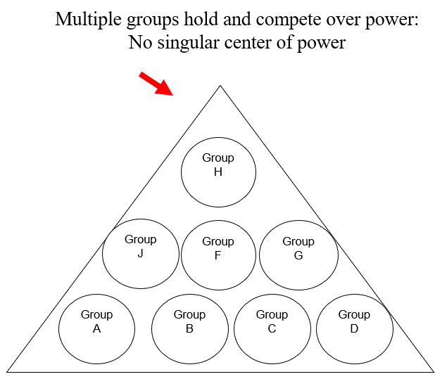
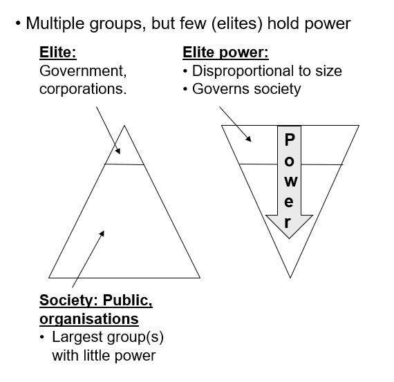

# Political Science — Master Notes

by Jakob V. Stangel

> One running document for the whole course, organised by **Part → Lecture → readings**.
> Format per reading: **Résumé → ★ Heart of it → Key concepts → Section-by-section → Cases → Key terms → Exam pointers.**

## Overview — where everything is
*(Everything below is clickable — jump straight to a lecture, reading, case, or fun-facts box.)*

**Part I · Political Systems & Institutions**
- **[Lecture 1: Introduction — Power, Politics & Political Science (MDJ)](#lecture-1)** — [OD Ch. 1: Introduction](#od-ch-1--introduction) · [Ansell Ch. 1](#ansell--why-politics-fails-ch-1) · [the chain, worked](#ansell-chain) · [★ Fun facts](#ff-module1)
- **[Lecture 2: The State (AUW)](#lecture-2)** — [OD Ch. 2: The Modern State](#od-ch-2--the-modern-state) · [OD Ch. 4: States & Identity](#od-ch-4--states-and-identity) · [★ Fun facts](#ff-module2)
- **[Lecture 3: Political Regimes (FK)](#lecture-3)** — [OD Ch. 3: States, Citizens & Regimes](#od-ch-3--states-citizens-and-regimes) · [regime taxonomy](#c3-taxonomy) · [★ Fun facts](#ff-lecture3)
- **[Lecture 4: Systems of Government](#lecture-4)** — [OD Ch. 5: Governing Institutions](#od-ch-5--governing-institutions-in-democracies) · [parliamentary vs presidential vs semi-presidential](#c5-comparison) · [★ Fun facts](#ff-lecture4)
- **[Lecture 5: Participation and Representation (FK)](#lecture-5)** — [OD Ch. 6: Participation & Representation](#od-ch-6--institutions-of-participation-and-representation) · [electoral systems compared](#c6-electoral) · [★ Fun facts](#ff-lecture5)

> *(All lectures so far fall under **Part I**. New lectures go under Part I until the syllabus introduces a new Part.)*

---

Part I · Political Systems &amp; Institutions

# Lecture 1: Introduction — Power, Politics, and Political Science (MDJ)

**Required reading:** OD ch. 1 · Ansell (2023) ch. 1

**Core theme:** *What is politics, and how do we study it?* Two complementary lenses — OD gives you the **discipline's toolkit** (what comparative politics is + the main theory families), Ansell gives you a **single analytical engine** (political economy: self-interest → collective-action problems → the need for political "promises").

---

## OD Ch. 1 — Introduction
**Book:** Orvis & Drogus, *Introducing Comparative Politics: Concepts and Cases in Context*, 5th ed. (CQ Press/SAGE, 2021)

### Chapter résumé
The opening chapter defines the field and hands you the analytical vocabulary used for the rest of the book. It answers three "meta" questions — *what* comparative politics is, *why* to study it, and *how* comparativists do research — and then lays out the **three key questions** that organize the whole discipline: **What explains political behavior? Who rules? Where and why?** Most of the chapter is a guided tour of the competing **theory families** used to answer the first two questions. It closes with the book's plan (three parts) and its method of teaching through **eleven recurring country case studies**.

★ <strong>The heart of the chapter:</strong> the whole field collapses into <strong>three questions</strong> — <em>what explains behaviour? · who rules? · where &amp; why?</em> — answered with the <strong>Interests / Beliefs / Structures</strong> and <strong>Pluralist / Elite</strong> frameworks, all read through <strong>Lukes' three dimensions of power</strong>. Master those and you can attack any comparative-politics question.

### Key concepts / "modes" to use
These are the analytical toolkits you're expected to *apply* to cases later:
- **Three dimensions of power** (Lukes) — the lens for spotting *where* power operates.
- **Empirical vs. normative theory** — always separate "what *is*" from "what *ought to be*."
- **Research methods** — single-case study · comparative method (most-similar / most-different systems) · quantitative statistics.
- **Explaining behavior → 3 families:** Interests · Beliefs · Structures.
- **Who rules → 2 families:** Pluralist vs. Elite theory.

### Section-by-section main points

#### Comparative Politics: What Is It? / How to Study It?

***What is politics?*** *(expanded with the lecture — MDJ)*
- **OD's definition:** politics = *"the process by which human communities make collective decisions"* (any scale, village → international body). This is a **procedural** definition — it's about *how* decisions get made, not their content. Four **implications**:
  - **Group, not private, decisions** — it concerns the group.
  - **The whole community** — decisions normally bind everyone.
  - **The process** — focus is on the decision-making *process*.
  - **≠ polity / policy** — distinguish **politics** (the process) from **polity** (the rules/institutions) and **policy** (the outcomes).
- Also: the process applies **across regime types**, needn't involve **large groups**, and is **not necessarily inclusive** (decisions are often made by small, unelected groups).
- **The distributional definitions** (what OD's definition leaves out — *the distribution of resources*):
  - **Lasswell (1936):** politics = *"who gets what, when, how."*
  - **Easton (1953):** politics = *"the authoritative allocation of values for a society."*
  - → politics as a **distributional game**: the capacity to distribute **material and non-material resources** (who wins, who loses).
  - Two key **assumptions** behind this view: **① scarcity** of resources (no scarcity → no distributional battle) and **② preference heterogeneity** (people want different, often conflicting, things).
- **Comparative politics** = the subfield comparing power & decision-making *within* countries (contrast: **international relations** studies *between*/beyond states).
- **Power — the three faces / dimensions.** *This is the chapter's master concept — it recurs as the lens for every theory later, so know it cold.* The lecture runs **one example** (a parliamentary **tax increase**) through all three so the differences are clear:

| Face | Who (attribution) | Core idea | The tax example | Power = |
|---|---|---|---|---|
| **1st · Decision-making** | **Dahl (1957)** | A gets B to do something B would not otherwise do — **observable** conflict & decisions | A majority in Parliament passes the tax increase despite strong opposition | **winning an observable decision** |
| **2nd · Agenda-setting** | **Bachrach & Baratz (1962)** | Power through **non-decision-making** — keeping threatening issues **off the agenda** via rules/values | Powerful actors keep the tax increase off Parliament's agenda, so no debate or vote ever happens | **controlling what gets decided** |
| **3rd · Ideological** | **Lukes (1974)** | Shaping people's **wants, perceptions & preferences** — even with *no observable conflict* | People come to see taxing the wealthy as harmful/illegitimate, so the demand never even arises | **shaping wants & preferences** |

  - **The difference in one line:** the 1st face is about *winning* a visible fight; the 2nd is about *stopping the fight from happening*; the 3rd is about *making sure no one wants to fight in the first place*. Power gets **less visible** as you go down.
  - **Why it's central — the recurring pay-off:** each later theory is graded by *which dimension it can see*. Rational choice & pluralists see essentially only the **1st**; rational-choice institutionalists add the **2nd**; psychological theories, postmodern discourse, historical institutionalism and elite theory reach into the **2nd & 3rd**. Being able to say "this theory only captures the first dimension" is a core analytical move.
  - **Worked example of the move (straight from the book):** *Rational choice* accepts people's preferences **as given** and only asks how they rationally pursue them — so it lives purely in the **1st dimension**, ignoring how preferences are *formed*. That is exactly why it "can't explain preferences in advance" and stumbles on the **[cross-national union puzzle](#case-unions)** (why French unions went communist while US unions chased only wages): it has no way to see the **3rd-dimensional** forces that *shaped* those preferences. **Psychological theories** and **historical institutionalists**, which do reach the 3rd dimension, are what step in to explain it. → *This is the template: name the theory, name the dimension(s) it can't see, then name a rival theory that reaches further.*

#### Why Study Comparative Politics? — three benefits

1. Understand political events in specific countries (and inform foreign policy).
2. Draw **lessons** transferable from one place to another (e.g. presidential systems may worsen post-civil-war conflict — invisible if you only study the US).
3. Build **broad theories** of how politics works.

#### How Do Comparativists Study Politics? — methods

- No lab: political actors *react* to being studied, so no perfect control.
- **Empirical theory** = explains what *does* occur (describe pattern → explain cause → predict). **Normative theory** = what *ought* to occur. The discipline is mostly empirical, but normative concerns shape which questions get asked (and that's legitimate).
- **Three research methods:**
  - **Single-case study** — deep dive into one case; generates/tests theory; *process tracing* links causes→effects; **deviant cases** expose theory limits. Never definitive beyond itself.
  - **Comparative method** — mimic the lab via careful case selection:
    - **Most-similar systems** — cases alike in many ways, differ on the key variable.
    - **Most-different systems** — cases differing in many ways but sharing the outcome (e.g. revolutions: France, Russia, China, Iran…).
  - **Quantitative statistical techniques** — reduce evidence to numbers, compare hundreds of cases (e.g. the [civil-war & diamonds](#case-diamonds) study: civil war driven more by *lootable resources* than ethnicity).
- **Scientific-method vocabulary:** theory · hypothesis · variable · **dependent** vs **independent** variable · **control**.
- Best modern scholarship *combines* methods (quant for patterns + case studies for causal depth).

#### Three Key Questions in Comparative Politics

1. **What explains political behavior?** (core of all political science)
2. **Who rules?**
3. **Where and why?** (comparativists' distinctive contribution — the same explanation across different times/places?)

#### Q1 — What Explains Political Behavior? → three answer-families

*The chapter's (and the exam's) core. Each family splits into competing theories — below, each with its **core idea**, its **critique**, and which **face of power** it "sees." Learn the theory names + one line each.*

**① Interests — behaviour = actors pursuing their own preferences**

| Theory | Core idea | Critique | Sees face |
|---|---|---|---|
| **Rational choice** | Rational individuals pursue self-defined **preferences** instrumentally (borrowed from economics; starts at the individual). | Can't know preferences **in advance** → weak predictive power; struggles with cross-country variation. Group-behaviour critics: **Achen & Bartels**. | 1st |
| **Psychological** | **Non-rational** factors — personal experience, **emotions**, personality — shape behaviour (**Petersen** on fear; **Hetherington & Weiler** on personality). | Its focus on the individual makes **group** behaviour hard to explain. | 3rd |

**② Beliefs — behaviour = values & ideas**

| Theory | Core idea | Critique | Sees face |
|---|---|---|---|
| **Political culture** | Shared **attitudes, values, symbols** shape behaviour. *Modernist:* clear, identifiable civic values (Almond & Verba's **civic culture**; **postmaterialist** shift, Inglehart). *Postmodernist:* culture = symbols open to interpretation in **discourse** (Foucault). | Do countries really have *one* culture? Culture may be an **effect**, not a cause; postmodernism accused of explaining nothing. | 2nd–3rd |
| **Political ideology** | A **systematic, conscious belief-set** guides action (liberalism, communism, fascism). | May just **justify** actions really driven by self-interest or culture. | 3rd |

**③ Structures — behaviour = shaped & limited by broad structures**

| Theory | Core idea | Critique | Sees face |
|---|---|---|---|
| **Marxism** | Behaviour explained by **class conflict** rooted in the economic system (bourgeoisie vs proletariat — **Marx**). | Overlooks **non-economic** motives (religion, nationalism) and other sources of power. | 2nd–3rd |
| **Institutionalism** | **Institutions — the "rules of the game"** — shape behaviour (*rational-choice institutionalist*, **Weingast**; *historical institutionalist*, **Haggard & Kaufman**; e.g. the [US two-term tradition](#case-twoterm)). | Institutions may **reflect** self-interest or culture rather than *cause* behaviour. | 2nd (RC) / all 3 (historical) |

#### Q2 — Who Rules? → two answer-families

- **Pluralist theories** (classic statement: **Robert Dahl**, *Who Governs?* 1961) — society = many competing groups; power *dispersed*; no group wins permanently; policy = compromise. (Thinks mostly in the **1st dimension** of power.) Claims to apply even to authoritarian states (Soviet factions; African patron–client networks).
- **Elite theories** — every society ruled by a small elite controlling ~all power (uses **2nd & 3rd dimensions**). Variants:
  - **Marxism** — ruling class = owners of the economy (bourgeoisie); state = "executive committee of the bourgeoisie."
  - **Power elite** (C. Wright Mills) — interlocking economic + political + military elites.
  - **Oligarchy** (Winters) — extreme wealth as power, used to protect wealth.
  - **Patriarchy** (feminist) — rule by men; politics/military tied to masculinity.
  - **Racial elite / "new Jim Crow"** (Alexander) — one race maintains dominance via law, wealth, discourse.
- **Test for who rules:** Who holds formal power? Who influences decisions? Who benefits? → few = elite; many = pluralist.

**Visualising it (from the lecture):**

**How to read them.** *Pluralist* (first diagram): power is **dispersed** among many competing groups — *no single centre*. *Elitist* (second): a **small elite** (government, corporations) sits at the top and holds power **disproportionate to its size**, while the **largest group — the public/society — has little power**; the inverted triangle shows **power flowing *down*** onto them. Same society, opposite claim about where power really sits.

#### Q3 — Where and Why?

- Add the **comparative dimension** to Q1 & Q2: why do welfare states differ (see the [Sweden vs US welfare state](#case-sweden) case)? Explanations compete — rational choice / ideology / institutions. Comparison across cases reveals patterns a single case hides.

#### Plan of the Book

- **Part I** — the state (what it is, strong/weak; state–citizen–regime; state–identity).
- **Part II** — how political systems work (democratic & authoritarian institutions; participation; regime change).
- **Part III** — political economy & policy.
- **11 recurring country cases:** 4 wealthy democracies (Britain, Germany, Japan, US); 2 post-communist (China, Russia); largest enduring democracy (India); the one theocracy (Iran); 3 post-authoritarian democracies (Brazil, Mexico, Nigeria).

### Cases & examples
The concrete cases the chapter uses. Each one: *what actually happened* → *what it illustrates*.

- **Tunisia vs Syria (2011).** Both were swept up in the Arab Spring protests, yet the outcomes split completely: Tunisia negotiated a relatively **peaceful transition to democracy**, while Syria collapsed into a long, brutal **civil war**. → *Illustrates:* why comparison matters — understanding a country's internal dynamics has real foreign-policy stakes; it also undercuts the lazy claim that "Arab/Islamic culture" is uniformly anti-democratic (same culture-family, opposite results).

- **Post-civil-war presidentialism.** Americans treat their directly-elected presidency as *the* stable model. But in a country just out of civil war it's **winner-take-all**: only one side's candidate can win the top job, so the losers may prefer to **restart the war** than live with the result. A **power-sharing** system that gives every major group a slice of national power tends to be safer. → *Illustrates:* a lesson you simply cannot see by studying the US alone — the payoff of comparison.

- **Civil war & diamonds** (Collier & Hoeffler; **Sierra Leone**). A large **quantitative** study of hundreds of civil wars found that **ethnic division is not the main cause** people assume. War is far more likely where a group can seize a **valuable, lootable resource** — like the diamonds fuelling Sierra Leone's 1990s war. Where there's no such prize, ethnic division rarely turns violent. → *Illustrates:* the quantitative method + a genuinely counter-intuitive finding.

- **Ukraine 2014 — "is it a civil war?"** When fighting erupted in 2014 (with a Russian military presence backing one side), scholars couldn't cleanly classify it: *how much* violence, for *how long*, before it "counts" as a civil war? → *Illustrates:* the hard first step of any scientific study — **defining and measuring your variables** precisely.

- **Almond & Verba, *The Civic Culture* (1963).** They surveyed citizens across five countries and argued that stable democracies (US, UK) share a **"civic culture"** — people participate *and* defer enough to let leaders govern — whereas **Mexico** had a **"subject" culture** (citizens saw themselves as subjects, not participants), fitting its authoritarian rule until 2000. → *Illustrates:* the classic **modernist** political-culture claim — and the standard critique that culture may be an *effect* of institutions, not their cause.

- **US Catholics shifting Democrat → Republican.** Mid-20th-c. working-class Catholics voted **Democrat** on economic interest. As they grew affluent, they came to prioritise **moral/cultural** issues (e.g. abortion) and drifted **Republican**. → *Illustrates:* **postmaterialism** (Inglehart) — political culture *changing over time* and reshaping party alignments.

- **"Family values" (Reagan vs Clinton).** No US politician dares oppose "family values," yet the phrase has **no fixed meaning**: Reagan's Republicans used it to claim the traditional middle-class family; Clinton's Democrats **reinterpreted** it to mean single mothers and two-income families needing afterschool programmes. → *Illustrates:* the **postmodernist** point — political symbols are contested and redefined through **discourse** (a play for the 3rd dimension of power).

- **Unions: France / US / UK.** Same institution, three preference-sets: **French** unions tied themselves to the **Communist Party** and pursued broad ideological goals; **US** unions stayed "bread-and-butter" (wages & conditions), shunning socialist parties; **British** unions built their own **Labour Party**. → *Illustrates:* the puzzle for **rational choice** — it takes preferences as given, so it can't explain *why* they differ so sharply across countries (this is the worked example above).

- **US two-term tradition** (Washington → FDR). Washington voluntarily stepped down after two terms; **no president broke the norm for 150+ years** until FDR won a third term in **1940** — after which it was written into the Constitution (22nd Amendment). → *Illustrates:* an **informal institution** that shaped behaviour purely because leaders and citizens believed it *should*.

- **Chile's democratic transition (1990s).** One of the most successful exits from military rule — explained three different ways: **rational-choice institutionalists** (elites cut a strategic constitutional bargain that served their interests), **political-culture** theorists (Chilean values favoured democracy), **historical institutionalists** (Chile could revive its earlier stable democratic institutions, a legacy neighbours lacked). → *Illustrates:* how the **same event** gets three competing explanations — and the analyst's job is to weigh them.

- **Sweden vs US welfare state.** Sweden runs a large, expensive welfare state; the US spends far less. Why do two rich democracies diverge? **Interests:** strong labour won in Sweden, business overpowered labour in the US. **Beliefs:** Sweden's dominant Socialists spread social-democratic ideology; US "make it on your own" culture rejects socialism. **Institutions:** Sweden's unified labour body (LO) became central to policymaking; US unions stayed decentralised and weak. → *Illustrates:* the lead **"Where and why?"** puzzle, with one answer from each theory family.

- **US corporate power / oligarchy** (Winters). Is the US genuinely democratic if a **corporate elite** holds outsized power? Winters argues extreme wealth ("material power") lets **oligarchs** hire lawyers and lobbyists to shield their income from redistribution. → *Illustrates:* a **"Who rules?"** case pitting **elite theory** against **pluralism**.

**The 11 recurring countries** (used across the whole book): Britain, Germany, Japan, USA (wealthy democracies) · China, Russia (post-communist) · India (largest democracy) · Iran (theocracy) · Brazil, Mexico, Nigeria (post-authoritarian).

### Key terms
| Term | Meaning |
|---|---|
| Politics | Process by which communities make collective decisions (procedural; group, whole community, ≠ polity/policy) |
| Polity / Policy | The rules & institutions / the outcomes (vs *politics* = the process) |
| Distributional game | Politics as allocating resources — "who gets what" (Lasswell; Easton) |
| Scarcity / Preference heterogeneity | The two assumptions behind the distributional view of politics |
| Comparative politics | Subfield comparing power/decision-making across countries |
| Three faces of power | (1) decision-making, Dahl; (2) agenda-setting, Bachrach & Baratz; (3) ideological, Lukes |
| Empirical / Normative theory | Explains what *does* / what *ought to* occur |
| Single-case study | Deep study of one case (uses process tracing) |
| Comparative method | Careful case selection: most-similar vs most-different systems |
| Rational choice theory | Actors rationally pursue self-defined preferences |
| Political culture | Widely held attitudes/values/symbols about politics |
| Civic culture | Culture supporting stable democracy (Almond & Verba) |
| Political ideology | Conscious systematic belief-set about how politics *ought* to be |
| Institutionalism | Institutions ("rules of the game") explain behavior |
| Pluralist theory | Power dispersed among competing groups |
| Elite theory | A small elite controls virtually all power |
| Patriarchy | Rule by men |

### Exam pointers
- Be able to **apply the 3 dimensions of power** to an example, and say which theory family "sees" which dimension.
- Know the **Interests / Beliefs / Structures** trichotomy for Q1 and **Pluralist vs Elite** for Q2 — with one named theorist per box (the names are in the two tables above: e.g. Interests → *Achen & Bartels / Petersen*; Beliefs → *Almond & Verba, Inglehart, Foucault*; Structures → *Marx, Weingast*; Pluralist → *Dahl*; Elite → *Mills, Winters, Alexander*).
- Distinguish **most-similar vs most-different** systems designs with an example.
- Always flag **empirical vs normative** when a question mixes them.

---

## Ansell — *Why Politics Fails*, Ch. 1
**Book:** Ben Ansell (2023), *Why Politics Fails: The Five Traps of the Modern World – and How to Escape Them*, Penguin.
> *Note:* the provided PDF is titled **"Introduction: Simple Problems, Impossible Politics"** — this is the framing chapter the syllabus lists as "chapter 1." It sets up the whole book.

### Chapter résumé
Ansell argues that our biggest challenges (climate change is the opening example) are often **"simple problems with impossible politics"**: we understand the solution but can't get people to act. The reason is **political economy** — individuals are **self-interested**, and self-interest predictably collides with the collective good, producing **collective-action problems**. He introduces the **five goals** we broadly agree on — **Democracy, Equality, Solidarity, Security, Prosperity** — each of which is also a **trap**. Politics is fundamentally about making **collective promises** to each other; but promises can't be externally enforced, so they only work when made **self-enforcing** through **institutions** and **norms**. The book's project: learn to spot the five traps and escape them.

★ <strong>The heart of the chapter:</strong> one chain explains why politics fails — <strong>self-interest → collective-action problem → tragedy of the commons → the need for self-enforcing political promises (institutions &amp; norms)</strong>. If you learn one thing here, learn to <a href="#ansell-chain">run that chain</a>.

### Key concepts / "modes" to use
- **Political economy** — model individuals as self-interested utility-maximizers, then scale up to society.
- **Self-interest → preferences → constraints → trade-offs** — the micro engine.
- **Collective-action problem** — self-interested individuals undermine a shared goal.
- **Tragedy of the commons** & **externalities** (negative/positive) — the recurring failure shapes.
- **Politics as promises** — collective, unenforceable, needing **self-enforcing** design.
- **Institutions** (formal rules) & **norms** (informal expectations) — what makes promises stick.
- **The Five Traps:** Democracy · Equality · Solidarity · Security · Prosperity.

### Section-by-section main points

#### Opening — Simple Problems, Impossible Politics

- Climate change: science is a century old and well understood; the road from emissions → warming is *simple*. The hard part is getting anyone to act — a **global problem with domestic politics**. No world government to enforce, so everyone free-rides.
- International attempts show politics *can* work (Paris 2015) or fail (Kyoto, Copenhagen) — success came from flexibility, vague wording, deferral.
- Climate tests all **five** goals: democracy (global consensus?), equality (should richer pay more?), solidarity (do rich nations owe poor?), security (climate refugees, enforcement?), prosperity (short-term gain vs long-term survival).

#### Common ground

- **Politics** = how we make collective decisions / make promises to each other in an uncertain world. Essential for solving shared dilemmas.
- **Double-edged sword:** we need politics but hate it; we look for alternatives (markets, technology, strong leaders) but these are **"false gods"** — they still run into human disagreement.
- Disagreement is **inevitable** (elections have losers; spending is unequal; who guards the guards?). Push politics down in one place, it pops up elsewhere ("paste in the toothpaste tube").
- Despite polarization, most people **agree on five things** — which are also five **traps**.

#### The five goals (each a trap)

- **Democracy** — right/ability of the mass public to choose and replace leaders. ~½ the world lives in democracies; broadly popular (86% in World Values Survey favor it) but under pressure (the "third wave" stalled; populism, referendums, attacks on media/expertise).
- **Equality** — everyone treated the same; but debate over *outcomes* vs *opportunities* and redistribution. Wide consensus that income gaps are too large (2019: only 7% disagreed), yet inequality has *risen* in rich countries since the 1980s → populist backlash ("inequality paradox").
- **Solidarity** — support for fellow citizens in hard times (illness, bad luck). Underpins popular "third-rail" policies (US Social Security, UK NHS). COVID-19 showed global health interdependence.
- **Security** — the most basic desire: to be safe. 70% prefer security over freedom (highest where war is recent). Concerns: violence *within* states, police violence ("who guards us from our protectors?"), return of interstate war (Ukraine).
- **Prosperity** — enough money to live/grow; but endless growth warms the planet → trade-off between prosperity and environmental survival.

#### Political economy (the method)

- The school of thought taking seriously how individual and society interact: start with a **model of each of us** (what we want + how we plan to get it), then pan out to society and watch **best-laid plans undermined by… us**.
- **Basic model:** everyone is **self-interested** — has ordered **preferences** and tries to **maximize utility** (pick the highest-value option). Not an ethical claim — a *predictive analytical tool*.
- **Methodological individualism:** start from individuals, not classes/cultures/groups.
- **Constraints & trade-offs:** you can't have everything (physical, institutional, social limits) → every choice sacrifices an alternative (coffee vs tea; lower taxes vs social liberalism at the ballot box).
- Even **voting** is a puzzle: your single vote is unlikely to be decisive, so turnout must be partly explained by a sense of **duty**. Politicians too are self-interested (must win elections → campaign arms race).
- Studying self-interest is **liberating**, not cynical: even apparently selfless behavior often has a self-interested logic (e.g. the rich opposing public-education spending that "devalues" their kids' advantage).

#### Collective-action problems

- When self-interested individuals interact, they can inadvertently wreck a shared goal.
- **Example — the [[anchor:Cod Wars]]** (Britain vs Iceland, 1950s–70s): overfishing a shared resource.
- **Tragedy of the commons:** without ownership, everyone fishes freely → stocks collapse; my self-interest hurts yours.
- **Externalities:** a market action's effect on a third party — mostly **negative** (pollution, congestion), sometimes **positive** (a neighbor's rose garden). Political life is "full of externalities."
- Root cause: we are **interdependent** — my choice affects your options — and we can't commit others (or ourselves) to "do the right thing." *The making of a tragedy.*

#### Politics as a promise

- We're *smart*: we anticipate what others will do — which is exactly why collective-action problems arise (can't blame "stupidity").
- Politics = making **collective promises** (politicians→voters, allies→adversaries). A **promise** ≠ a **contract**: it **can't be legally enforced by a third party** — there's *no higher power than politics itself*.
- So political promises are **fragile and temporary**; they succeed only when **self-enforcing** — designed so that reneging is hard.
- Two tools to grant promises permanence:
  - **Institutions** — formal rules/organizations that lock in expectations (e.g. the **US Senate filibuster**: powerful, flawed, over-represents small states, hard to remove safely — shows institutions structure behavior even when dysfunctional).
  - **Norms** — informal expectations about how we should behave; invisible but powerful, vaguer and harder to enforce than rules; not every leader can invoke them.
- Because institutions & norms vary, **politics plays out differently around the world** (e.g. Nordic high-trust, inclusive systems are hard to transplant).

#### The traps (close)

- Each of the five goals faces a **trap triggered by self-interest** that blocks the collective goal. Traps aren't destiny — but they're **insidious, pervasive, even enticing**.
- Two options: spot the traps "in the wild" and step around them, or — if already caught — learn to **escape**. *Only by understanding why politics fails can we make it succeed.*

**The chain, run once (worked).** This is the single argument the whole chapter builds — here it is end-to-end on the [Cod Wars](#gl-cod-wars):
1. **Self-interest.** Every fisherman, British and Icelandic, tries to maximise his *own* catch (the political-economy starting model).
2. **→ Collective-action problem.** They're **interdependent** — fishing the *same* sea — so each one acting on self-interest undermines the shared goal (a sustainable stock). Individually rational, collectively ruinous.
3. **→ Tragedy of the commons / externality.** The sea is **unowned and hard to monitor**, so no one can be excluded → everyone overfishes → the stock collapses (**tragedy of the commons**). Put the other way: my extra catch imposes a cost on you — a **negative externality**.
4. **→ Need for political promises.** We'd all be better off with a binding catch limit, but there's **no world government** to enforce one — so the *states* must make **political promises** to each other on behalf of their fishermen.
5. **→ Institutions & norms.** A promise can't be enforced by any third party, so it only holds if it's **self-enforcing** — locked in by **institutions** (formal rules: recognised fishing limits/zones) and **norms** (informal expectations). When Iceland kept *extending* its limits, the promise broke and new ones were needed — *"politics never ends."*

**Reusable template (works on any trap):** name the **self-interest** → show the **interdependence** that makes it a **collective-action problem** → identify the **commons/externality** failure → state the **promise** that would fix it → name the **institution/norm** that could make the promise stick.

### Key terms
| Term | Meaning |
|---|---|
| Political economy | Study of how self-interested individuals and society interact |
| Self-interest | Model assumption: people pursue their own ordered preferences |
| Utility maximization | Choosing the option that yields the highest personal value |
| Constraint / trade-off | Limits force sacrifice of one option for another |
| Collective-action problem | Self-interested individuals undermine a shared goal |
| Tragedy of the commons | Unowned shared resource gets over-exploited |
| Externality | Effect of a transaction on a third party (negative/positive) |
| Politics-as-promise | Collective promises that no third party can enforce |
| Self-enforcing | Arrangement where reneging is made costly/hard |
| Institution | Formal rule/organization locking in expectations (e.g. filibuster) |
| Norm | Informal expectation about proper behavior |
| The Five Traps | Democracy, Equality, Solidarity, Security, Prosperity |

### Exam pointers
- Memorize the **five goals/traps** (Democracy, Equality, Solidarity, Security, Prosperity) — the spine of the whole book.
- Be able to [**run the chain**](#ansell-chain): self-interest → collective-action problem → tragedy of the commons/externalities → need for political promises → institutions & norms *(worked end-to-end above)*.
- Use the **Cod Wars / tragedy of the commons** as your go-to worked example.
- Key distinction: a **promise** (unenforceable, needs to be self-enforcing) vs a **contract** (third-party enforced).

### Bridge to OD
Both readings converge on **institutions** and on modelling actors via **interests/self-interest** (OD's "Interests" family = Ansell's political-economy engine). Ansell's "politics = collective decisions" is almost verbatim OD's definition of **politics**. Good to cite them together on *why institutions matter*.

---

## ★ Fun facts & memorable details

> The sticky examples, surprising stats and quotable lines from this module — the stuff worth dropping into an essay or exam answer.

**Memorable examples (great to cite)**
- **The Cod Wars** (Britain vs Iceland, 1950s–70s): two NATO allies clashing over cod — boats rammed, one accidental death by electrocution, and Icelandic coastguards fitting **wire-cutters** to slash British trawler nets. A perfect little tragedy-of-the-commons story. *(Ansell)*
- **Civil war & diamonds:** statistical research (Collier & Hoeffler) found civil wars are driven more by control of **lootable resources** — diamonds, e.g. Sierra Leone — than by ethnic division. *(OD)*
- **The "new Jim Crow"** (Michelle Alexander): mass incarceration reframed as a modern system of racial control. *(OD)*
- **George Washington's two-term tradition:** an *informal* institution that held for 150+ years until FDR broke it in 1940 — then it was locked into the Constitution. *(OD)*
- **"Family values"** as a contested symbol — Reagan's Republicans and Clinton's Democrats each reinterpreted it (the postmodernist point about discourse). *(OD)*

**Surprising stats**
- **86%** worldwide (World Values Survey) say democracy is a good way to run a country — and in **China, Ethiopia, Iran & Tajikistan over 90%** agree with pro-democracy statements, *more* than in the US. *(Ansell)*
- **~70%** say they'd prefer **security over freedom** — highest where war is recent. *(Ansell)*
- **~95%** across wealthy countries think government should provide healthcare — even **85% in the US**. *(Ansell)*
- **2016** was, by some counts, the **most violent year since WWII**. *(Ansell)*

**Quotable lines**
- Marx: the modern state is *"the executive committee of the whole bourgeoisie."* *(OD)*
- Keynes: *"In the long run we are all dead."* — on why forecasting fails. *(Ansell)*
- Ansell on the inescapability of politics: push it down in one place and it pops up in another, *"like the proverbial paste in the toothpaste tube."*
- The **NHS** as Britain's *"national religion."* *(Ansell)*

**Trivia**
- OD's example of why natural science can be "purer": South Korea's **Woo Suk Hwang faked stem-cell results** — but biologists don't get *normatively* attached to findings the way political scientists do.
- The CO₂-warming theory dates to **1861**, revived in a **1956 New York Times** piece imagining "tigers roaming… and squawking Arctic parrots." *(Ansell)*

---

# Lecture 2: The State (AUW)

**Required reading:** OD ch. 2 (*The Modern State*) · OD ch. 4 (*States and Identity*)

**Theme of the lecture:** the **state** itself — first *what a modern state is* and why some are strong while others fail (ch. 2), then how **identity** (nation, ethnicity, race, class, religion, gender, sexuality) becomes the central challenge to the state and to the liberal ideal of equal citizenship (ch. 4). Ch. 2 gives you the **anatomy** of the state; ch. 4 shows the **fault lines** running through it.

**Lecture frame (AUW — Ayça Uygur Wessel).** The lecture hangs both chapters on **four questions** — use them as the skeleton:
1. **What is a state?** → the four characteristics (OD Ch. 2).
2. **Where did states come from?** → two pathways: **European (war-driven)** & **colonial**.
3. **Why are some states stronger than others?** → theories of **strength** & **weakness**.
4. **Who does the state represent?** → the **nation / identity** puzzle (OD Ch. 4).

**State ≠ Nation ≠ Regime ≠ Government** *(memorise the one-liners):*
- **State** — the *permanent administrative apparatus*.
- **Nation** — a *group of people with a shared sense of belonging*.
- **Regime** — the *fundamental rules* of the state (its type).
- **Government** — the *people who currently run* the state.

**Two exam-style puzzles the lecture poses:**
- ***What comes first?*** Is there a neat causal order **Territory → Sovereignty → Legitimacy → Bureaucracy**, or are the four **mutually reinforcing**? (Best answer: mostly mutually reinforcing — bureaucracy raises the tax that funds the army that defends the territory that grounds sovereignty…)
- ***Greenland:*** rate its characteristics — strong on **territory**, but weak **external sovereignty** (part of Denmark). Shows the characteristics come in **degrees**, not all-or-nothing.

---

## OD Ch. 2 — The Modern State
**Book:** Orvis & Drogus, *Introducing Comparative Politics*, 5th ed., ch. 2.

### Chapter résumé
Defines the **modern state** — the foundational unit of comparative politics — and separates it from *country*, *nation*, *government*, and *regime*. It argues every modern state shares **four characteristics** (territory, external/internal sovereignty, legitimacy, bureaucracy) that make it an exceptionally powerful ruling apparatus. It traces the state's **historical origins** (first in Europe, 15th–18th c., then exported worldwide by colonialism, universal only by the 1960s) and explains why states vary in **strength** (the strong/weak/failed spectrum, political goods, the resource curse, quasi-states). **~Half the chapter is eleven country case studies** ranked strongest→weakest — so weight your revision toward the cases.

★ <strong>The heart of the chapter:</strong> a modern state = <strong>four characteristics</strong> (territory · external + internal sovereignty · legitimacy · bureaucracy); <em>how fully a state has them</em> decides whether it is <strong>strong, weak, or failed</strong>. Use the four as a checklist on any case.

**The red thread.** One question runs through the whole chapter: **does an entity have the four characteristics — and how fully?** That single test defines what a state *is* (the characteristics), explains where states *came from* (building the four via war & colonialism), and grades why they *differ in strength* (strong = has all four; failed = has lost them). Every case is scored on the same four.

### Key concepts / "modes" to use
- **The four characteristics of the modern state** — the analytic backbone: **territory · external & internal sovereignty · legitimacy · bureaucracy.**
- **Sovereignty split:** *external* (recognised independence from outside powers) vs *internal* (sole law-making/enforcing authority inside) — they can come apart.
- **Weber's monopoly on the legitimate use of force** — the state claims to be the only body that may legitimately coerce.
- **Weber's three types of legitimacy** — traditional · charismatic · rational-legal.
- **Strong / weak / failed state** — a *continuum* measured by whether the state supplies **political goods** (security, rule of law, infrastructure).
- **Ideal type** — no real state matches the model perfectly; use it as a yardstick.

### Section-by-section main points

#### What is a state? — state vs. the rest

***Core:*** don't confuse the four — **state** (the apparatus) ≠ **government** (who runs it now) ≠ **regime** (the type of rules) ≠ **nation** (a people).
- A **state** = "an ongoing administrative apparatus that develops and administers laws and implements policies in a specific territory." **Government** = the transient occupants (US: "administrations"); **regime** = the *type* of government (liberal democracy, fascism — ch. 3); **nation** = a people with shared identity (ch. 4); **country** = too vague for analysis.

#### The four characteristics of a state *(heavily emphasised)*

***Core:*** four features together make the state a uniquely powerful ruling apparatus — **the checklist you score every case on.**
- **① Territory** — clearly defined borders; sizes range from Russia (6.5m sq mi) to micro-states under 200 sq mi. Borders still shift (Kosovo 2008, South Sudan 2011), usually to align state with nation.
- **② External vs internal sovereignty** — *external* = recognised independence (counter-examples: colonies, Vichy France, Manchukuo — had territory/government but externally controlled); *internal* = sole authority to make/enforce law, defended against secession. A state needs *others to recognise it* (see the [Somaliland](#c2-somaliland) case). Sovereignty ≠ omnipotence.
- **③ Legitimacy** — the recognised right to rule; boosts sovereignty *far more cheaply than force*. **Weber's three types:** **traditional** (long-standing custom — divine right of kings), **charismatic** (personal virtue/heroism — early Mao), **rational-legal** (leaders chosen by accepted laws — elected under a constitution; Weber's marker of *modern* rule). In practice regimes **blend all three**. Collier: without legitimacy you get **repression, conflict, or "theater."**
- **④ Bureaucracy** — appointed officials who implement law (collect tax, run the army, pave roads). Weak legitimacy + weak bureaucracy = the two key drivers of state weakness.

#### Where did states come from? — two pathways *(moderate)*

***Core:*** the four characteristics were **built two ways** — Europe by *war & competition*, the rest by *colonial conquest* — and the route shapes later capacity.

**① European pathway — "war made the state" (Charles Tilly).** A causal flow driven by **military competition**:
> **Feudalism** (overlapping authorities) → **absolute monarchies** (consolidate territory & sovereignty; *"L'état, c'est moi"* — state not yet separate from the ruler) → **war & political competition** (15th–18th-c. rulers were "war-lords/ladies") → **taxation + armies + administration** → **efficient bureaucracies** → **stronger territorial states.**
- **Tilly's four activities** (each reinforces the state — he likens the early state to a **protection racket**): **war-making** (neutralise external rivals) · **state-making** (neutralise internal rivals) · **protection** (neutralise clients' enemies) · **extraction** (raise the **tax** to fund the first three).
- **Brandenburg-Prussia** *(worked example):* surrounded by larger powers → needed armies → needed revenue (poor economy) → heavy **taxation in return for protection** → efficient bureaucracy → high **state capacity**. Prussia was strong **not because it always won**, but because it had to fight in a **very competitive environment**, which raised the incentive to build a strong state.
- Competition cut Europe from **~500 sovereign entities in 1500 to ~50 today**. The *truly* modern state arrives once it is seen as **separate from the ruler** and liberalism turns subjects into **citizens** (Glorious Revolution 1688; French Revolution 1789). *(Premodern states elsewhere ruled **people** more than precise territory — China's Confucian bureaucracy was closest to modern, ~1,800 years early.)*

**② Colonial pathway — statehood through conquest.** European powers **exported** borders, administrative structures and international recognition — but colonial borders **ignored existing political communities**. Result: **statehood ≠ state capacity** — postcolonial states inherited legal external sovereignty but **weak internal sovereignty**, imposed institutions and divided loyalties → mostly **very weak states** (universal statehood only by the 1960s). **Main take-away: the *origins* of statehood shape how *capacity* later develops.**

#### Why are some states stronger? — strong / weak / failed *(heavily emphasised)*

***Core:*** strength = **how many political goods the state actually delivers** — a *continuum* (strong → weak → failed), not three boxes, and a state can be strong on one characteristic, weak on another.
- States supply **political goods** (Rotberg: security, rule of law, infrastructure). **Strong** = provides them generally; **weak** = only partially; **failed** = loses effective sovereignty over part/all territory (Syria, DRC, Afghanistan). Strength is a **continuum** and can move *both* ways (Fukuyama: even the US state has weakened).
- **Vicious cycle of weakness:** no resources → falling legitimacy → underpaid officials → corruption → worse services → citizens turn to mafias/private justice → the monopoly on force erodes further.
- **Why states differ — theories of *strength* (name + who):**
  - **Warfare** (**Tilly**) — external threats force state-building (Prussia).
  - **Colonial legacies** (**Acemoglu, Johnson & Robinson**) — externally imposed institutions shape later state capacity (Congo, Nigeria).
  - **Elite agreements** (**North, Wallis & Weingast**) — elites trade *private violence* for **impersonal institutions & the rule of law** (England).
  - *(+ **Fukuyama's two paths:** bureaucracy-first Prussia/Germany vs democracy-first US → machine politics.)*
- **Theories of *weakness*:**
  - **Resource curse** — resource dependence weakens **accountability** and breeds corruption (mineral revenue lets rulers ignore citizens; gives rebels a prize — *not* inevitable, cf. Norway).
  - **International system** — international **recognition** props up **quasi-states** that couldn't otherwise survive (post-1945 norm against conquest; Cold War patrons).
- Measured by the **Fragile States Index** (178 states, 12 factors — the chapter questions its equal weighting).

### Cases & examples

**Why these cases are here — circle them back to the theme.** The chapter isn't telling eleven country stories for their own sake: each is a **worked example of the chapter's spine** — the **four characteristics**, the **strong → weak → failed** spectrum, and the **different bases of legitimacy** (Weber's three types). Read *every* case for three things: **(1) how strong, and why · (2) its basis of legitimacy · (3) any sovereignty problem.** The table maps each case to the concept it best demonstrates; the write-ups below give the story, and each closing **→ line** states the tie back to the theme.

| Case | Strength | Basis of legitimacy | Best demonstrates (chapter concept) |
|---|---|---|---|
| [Germany](#c2-germany) | Strongest | shifting → liberal democracy | Fukuyama's **bureaucracy-first** path; first welfare state |
| [Japan](#c2-japan) | Strong | democracy (emperor symbolic) | **defensive modernisation** |
| [UK](#c2-uk) | Strong | traditional → rational-legal | slow **evolution**; sovereignty is **reversible** (Brexit) |
| [USA](#c2-us) | Strong | rational-legal (written constitution) | Fukuyama's **democracy-first** path; state **built by design** |
| [Mexico](#c2-mexico) | Moderate | liberal democracy (post-PRI) | loss of the **monopoly on force** |
| [China](#c2-china) | Moderate | **economic performance** | legitimacy **without** democracy |
| [Brazil](#c2-brazil) | Moderate | cycled through all types | legitimacy can rest on **many bases** |
| [India](#c2-india) | Moderate–weak | liberal democracy | democracy surviving in a **weak** state |
| [Russia](#c2-russia) | Weak | nationalism | external strength **≠** internal rule of law |
| [Iran](#c2-iran) | Weak | **theocracy** | theocratic legitimacy |
| [Nigeria](#c2-nigeria) | Weakest | contested | weak postcolonial state **+ resource curse** |
| [Somaliland](#c2-somaliland) | *(boxed)* | — | internal vs external sovereignty are **separable** |
| [ISIS](#c2-isis) | *(boxed)* | religious only | the **four characteristics** as a checklist |

- **Somaliland (internal vs external sovereignty).** After Somalia collapsed in 1991, this ex-*British* region declared independence, wrote a 2001 constitution (an elected house + a house of **clan elders**), held real elections and grew on livestock/remittances — yet **no state recognises it** (one embassy, Ethiopia's). → *Shows the two sovereignties are separable:* it has near-full internal sovereignty but zero external — and looks more state-like than recognised Somalia.
- **ISIS — "was it a state?"** From its 2014 caliphate to 2017 defeat it held Belgium-sized territory (~6m people), taxed "every bushel of wheat" and ran a bureaucracy (even a DMV). But territory was only nominal, it rejected the international system (no external sovereignty), its legitimacy was purely religious, and it failed at **security**. → *Verdict: only "partially" a state* — the four characteristics used as a diagnostic checklist. (Tilly: *"war made the state, and the state made war."*)
- **Germany — first modern welfare state (strongest of the 11).** Unified late (**1871**, Bismarck) on a merit-based **Prussian bureaucracy/military**; Bismarck built **Europe's first welfare programs** to undercut socialists. Legitimacy lurched: nationalism → Nazism → divided 1945–90 → reunified 1990, then led EU integration. → *Strong state despite a turbulent history; Fukuyama's "bureaucracy-first" path; voluntary ceding of sovereignty to the EU.*
- **Japan — determined sovereignty.** Consolidated under the **Tokugawa shogunate (1603)**; after US warships forced it open (**1853**), the **1867 Meiji Restoration** built a modern army, bureaucracy and constitution (1889) — the **first non-Western modern economy**. Militarism → WWII → US occupation (first lost sovereignty in 400 years) → US-written pacifist democracy. → *Defensive modernisation; democracy replaces monarchy as legitimacy while the emperor stays symbolic.*
- **United Kingdom — the long evolution.** The opposite of the US: centuries of gradual change — single monarch from 1603, **Acts of Union 1707**, **Glorious Revolution 1688** starting the shift to liberal-democratic legitimacy; first to industrialise → global empire. → *Slow evolutionary state-building; sovereignty is reversible* — Scottish referendum (2014, lost 55–45) and **Brexit (2016)** reclaiming powers from the EU.
- **United States — a consciously crafted state.** Almost uniquely **created by design** (Declaration 1776 → Constitution after the failed Articles). Sovereignty tested by the **Civil War**; the Constitution built **federalism** and preserved slavery. Bureaucracy came *late* (machine politics until the **1880s Pendleton Act**). → *Rational-legal legitimacy via a written constitution; Fukuyama's "democracy-first" path; top external power but internally weakened by the legacy of slavery/racial inequality.*
- **Mexico — challenges to internal sovereignty.** A very weak first state (lost half its territory to the US, 1846–48); order under **Porfirio Díaz**, then the **Revolution (1910–20)** and **75 years of PRI rule** (electoral authoritarianism on oil + clientelism), ending with **Fox in 2000**. → *Above all, the **loss of the monopoly on force*** — drug cartels killed 75,000–100,000 in a decade.
- **China — economic legitimacy over reform.** Had a merit **Confucian bureaucracy ~1,800 years before Europe**; empire fell 1912 → **Communist victory 1949** (Mao; famine ≥20m dead) → after 1976 **Deng's** market reforms → history's fastest growth, now the #2 economy. → *Legitimacy shifts from communist ideology + Mao's charisma to **economic performance*** (a "modernising authoritarian" regime), tightening under Xi.
- **Brazil — many bases of legitimacy.** Had **more slaves than any American colony** and was the **last to abolish slavery (1888)**; gained independence peacefully as a monarchy. Cycled through charisma, **clientelism (the *coronéis*)**, Vargas's quasi-fascist Estado Novo, and military rule (1964–85) to democracy — then the **Petrobras scandal → 2016 impeachment**. → *A state that cycled through nearly every basis of legitimacy; corruption undermines the bureaucracy.*
- **India — enduring democracy in a weak state.** Territory forged by British rule; independence **1947** (Congress/Gandhi — the first successful 20th-c. anticolonial movement) amid **Partition** (largest migration in history, ≥1m dead). → *Uniquely for a postcolonial state, its legitimacy is continuous **liberal democracy***, but the state is weak — corruption, mass poverty, Hindu–Muslim tension (its worst FSI indicator).
- **Russia — strong external, weak rule of law.** Four regimes: tsarist absolutism → the **communist USSR** (Stalin's modernisation killed ~20m) → a fragile 1990s democracy (oligarchs, mafias) → **Putin's electoral authoritarianism**; the USSR split into **15 states in 1991**; **Crimea annexed 2014**. → *External strength and nationalist legitimacy **decoupled** from internal rule of law.*
- **Iran — legitimacy via theocracy.** Heir to ancient Persia; **never colonised** but dominated by Britain/Russia; the **Pahlavi** modernising-authoritarian state (1925–79) → the **1979 revolution** under **Khomeini → the first modern theocracy**. → *Legitimacy runs monarchy → modernising authoritarianism → **Islamic theocracy***; secure territory but a fairly weak state (corruption, sanctions, contested legitimacy).
- **Nigeria — an extremely weak state (weakest of the 11).** A colonial patchwork (Muslim north; Yoruba west; stateless Igbo east) under British "indirect rule"; independence 1960 → **Biafra civil war (1967–70, ~1m dead)** as oil came online; six coups; fragile democracy from 1999. → *The classic weak postcolonial state **plus the resource curse*** — oil fuels corruption and secession; sovereignty threatened by **Boko Haram**.

### Key terms
| Term | Meaning |
|---|---|
| State | Ongoing administrative apparatus making/implementing law in a territory |
| Government / Regime | The transient occupants / the *type* of government |
| Territory | Area with defined borders a state claims |
| External sovereignty | Recognised independence from outside powers |
| Internal sovereignty | Sole authority to make/enforce law inside |
| Legitimacy | The recognised right to rule |
| Traditional legitimacy | Right to rule from long-standing custom |
| Charismatic legitimacy | Right to rule from personal virtue/heroism |
| Rational-legal legitimacy | Right to rule via accepted laws/procedures |
| Bureaucracy | Appointed officials who implement the law |
| Feudal states / Absolutism | Overlapping sovereignties / single-monarch exclusive rule |
| Ideal type | Model of the purest version of something |
| Political goods | Security, rule of law, infrastructure a state provides |
| Strong / weak / failed state | Provides political goods generally / partially / loses sovereignty |
| Resource curse | Reliance on one resource lets the state ignore citizens |
| Quasi-states | Legally recognised but lacking a functioning state apparatus |
| Clientelism | Exchange of material resources for political support |

### Exam pointers
- Use the **four characteristics as a diagnostic checklist** (the [ISIS](#c2-isis) box is the model answer).
- Give **[Weber's three legitimacy types](#c2-legitimacy)** with an example each, and note real states blend them *(developed under Legitimacy)*.
- Explain **[strong/weak/failed](#c2-strength)** as a continuum + at least two theories of *why* (Tilly's warfare · colonial legacies (Acemoglu, Johnson & Robinson) · North-Wallis-Weingast elite bargains; weakness = resource curse · international recognition).
- Keep **external vs internal sovereignty** distinct — [Somaliland](#c2-somaliland) (internal only) and [Russia](#c2-russia) (external strong, rule of law weak) are the go-to illustrations.

---

## OD Ch. 4 — States and Identity
**Book:** Orvis & Drogus, *Introducing Comparative Politics*, 5th ed., ch. 4.

### Chapter résumé
Identity politics — organised around **nation, ethnicity, race, class, religion, gender and sexual orientation** — has become the central challenge to the modern state and to the liberal ideal of **equal citizenship**. The chapter's core theoretical move is to reject **primordialism** (identities as natural/ancient) for **constructivism**: an identity's *political saliency* is **socially constructed**, shaped by elites, grievance, and above all the state (education, censuses, laws). The central normative debate is **individual vs. group rights** — is legal equality enough, or do marginalised groups need recognition, autonomy, representation and status support? Each identity type gets a case study; the chapter weights **gender/sexuality, race, and religion** most heavily.

★ <strong>The heart of the chapter:</strong> an identity's <strong>political saliency is socially constructed, not natural</strong> (constructivism, not primordialism) — so the real battle is <strong>individual vs. group rights</strong> over recognition, autonomy, representation and status.

**The red thread.** The whole chapter is *one idea applied seven times.* For **each** identity marker — nation · ethnicity · race · class · religion · gender · sexuality — ask the same **two questions**: ① **how was its political saliency constructed?** and ② **individual rights or group rights?** Every section and case below is a variation on those two questions; if you can answer them for a marker, you can answer the chapter.

**Lecture framing (AUW):** this chapter answers the lecture's 4th question — ***who does the state represent?*** A state claims a **territory**, and territory comes with **"the people"** it claims to represent — but people and territory rarely coincide neatly. Key distinction: **State** (territorial/administrative org) ≠ **Nation** (a people with shared belonging) ≠ **Nationalism** (*the political project of making the nation politically sovereign / controlling a state*). A state can contain many nations; a nation can exist without a state; nationhood is **socially constructed** (Anderson's *"imagined community"*).

### Key concepts / "modes" to use
- **Political saliency** — how politically important an identity is; **created, not innate**.
- **Primordialism vs constructivism** — identities as natural/ancient vs **socially constructed** ("imagined communities," Anderson). *The chapter adopts constructivism.*
- **Nation vs ethnic group** — a nation has/seeks a **state**; an ethnic group does not (a dissatisfied ethnic group can *become* a nation).
- **Cultural vs civic nationalism** → citizenship by **jus sanguinis** (blood, Germany) vs **jus soli** (soil, France); civic seen as more democracy-friendly.
- **The four demands of identity groups** — recognition · autonomy · representation · improved social status.
- **Group-rights toolkit:** **consociationalism** (Lijphart — share central power) vs the **centripetal approach** (Horowitz — incentivise leaders to moderate).
- **Three forms of secularism** — **neutral state** (USA) · **laïcité** (France) · **positive accommodation** (Germany); India's variant = **"principled distance."**
- **Assimilationist vs liberationist** strategies (feminist & LGBTQ).

### Section-by-section main points

#### Understanding Identity — the chapter's core move

***Core:*** it isn't groups but their **political saliency** that's constructed — **saliency is *made*, not given.** *(This is the lead argument for any ch. 4 answer.)*

| | **Primordialism** *(almost no social scientist)* | **Constructivism** *(the chapter's choice)* |
|---|---|---|
| Identities are… | natural, ancient ("time immemorial"), **fixed** | **socially constructed** — "imagined communities" (Anderson) |
| Defined by | kinship, language, phenotype | stories, symbols, interpretation |
| Do they change? | no | **yes** — flexible; you hold **many** at once; elites **activate** whichever fits |
| Who talks this way | ethnic/national **leaders** (it legitimises their claims) | social scientists (Huntington's *Clash of Civilizations* = a sophisticated cultural version) |

**Why the chapter picks constructivism** — primordialism *cannot explain* three things constructivism can:
1. **Change over time** — the *same* difference goes dormant → deadly: ex-Yugoslavia's religious identities barely mattered under communism, then became killing lines *as* war spread.
2. **Identities appearing / splitting** — "Serbo-Croatian" fractured into three "languages" as war came; "**Asian American**" & "**Hispanic**" were *coined* in the 1960s; "Igbo" as a unified group first appears in 1930s documents.
3. **The state manufacturing identity** — via schooling ("national history"), censuses and elections the state decides which categories even exist and become salient.

→ **The move:** reject primordialism, adopt constructivism, then for each marker ask *how* its saliency was built. **Gender** is the odd one out: rarely territorial, but the "proper woman" ideal **polices the boundary of every other identity**.

#### The Policy Debate — individual vs group rights *(emphasised)*

***Core:*** once an identity is salient, groups make **four demands**; the whole fight is whether to answer them with **equal individual rights** (liberalism) or **special group rights** (multiculturalism).
- **The four demands:** ① **recognition** (Taylor's "politics of recognition" — the universal one) · ② **autonomy** (self-rule over a region or personal/religious law; thwarted → secession → civil war) · ③ **representation** (may need institutional change) · ④ **improved status** (most groups start poorer).
- **FOR group rights** (Kymlicka): legal equality alone can't include culturally distinct minorities → **multicultural integration** (vs **assimilation**). Institutional form: **consociationalism** (Lijphart — each group gets a share of central power + vetoes; Switzerland, Belgium, Lebanon, [Northern Ireland](#c4-northernireland)) — *the most common post–Cold War response.*
- **AGAINST group rights** (classic liberalism): only individuals have rights; group rights **freeze inequality** and erode the shared identity democracy needs. Alternative: the **centripetal approach** (Horowitz — electoral rules that *reward broad, cross-ethnic appeal*; [Nigeria](#c4-nigeria)).
- **The sharp dilemma** (exam favourite): should groups pursuing *illiberal* goals — e.g. religious law limiting gender equality — get special rights?

#### Nations, Nationalism & Immigration

***Core:*** the only line between a nation and an ethnic group is the **state** — a nation has or seeks one; and nations are *made*, not found.
- Nations are **modern** and often *built by states* (d'Azeglio: *"We have made Italy. Now we must make Italians."*).
- **Cultural (jus sanguinis) vs civic (jus soli)** nationalism; **immigration** is where the fight plays out (Syrian refugees, Brexit, Trump's wall). Even "civic" USA isn't so civic — **50%** think a "true American" is Christian, English-speaking, US-born.

#### Ethnicity

***Core:*** ethnic saliency is **switched on**, not ancient — by **leadership + grievance + resource wealth + fear.**
- "Imagined" and shiftable (Serbo-Croatian split into three languages *as* war came); wants recognition/autonomy/representation (India reorganised states on linguistic lines).

#### Race *(heavily emphasised)*

***Core:*** race = identity built on **physical** markers by **external imposition** (to justify domination/slavery) — the one identity that starts as *power over* a group, not self-assertion.
- Differs from ethnicity in *marking* (physical vs cultural), *origin* (imposed vs self-claimed) and built-in **power**. Genetic variation across "races" is no bigger than within them. Constructed by place: US **"one-drop rule"** vs Brazil's 12+ visual categories.

#### Social Class

***Core:*** the one identity still often defined by **"objective" criteria** — yet its **political saliency is falling.**
- Marx's classes (bourgeoisie/proletariat) fit a post-industrial economy awkwardly; constructivists see class as symbols/aspiration. Union density **~35% (1985) → ~17%**; despite rising inequality, workers moved to **nationalist/right parties** (Brexit, Trump), not class politics (Huber: leaders mobilise whichever cleavage most cheaply wins).

#### Religion & the Secular State *(heavily emphasised)*

***Core:*** religion's demands mirror ethnicity's (recognition + autonomy over personal law); what varies is **how the state handles religion** — three models of secularism to memorise:

| Model | Rule | Country | Flashpoint |
|---|---|---|---|
| **Neutral state** | neutral about religion, but not opposed | **USA** | school prayer, creationism |
| **Laïcité** | religion barred from the **public sphere** | **France**, Turkey, Mexico | the **veil** bans |
| **Positive accommodation** | state **supports** registered faiths | **Germany** (church tax) | recognising non-hierarchical Islam |

- India's **"principled distance"** is a fourth stance — treat groups **differently on purpose** (see the [India case](#c4-india)).
- Religion is more flexible than ethnicity (you can convert) *except* when politicised (ex-Yugoslavia marked identity despite low religiosity).

#### Gender & Sexual Orientation *(the most heavily emphasised — two cases)*

***Core:*** both movements pose the multiculturalism question in its sharpest form — **assimilate into existing norms, or transform them?**
- **Assimilationist** (liberal feminists / mainstream LGBTQ): win **equal rights within** existing institutions (same-sex marriage extends a heterosexual institution).
- **Liberationist** (Iris Young; radical LGBTQ): **transform the norms themselves** ("sexual citizenship"; marriage seen as patriarchal).
- Both grew from the 1960s West (**Stonewall, 1969**); the **transgender** movement now challenges the gender **binary** itself.
- Outcomes: big legal gains, not parity — women = **24% of MPs**; quotas <10 states (1980) → >100 (2010); same-sex marriage **Netherlands (2001)** → 25 countries by 2019.

### Cases & examples
Each identity type gets a case; each below: *what it shows* → *the concept*.

- **Northern Ireland — Good Friday Agreement (1998).** With neither unionists nor nationalists able to win, the 1998 deal built a **consociational** system: NI stays British, power devolves to a PR-elected assembly, first/deputy-first ministers shared, every member labels as unionist/nationalist/other. It has collapsed repeatedly (2002–07; since 2017). → *Consociationalism/power-sharing — ends the violence but doesn't erase the division.*
- **Nationalism in Germany.** Germany ran a **strictly cultural** nationalism (**jus sanguinis**, codified 1913), auto-granting citizenship to ethnic Germans while denying it to German-born children of ~3m Turkish **"guest workers."** A **2000** reform opened **jus soli** (birth + residence + language); still **>40% of Turkish residents remain non-citizens**. Merkel's ~500k+ Syrian refugees (2015) revived the fight — the far-right **AfD** won 12.6% and 94 seats (2017). → *Cultural vs civic nationalism; immigration and who counts as "the nation."*
- **Ethnicity in Nigeria.** ~400 languages; the big three (**Hausa, Yoruba, Igbo**) were **constructed in the 20th century** ("Igbo" first appears in 1930s documents). A 1966 coup → anti-Igbo pogroms → **Biafra (civil war 1967–70, >1m dead)**. Nigeria then used **centripetal rules** (parties must be national; the president must win ≥25% in two-thirds of states; north/south rotation). → *Constructed/modern ethnicity + the centripetal approach + oil conflict.*
- **Racial politics in the USA** *(most detailed case).* Race was **legally constructed** (one-drop → 1/32 under Jim Crow); "white" meant "not black," and the Irish/Italians/Jews only slowly "became white"; **"Asian American"/"Hispanic"** were coined in the 1960s. Persistent gaps: white wealth **>6×** black/Hispanic; **~⅓ of black men** touch the justice system. From **Obama (2008)** to **Trump (2016)** — where **racial resentment, not economics, best predicted the Trump vote** (Sides/Tesler/Vavreck). → *Social construction of race, external imposition + power, and white backlash.*
- **Class politics in the UK.** Britain openly *recognises* class; unions built their **own party (Labour, 1900)** and peaked at **just over half the workforce unionised in 1979**, before the "winter of discontent" brought **Thatcher**, who broke union power; Blair's Labour moved to the centre. The working class shrank and many backed **Brexit**. → *Objective-vs-constructed class and the **decline of class salience** — mobilisation shifted from class to nation.*
- **Secularism in India.** A plural, devout society (>80% Hindu, ~13% Muslim) built on **"principled distance"** — the state treats groups *differently*, giving Muslims more autonomy over **personal law**. **Shah Bano (1986):** the Court granted a divorced Muslim woman maintenance, then Parliament **reversed it** to restore Muslim personal law (communal rights beat individual equality). **Gujarat 2002:** ~2,000 Muslims killed. Modi/BJP push **Hindutva** against official secularism. → *Principled-distance secularism; autonomy vs uniform citizenship, fought through women's rights.*
- **Women in Iran.** A contradiction of **social gains but political/cultural repression**: Khomeini's regime mandated the hijab and stripped divorce rights, yet **1979→2002 female literacy rose 31%→69%, fertility fell 6.5→2.7, and women became 60% of university students** — while holding ~2% of top posts. **Islamic feminists** claim *ijtihad* (the right to interpret texts); anti-veil protests since 2017. → *Social vs political gains; secular **and** Islamic feminism; gains are reversible under conservative rule.*
- **LGBTQ rights in Brazil.** Ended anti-sodomy law very early (**1823**), hosts the world's largest pride parade, yet is the **largest Catholic country** and elected the anti-gay **Bolsonaro (2018)**. Courts (not the legislature) delivered **civil unions (2011) and same-sex marriage (2013)** via the constitution's anti-discrimination clause — but Brazil **leads the world in transgender murders**. → *LGBTQ rights in a new democracy — real court-won recognition alongside violence and religious backlash; mostly assimilationist.*

### Key terms
| Term | Meaning |
|---|---|
| Political saliency | How politically important an identity is (created, not innate) |
| Primordialism | Identities as natural/ancient/God-given |
| Constructivism | Identities as socially constructed ("imagined communities") |
| Social construction | Ongoing process by which a society defines who "we" are |
| Nation / Nationalism | Group that has/seeks a state / the desire for one |
| Ethnic group | Cultural group *not* seeking its own state |
| Cultural / civic nationalism | Unity by shared culture / by shared political beliefs |
| Jus sanguinis / jus soli | Citizenship by blood / by soil (residence) |
| Race | Group defined on perceived *physical* markers, by external imposition |
| Social class | Group sharing status by wealth/income/work/education |
| Consociationalism | Ease conflict by giving each group a share of central power |
| Centripetal approach | Incentivise leaders to moderate & broaden appeal |
| Autonomy / Assimilation | Partial self-rule / minorities adopt the majority culture |
| Multicultural integration | Accommodate enduring ethnocultural identities |
| Neutral state / laïcité / positive accommodation | Three forms of secularism (USA / France / Germany) |
| Assimilationist / liberationist | Equal rights within norms / transform the norms |

### Exam pointers
- Lead with **[constructivism vs primordialism](#c4-constructivism)** and *why* the chapter picks constructivism (saliency is *made*, not given) — the full argument + comparison table is worked out under [Understanding Identity](#c4-constructivism).
- Frame any identity conflict with the **[four demands + individual-vs-group-rights debate](#c4-grouprights)**, then the **consociationalism ([Northern Ireland](#c4-northernireland)) vs centripetal ([Nigeria](#c4-nigeria))** toolkit *(developed under [The Policy Debate](#c4-grouprights))*.
- Know the **[three forms of secularism](#c4-secularism)** with a country each, plus India's **principled distance** *(table under [Religion & the Secular State](#c4-secularism))*.
- For gender/sexuality use the **[assimilationist vs liberationist](#c4-gender)** split; [Iran](#c4-iran) (social vs political gains) and [Brazil](#c4-brazil) (court wins vs backlash) are the sharpest cases.

---

## ★ Fun facts & memorable details

> Sticky stats, dates and quotes from Module 2 (ch. 2 & 4) — the stuff that makes an answer land.

**Quotable lines**
- *"L'état, c'est moi"* ("The state, it is me") — **Louis XIV**, on the absolutist state not yet separate from the monarch. *(ch.2)*
- *"War made the state, and the state made war."* — **Charles Tilly**. *(ch.2)*
- *"The difference between fascism and democracy is not whether the police are called, but when."* — on the monopoly of force. *(ch.2)*
- *"We have made Italy. Now we must make Italians."* — **d'Azeglio**, on nations as *built*. *(ch.4)*
- Thesis of ch.4: liberalism vs communism defined the 20th century, *"but nationalism won."*

**Striking numbers**
- Europe went from **~500 sovereign entities in 1500 to ~50 states today**. *(ch.2)*
- **China built a merit bureaucracy ~1,800 years before Europe** (empire united 221 BCE). *(ch.2)*
- **Mexican cartel violence:** 75,000–100,000 killed in a decade — a direct challenge to the monopoly on force. *(ch.2)*
- **India's Partition (1947):** likely the largest migration in history, ≥1 million dead. *(ch.2)*
- US **white wealth is >6×** black/Hispanic; **~⅓ of black men** pass through the justice system. *(ch.4)*
- Union density **~35% (1985) → ~17%** today; UK unions peaked at **just over half the workforce in 1979**. *(ch.4)*
- Iran **1979→2002:** literacy 31%→69%, fertility 6.5→2.7, women 60% of university students — but ~2% of top posts. *(ch.4)*

**Memorable facts**
- **Tilly's "protection racket":** the early European state is basically a protection racket — rulers sold *protection* against threats they themselves partly created, funding it by **extraction** (tax). *(lecture)*
- **Brandenburg-Prussia** became a strong state **not by winning wars** but by having to fight in a brutally **competitive** neighbourhood — the pressure forced a strong tax-and-bureaucracy machine. *(lecture)*
- **Germany** built **Europe's first welfare state** (Bismarck) as a tool to undercut socialists. *(ch.2)*
- **Japan** was the **first non-Western modern economy**; US warships forced it open in 1853; the 1945 occupation was its first lost sovereignty in **400 years**. *(ch.2)*
- **Brazil** had **more slaves than any American colony** and abolished slavery **last (1888)** — yet legalised **same-sex marriage (2013)** while leading the world in **transgender murders**. *(ch.2 & 4)*
- **ISIS** reportedly ran a **DMV** and picked up garbage more efficiently than Iraq — but still failed the "state" test on security and recognition. *(ch.2)*
- **Somaliland** works as a state but has **one embassy** and **zero recognition**. *(ch.2)*
- The far-right **AfD** (2017) was the **first far-right party in the German parliament since 1960**. *(ch.4)*
- **Stonewall (1969)** turned a tiny movement into a mass one "literally overnight." *(ch.4)*
- **"Igbo"** as a unified identity first appears in documents only in the **1930s** — ethnicity as a modern construction. *(ch.4)*

---

# Lecture 3: Political Regimes (FK)

**Required reading:** OD ch. 3 (*States, Citizens, and Regimes*)

**Theme of the lecture (Filip Kiil):** ch. 2 asked *what a state is*; ch. 3 asks *what kind of government rules it* — the **regime** — and sorts regimes by the **ideology** that answers **who may rule and what rights citizens get.**

**Lecture frame (FK) — the State–Regime–Citizen(–Ideology) nexus**

***Core:*** four linked concepts; the **regime** sits between the permanent **state** and the current **government**, and is classified by its **ideology**.
- **State** — the ongoing administrative apparatus (ch. 2); most enduring.
- **Regime** — the formal **+ informal** institutions defining the *type* of government; more enduring than governments, less than the state. *(US: 46 administrations, one democratic regime since 1789; Nigeria: 8 regimes.)*
- **Citizen** — a member of the political community with **rights + duties** (vs a *subject*, who has only duties/obedience).
- **Ideology** — defines the **state–citizen relationship** and is how we classify regimes — but regimes often **diverge** from their ideology (informal institutions dominate, especially in weak states).

**The V-Dem / "Regimes of the World" ladder** (Lührmann, Tannenberg & Lindberg 2018) — the modern measure the lecture uses:

| Regime | Multi-party elections? | Free & fair? | Rights + checks on the executive? |
|---|---|---|---|
| **Closed autocracy** | No | — | No |
| **Electoral autocracy** | Yes | **No** (restrictions undermine fairness) | No |
| **Electoral democracy** | Yes | **Yes** | Partial |
| **Liberal democracy** | Yes | Yes | **Yes** (rights, legal equality, checks) |

**Explaining regime *change*** (the same **Interests / Beliefs / Structures** lens from [Lecture 1](#od-ch-1--introduction)):

| Lens | How it explains change |
|---|---|
| **Interests** | Elites expand/restrict democracy to maximise power (democratise post-1990 for aid; **backslide** when power is threatened). |
| **Beliefs** | Democratic ideals spread in 19th–20th c.; fascism/communism caused reversals; recent **populism** erodes liberal values. |
| **Structures** | Industrialisation enabled democratisation; Cold War blocs sustained autocracy; globalisation/inequality now strain democracy. |

---

## OD Ch. 3 — States, Citizens, and Regimes
**Book:** Orvis & Drogus, *Introducing Comparative Politics*, 5th ed., ch. 3.

### Chapter résumé
Examines the **state↔people** relationship as embodied in different **regimes** — the formal + informal institutions defining a *type* of government. It traces the rise of the **"citizen"** (vs "subject") and of **civil society**, presents **T.H. Marshall's** three rights of citizenship (civil, political, social), then gives the chapter's core: a **taxonomy of regime types classified by ideology** — liberal democracy, communism, fascism, modernizing authoritarianism, personalist, electoral authoritarianism, theocracy. A recurring thread: **no regime works exactly as its ideology claims** — informal institutions often matter more.

★ <strong>The heart of the chapter:</strong> a <strong>regime</strong> = the formal + informal institutions defining a *type* of government, classified by its <strong>ideology</strong>. The single axis that orders them all: <strong>how much power goes to citizens vs. the state.</strong> <strong>Liberal democracy</strong> (limited state, broad rights) is the benchmark; every other regime tilts power toward the state and restricts full citizenship to a select group.

**The red thread.** Read the whole chapter as answers to **one question — *how is power shared between citizens and the state?*** Liberal democracy shares it widely (limited government + Marshall's rights); communism, fascism, modernizing & electoral authoritarianism, and theocracy concentrate it (in the party / a leader / a developing elite / God), restricting full citizenship to the working class / loyal nationals / the developers / the faithful. For **every** regime type ask: **who has power, and what rights do citizens get?**

### Key concepts / "modes" to use
- **State vs regime vs government** — continuous apparatus / *type* of government / current occupants.
- **Citizen vs subject** — rights + duties vs duties only.
- **Marshall's three rights** — **civil · political · social** (the yardstick for "full" citizenship).
- **Ideology-based regime taxonomy** — the seven types (below).
- **Dahl's 8 guarantees** — the working definition of liberal democracy.
- **Formal vs informal institutions** — informal rules (patronage, factions) often explain how a regime *really* works.

### Section-by-section main points

#### Citizens & civil society

***Core:*** modern politics invented the **citizen** (rights + duties) out of the **subject** (obedience only) — and full citizenship needs all three of **Marshall's rights**.
- **Citizen vs subject:** 200–300 years ago Europeans were **subjects** of absolutist monarchs (no mechanism to protect "rights"); citizenship arose as sovereignty moved from the monarch to **"the people"** (after the French Revolution people addressed each other as *"citizen"*).
- **Marshall (1963) — three rights:** **civil** (individual freedom, fair treatment) · **political** (participation, vote) · **social** (welfare, socioeconomic equality). Full citizenship needs *enough* social equality to make civil/political equality real. **Virtually no country fully provides all three.**
- **Civil society** — organised, nongovernmental, nonviolent activity by groups larger than families/firms; impossible under absolutism, enabled by religious pluralism + capitalism.
- **Popular sovereignty** — even dictators claim to rule *on behalf of* the people (theocracy claims God willed the exception). Emerging **postnational** citizenship (EU, ICC) — but core rights still sit in the **nation-state**.

#### Regimes, ideologies & citizens

***Core:*** regimes are classified by **ideology**, but never match it perfectly — **informal institutions** often dominate (especially in weak states).
- Liberal democracy is the **benchmark all regimes respond to**: **~90% of the world's constitutions** — including authoritarian ones — mention "democracy" (Elkins et al. 2014).

#### The regime taxonomy — *memorise this* *(the exam core)*

***Core:*** seven regime types, each defined by an ideology answering **who has power** and **what citizens get**.

| Regime | Key idea | Who has power |
|---|---|---|
| **[Liberal democracy](#c3-libdem)** | Individuals free with natural rights; govt must preserve **life, liberty, property** | The **legislature** (elected, removable) |
| **Communism** | Historical materialism → proletarian revolution → classless, stateless society | **Vanguard party** now; the proletariat "later" |
| **Fascism** | Organic society; the **state creates the nation**; corporatism | A **supreme leader** |
| **Modernizing authoritarianism** | *Development* needs unity, so democracy must wait | A **modern (educated) elite** |
| **Personalist regime** | Claims to modernise but is really **neopatrimonial** | An **individual ruler** |
| **Electoral authoritarianism** | Blends democratic + authoritarian legitimacy | The **ruling party** (via rigged elections) |
| **Theocracy** | Rule by **divine** authority (Islamism → sharia) | **God** (via the clergy) — not the people |

#### Liberal democracy

***Core:*** **liberal democracy = democracy (rule by the people) + liberalism (individual rights)** — a *limited* state that protects rights and holds free, competitive elections.
- **Roots:** liberalism arose in the 16th–17th-c. religious wars; **social contract theory** (Hobbes, Locke, Montesquieu, Rousseau). **Locke:** government is legitimate only if it preserves **life, liberty, property** (Jefferson → "pursuit of happiness"). Democracy was added later; early liberals limited citizenship to **male property owners** — expanded over the 19th–20th c.
- **Dahl's 8 guarantees** (the working definition): freedom of **association** · **expression** · right to **vote** · broad **office eligibility** · leaders' right to **compete** · alternative **information** · **free & fair elections** · institutions that make policy **depend on votes**.
- **Varieties of democracy:** **liberal** (political rights — UK) · **social democracy** (adds economic regulation + social rights — Sweden; a variant *within* liberal democracy) · **participatory** (direct involvement beyond voting — Switzerland).

#### Communism

***Core:*** **Marx's historical materialism** — economic forces drive history — predicts a proletarian revolution ending in a classless, stateless utopia; in practice it produced the **totalitarian state**.
- **Feudalism → capitalism → socialism → communism.** Liberal democracy is a "shell" for capitalism; liberal rights = *"equal rights for unequal people."*
- **Stages:** **socialism** = collective ownership + **dictatorship of the proletariat** (a *class* dictatorship) → eventually stateless, classless **communism** (human nature itself changes).
- **Critique:** any theory promising utopia tends toward the **totalitarian state** ([Russia/Stalin case](#c3-russia)).

#### Fascism

***Core:*** **antiliberal *and* anticommunist** — the **state creates and embodies the nation**; the individual exists only for the state; citizens have **duties, not rights**.
- **Organic** conception of society; a **supreme leader** embodies the nation. **Corporatism:** one state-controlled organisation per sector (one union, one business association). Rejects rationality/materialism → glorifies struggle & war → **totalitarian** ([Nazi Germany case](#c3-germany)).

#### Modernizing authoritarianism

***Core:*** legitimacy through **development, not rights** — a **modern elite** must guide progress, and democracy would only interfere.
- **Technocratic legitimacy** rooted in **modernization theory** (postcolonial states must follow the West's path). **Four institutional forms:** **one-party** (civilian; postcolonial Africa/Asia — [Tanzania](#c3-tanzania)) · **military** (coup — [Brazil](#c3-brazil)) · **bureaucratic-authoritarian** · **personalist**.

#### Personalist regimes

***Core:*** in the **weakest states**, one leader captures everything — even the party/military that raised him — via **neopatrimonial** patron–client loyalty rather than institutions.
- Weak, unstable, unpredictable; rule of law inconsistent. Most common in Africa (Mobutu, Marcos, [Abacha/Nigeria](#c3-nigeria)).

#### Electoral authoritarianism (hybrid)

***Core:*** a **hybrid** — real opposition and elections *exist*, but the ruling party **manipulates the rules** so it never actually loses; it **proclaims itself democratic.**
- Blends liberal-democratic (elections) + modernizing-authoritarian (limits for "stability/development") legitimacy. Spread after the Cold War because open authoritarianism lost international legitimacy ([Mexico/PRI case](#c3-mexico)).

#### Theocracy

***Core:*** **rule by religious authorities on behalf of God** — so ultimate sovereignty is **Allah's, not the people's.**
- **Islamism** (a 19th–20th-c. reaction to Western imperialism, *not* traditional): sharia should be the basis of government. Key terms: **sharia** (law) · **ijtihad** (individual interpretation) vs **taqlid** (blind acceptance) · **shura** (consultation — the opening for quasi-democracy) · **umma** (community) · **jihad** (three kinds: inner struggle [most important] → righting injustice → armed defence [least]). Iran is the world's **only true theocracy** ([Iran case](#c3-iran)).

### Cases & examples

**Why these cases are here — circle them back.** Each country is a **worked example of one regime type**; read every case for **(1) which type · (2) who has power · (3) what rights citizens get.** The table maps case → type; the write-ups tell the story.

| Case | Regime type | Who has power | Freedom House |
|---|---|---|---|
| [UK](#c3-uk) | Liberal democracy | Parliament (sovereign) | Free |
| [Russia/USSR](#c3-russia) | Communism → (now electoral authoritarian) | Vanguard party / Stalin | Not Free |
| [Germany (Nazi)](#c3-germany) | Fascism | A supreme leader | *(Free today)* |
| [Brazil](#c3-brazil) | Modernizing authoritarian (military) | Technocratic military elite | Free (today) |
| [Nigeria (Abacha)](#c3-nigeria) | Personalist | One ruler (neopatrimonial) | Partly Free |
| [Mexico (PRI)](#c3-mexico) | Electoral authoritarian | The ruling party | Partly Free |
| [Iran](#c3-iran) | Theocracy | God (via the clergy) | Not Free |
| [Tanzania](#c3-tanzania) | Modernizing authoritarian (one-party) | A single party | — |

- **United Kingdom — "cradle of democracy."** Liberal democracy evolved **gradually, with no single written constitution** and no revolutionary break from monarchy: **Magna Carta (1215)** → **Glorious Revolution (1688)** → **Bill of Rights (1689)**; the franchise expanded only under pressure (1832 middle class ~7%; women's suffrage **1918**); recent **devolution (1997)**, a standalone **Supreme Court (2005)**. → *The first liberal democracy; power rests on **parliamentary sovereignty** (a powerful *informal* institution) + the slow build-up of all three Marshall rights.*
- **Russia/USSR — the first "communist" regime.** Revolution came in the "wrong country" (agrarian, not advanced-capitalist). **Lenin** added the **vanguard party** and led the **October Revolution 1917**; **Stalin** built a **totalitarian state** (rapid industrialisation, **2–20 million deaths**); **Gorbachev's** reforms → collapse **Dec 1991** into 15 states. → *Communism in practice = the totalitarian state; the regime diverged wildly from Marx's theory (Marx→Lenin→Stalin).*
- **Germany — the rise of the Nazis (fascism).** Hitler was **elected, not a coup** — the Nazis won **37% (1932)** amid depression; the **Reichstag fire (1933)** → Enabling Act → dictatorship; unions replaced by a party-controlled front (corporatism); Nazism fused fascism with **racism** → the **Holocaust (~6m Jews)**. → *Fascism + totalitarian state; its horror **delegitimised fascism globally**, though **neofascism** persists (Le Pen's National Front — 2nd in France's 2002 presidential race).*
- **Brazil — a military modernizing-authoritarian regime (1964–85).** A US-backed coup installed a **technocratic military** elite that staked legitimacy on **development + anticommunism** (National Security Doctrine); state-led industry produced the **"Brazilian Miracle" (1967–73)** but rising inequality. When growth stalled, unions + the Church revived civil society → **democracy restored 1985**. → *Modernizing authoritarianism in military form — legitimacy = development, so no growth = no legitimacy.*
- **Nigeria — Abacha's personalist regime (1993–98).** After the military annulled the **1993 election**, **General Abacha** seized power, gutted the courts, jailed/killed opponents (hanged poet **Ken Saro-Wiwa**), and **looted ~$3 billion** — ruling by **neopatrimonial** oil patronage. His **sudden death (1998)** ended it; wary officers delivered the **democracy in place since 1999**. → *Personalist regime — a weak state's institutions crumble around one man.*
- **Mexico — the PRI (electoral authoritarianism).** The **PRI** ruled **~71 years** via regular *but rigged* elections — a **democratic veneer** over **clientelism, corporatism and fraud** (Tlatelolco Massacre **1968**), with power rotated among factions and presidents limited to one **sexenio**. Erosion (contested **1988**) → **Vicente Fox (PAN) broke the monopoly in 2000**. → *The classic hybrid regime — informal institutions (clientelism, fraud) dominate the formal democratic shell.*
- **Iran — the Islamic Republic (theocracy).** **Khomeini's 1979 revolution** built the first modern theocracy: a **Supreme Leader** (a cleric with veto power) + a **Guardian Council (12 clergy)** vetting all candidates/laws, *above* an elected president & parliament (**Majlis**). The **1979 constitution** makes **Allah sovereign** and sharia the sole law. → *Theocracy — permanent tension between **theocratic authority** and **quasi-democratic** elements (shura/elections).*
- **Tanzania — Nyerere's one-party regime.** **Julius Nyerere** ("Africa's philosopher-king") justified a **one-party** state by claiming Africa lacked class divisions; his **ujamaa** "African socialism" ruined agriculture but achieved **near-universal literacy**; he **voluntarily resigned (1985)**. → *Civilian **one-party** modernizing authoritarianism — the "development vs democracy" trade-off.*

### Key terms
| Term | Meaning |
|---|---|
| Regime | Formal + informal institutions defining a *type* of government |
| Citizen / Subject | Member with rights + duties / person with duties (obedience) only |
| Civil / Political / Social rights | Marshall's three: freedom & fair treatment / participation / welfare & equality |
| Civil society | Organised nongovernmental, nonviolent activity beyond family/firm |
| Social contract theory | Legitimate govt = free individuals contracting to be governed |
| Liberal democracy | Democracy + liberalism; Dahl's 8 guarantees |
| Social / Participatory democracy | Adds social rights & economic control / adds direct participation |
| Parliamentary sovereignty | Parliament is supreme (UK) |
| Historical materialism | Material/economic forces drive history (Marxism) |
| Dictatorship of the proletariat | First communist stage: rule by the working class |
| Totalitarian state | Controls ~all of society, eliminates civil society |
| Vanguard party | Lenin: elite party leading the proletariat |
| Corporatism | One state-controlled organisation per social sector |
| Modernizing authoritarianism | Legitimacy from "development" by a modern elite |
| Technocratic legitimacy | Right to rule based on expertise |
| Personalist regime / Neopatrimonial | One ruler dominates / power via personal patron–client loyalty |
| Electoral authoritarianism | Hybrid: opposition + elections, but rigged |
| Theocracy / Islamism | Rule by religious authority / sharia as the basis of government |

### Exam pointers
- Nail the **[state / regime / government / citizen](#lecture-3)** distinctions + **[Marshall's three rights](#c3-marshall)** (civil/political/social) — the framing for any answer.
- Reproduce the **[seven-type regime taxonomy](#c3-taxonomy)** (key idea + **who has power**) — and answer everything through the red thread: *how is power shared between citizens and the state?*
- Define **[liberal democracy via Dahl's 8 guarantees](#c3-libdem)** + the **three varieties** (liberal/social/participatory).
- Distinguish the **authoritarian types** with a case each: communism ([Russia](#c3-russia)) · fascism ([Germany](#c3-germany)) · modernizing ([Brazil](#c3-brazil)/[Tanzania](#c3-tanzania)) · personalist ([Nigeria](#c3-nigeria)) · electoral authoritarian ([Mexico](#c3-mexico)) · theocracy ([Iran](#c3-iran)).
- Use the **V-Dem ladder** (closed autocracy → electoral autocracy → electoral democracy → liberal democracy) and the **Interests/Beliefs/Structures** lens to discuss *regime change*.

---

## ★ Fun facts & memorable details

> Sticky stats, dates & quotes from Lecture 3 (regimes).

**Quotable lines**
- Mussolini: *"The State is all-embracing; outside of it no human or spiritual values can exist"* — and he openly embraced the label **"totalitarian."**
- Marx: communism is *"a spectre haunting Europe"* (*Communist Manifesto*, 1848); liberal rights = *"equal rights for unequal people."*
- Nyerere: *"When a village of a hundred people have sat and talked together until they agreed where a well should be dug, they have practised democracy."*
- Locke's core liberties = **"life, liberty and property"** → Jefferson's **"life, liberty and the pursuit of happiness."**

**Striking numbers**
- **~90%** of the world's constitutions — including authoritarian ones — mention "democracy."
- **Dahl** = **8** guarantees of liberal democracy.
- Deaths under **Stalin**: estimated **2–20 million**; USSR dissolved **Dec 1991** into **15** states.
- Hitler's Nazis won **37% (1932)** and he was **elected** chancellor — not a coup; **~6 million** Jews killed.
- The **PRI** ruled **71 years**, winning **98% of local/congressional elections 1946–73** (and **98.7%** of the 1976 presidential vote).
- Iran's **Guardian Council = 12 clergy**; Iran is nearly all **Shiite**, though Sunnis are **~85%** of the world's Muslims.

**Memorable facts**
- The US has had **46 administrations but one regime** (since 1789); **Nigeria has had 8 regimes**.
- "**Kremlinology**" — analysts inferred Soviet power from who stood closest to the leader at parades.
- **Abacha** (Nigeria) looted ~**$3 billion** and hanged the poet **Ken Saro-Wiwa**.
- Le Pen's **National Front** came **2nd in France's 2002 presidential election** — neofascism didn't die with 1945.
- The **three jihads**: inner struggle (most important) → righting injustice in the *umma* → armed defence (least important) — the reverse of the popular Western image.

---

# Lecture 4: Systems of Government

**Required reading:** OD ch. 5 (*Governing Institutions in Democracies*)

**Theme of the lecture:** the **various elements of states and systems of government** — the different types of **executive and legislative systems**, focusing in particular on **parliamentarism vs. presidentialism**.

**Lecture frame (FK).** *Why it matters:* the institutional set-up **shapes policy** with big downstream consequences for people and businesses, and explains **why democracies function so differently** (US flashpoints the lecture cites: **Citizens United**, **Roe v. Wade**, the **filibuster**). Everything below runs on Lijphart's **majoritarian ↔ consensus** framing + Tsebelis's **veto players**.

---

## OD Ch. 5 — Governing Institutions in Democracies
**Book:** Orvis & Drogus, *Introducing Comparative Politics*, 5th ed., ch. 5.

### Chapter résumé
How democracies organise their governing institutions — **executive, legislature, judiciary, bureaucracy**, and the **national↔subnational** split — and why the same rules on paper produce different outcomes depending on **context** (party number/discipline, institutionalisation). The organising claim: **the executive–legislative relationship "more than anything else distinguishes different kinds of democracies,"** giving three models — **parliamentarism** (fusion, Westminster), **presidentialism** (separation, US), and **semi-presidentialism** (dual executive, France/Russia) — judged on **accountability, effective policymaking, and stability**. It sits all this on Lijphart's **majoritarian ↔ consensus** continuum (few vs many **veto players**), then covers judicial review, bureaucracy (the principal–agent problem), and **federal vs unitary** systems.

★ <strong>The heart of the chapter:</strong> the <strong>executive–legislative relationship</strong> is what most distinguishes democracies — <strong>parliamentary</strong> (powers <em>fused</em>), <strong>presidential</strong> (powers <em>separated</em>), or <strong>semi-presidential</strong> (executive <em>split</em>). Each is a different answer to <strong>how executive power is chosen, checked, and removed</strong> — trading off <strong>accountability, effective policymaking and stability.</strong>

**The red thread.** Everything hangs on one question: **how is executive power organised and held accountable?** Place each system on Lijphart's **majoritarian ↔ consensus** line (few ↔ many **veto players**): Westminster parliamentarism = most majoritarian (power concentrated, clear vertical accountability, weak horizontal check); US presidentialism = built-in separation/veto players (strong horizontal check, gridlock-prone). For any case ask: **how is the executive chosen · how is it removed · how many veto players · what's the accountability/efficiency/stability trade-off?**

### Key concepts / "modes" to use
- **Executive** split into **head of state** (symbolic, represents the country) vs **head of government** (runs policy).
- **The three systems:** **parliamentary** (fusion) · **presidential** (separation) · **semi-presidential** (split executive).
- **Majoritarian ↔ consensus democracy** (Lijphart) + **veto players** (Tsebelis) — the master frame.
- **Vertical vs horizontal accountability** (O'Donnell) — citizens→state vs state→state.
- **Judicial review** (+ common vs code law) · **principal–agent problem** (bureaucracy) · **federal vs unitary**.
- **The stability debate:** Linz's *"Perils of Presidentialism."*

### Section-by-section main points

#### The framing — majoritarian vs consensus, and accountability

***Core:*** institutions differ by **how much they concentrate vs disperse power** — Lijphart's majoritarian↔consensus line, measured by the number of **veto players**.
- **Majoritarian** (UK): single-party executive, executive dominates the legislature, unicameral, easily amended constitution → **few veto players**. **Consensus** (US/Germany): coalition executives, executive–legislative balance, bicameral, rigid constitution → **many veto players**.
- **Veto player** (Tsebelis): any actor whose agreement is needed to change policy — more of them (+ greater ideological distance) = less policy change.
- **Accountability** (O'Donnell): **vertical** = citizens hold the state accountable (elections, ch. 6); **horizontal** = state institutions check each other (this chapter). Only the **executive** is essential to all states; legislature + judiciary exist to *limit* it.

★ <strong>Why the majoritarian/PR choice matters for redistribution</strong> (Iversen &amp; Soskice 2006 — from the deck): with three classes (lower/middle/upper), in a <strong>proportional</strong> system the <strong>middle class sides with the lower class</strong> to redistribute from the rich → <strong>bigger welfare states</strong>; in a <strong>majoritarian</strong> system the middle class sides with the <strong>upper class</strong> to avoid heavy taxes from the poor → <strong>less redistribution</strong>. This is a big reason PR democracies redistribute more — a bridge to Lecture 5, and it helps explain the <a href="#case-sweden">Sweden vs US welfare</a> puzzle.

#### Executives & legislatures

***Core:*** the executive fills two roles — **head of state** (symbolic) and **head of government** (policy) — and *how those relate to the legislature* defines the three systems.
- One person can hold both roles (US president) or they can be split (UK monarch + PM). The **executive–legislative relationship** is the key variable.
- **Legislatures:** **unicameral** (one house) vs **bicameral** (two — the upper house usually represents states/regions; standard in federal systems). Legislatures are *more powerful in presidential systems* than in parliamentary ones — because of **separation of powers, a legislator can't also sit in the cabinet**, so members have **no ministerial promotion to earn from the executive** and stay independent. *(In a parliamentary system, ministers ARE MPs, so ambitious MPs toe the party line to be promoted into the cabinet → a weaker, executive-dependent legislature. Note: this is about chasing **cabinet (minister) posts**, not re-election to one's own seat — every legislator chases that.)*

#### Parliamentarism — the Westminster model *(most emphasised)*

***Core:*** executive and legislature are **fused** — parliament elects the chief executive (**PM**), who is *both* the majority-party leader *and* a sitting legislator. The purest **majoritarian** form.
- **PM is not directly elected:** citizens vote for parliament; the majority names the PM (in practice you know each party's candidate). A **ceremonial head of state** (monarch, or an esteemed elected "president") stays out of politics.
- **Removal = vote of no confidence** → PM resigns (party picks a new leader) *or* asks the head of state to call **new elections**; PM can also **dissolve** parliament. Usually **no fixed terms**. (No-confidence votes succeed only ~5% of the time but signal weakness.)
- **Power depends on the party system:** a disciplined single majority makes the PM *"the most powerful democratic executive in the world"* (legislation passes almost automatically). **No majority → coalition government**, small parties become **veto players**, stability drops (Sweden 2018: 133 days to form a government).
- **Cabinet** of ministers (must be MPs); in coalitions the PM must share out "portfolios" — the cabinet is the main policy-bargaining site and a check on the PM.

#### Presidentialism — the separation of powers

***Core:*** executive and legislature are **elected separately with separate powers** (**separation of powers**, Montesquieu). The defining feature is *separation*, not that one person is both head of state & government.
- **President is directly elected** and serves a **fixed term**; branches generally **can't remove each other** (only a hard **impeachment**). This builds in **institutional veto players** — lawmaking needs *both* president and legislative majority → checks & balances, but **gridlock** (esp. under divided government).
- **Cabinet** is freely appointed (often non-legislators, any party), subject to legislative consent — but it's a **less important** body than in parliamentary systems. The **legislature is typically more powerful** than in parliamentary systems.
- **Coalitional presidentialism:** with fragmented legislatures the president must build an informal party coalition and act "a little like a PM" (**Brazil** is the classic case).

#### Semi-presidentialism — the hybrid

***Core:*** executive power is **split** between a **directly elected president** (head of state, with real powers) and a **PM** (head of government, backed by the parliamentary majority, appointed by the president, removable by no-confidence).
- Legislation needs the president's signature **and** PM/majority support; the powers must be **clearly divided** (often unclear in practice). Originated in **France, 1958 (de Gaulle)**.
- **Cohabitation:** president and legislative majority from **different parties** → president appoints an opposing-party PM (French norm: president runs foreign policy, PM runs domestic). Limits presidential power but can cause gridlock.
- **Elgie's key question:** *can the president dismiss the PM?* If **yes** → unstable, democracy endangered (**Russia**); if **no** → more power-sharing, no less stable than parliamentarism.

#### ★ The core comparison — parliamentary vs presidential vs semi-presidential

***Core:*** learn this table cold — it's the centre of the lecture and the exam.

| Feature | **Parliamentary** | **Presidential** | **Semi-presidential** |
|---|---|---|---|
| Powers | **Fused** (exec from legislature) | **Separated** (elected independently) | **Split** executive (pres + PM) |
| Head of state / govt | Separate (monarch/ceremonial pres + **PM**) | **Same person** (president) | President (HoS, real powers) + **PM** (HoG) |
| Executive chosen by | **Parliament** (majority names PM) | **Directly elected** | President directly elected; PM by parliament |
| Terms | Usually **no fixed term** | **Fixed term** | Fixed presidential term; PM depends on parliament |
| How executive is removed | **Vote of no confidence** (+ PM can dissolve parliament) | Only **impeachment** (hard) | PM by no-confidence; president fixed |
| Veto players | **Few** (majoritarian) | **Built-in** (pres + legislature) | Depends (cohabitation adds them) |
| Classic cases | **UK, Germany, India** | **USA, Brazil** | **France, Russia** |

- **Accountability:** parliamentarism = clearest **vertical** (voters know whom to blame) but weak **horizontal** under a single majority; presidentialism = strong **horizontal** (separation) but can hurt policymaking.
- **Policymaking (Samuels):** presidential systems **change the status quo less** and more slowly. *Illustration:* **Thatcher (UK) reshaped economic policy far more than Reagan (US)** despite similar aims — she had a compliant majority; he faced a Democratic Congress.

#### The stability debate — Linz's "Perils of Presidentialism"

***Core:*** **Linz (1990):** presidentialism is more crisis-prone because of three flaws; but critics say the *society*, not the institution, is the real problem.
- **Linz's three perils:** **① dual legitimacy** (two independently elected branches, no democratic tie-breaker) · **② winner-take-all** presidents over-read their mandate and won't compromise · **③ inflexible fixed terms** (a failing president can't be removed). Danger peaks for *new* democracies under **coalitional presidentialism** (small presidential party + fragmented legislature).
- **Counter (Cheibub 2007):** presidential systems just *"tend to exist in societies where democracies of any type are likely to be unstable."* Semi-presidentialism is empirically **no less stable than parliamentarism** — *if* the president can't override the legislature or sack the PM.

#### Judiciary

***Core:*** courts interpret law and, via **judicial review**, can strike laws as unconstitutional — making them a **veto player** and a check on the majority (the "why should unelected judges decide?" problem). Only real if **institutionalised**.
- **Two legal families:** **common law** (precedent; UK/US → *decentralised, concrete* review) vs **code law** (written-only, Napoleon; French/Iberian colonies → *centralised, abstract* review via a special constitutional court).
- **"Judicialisation of politics"** (Tate & Vallinder) — a major recent trend. Judicial **independence** rests largely on **informal** factors (a fragmented, competitive political system gives courts room) and on hard-won **legitimacy** (courts have no army/purse).

#### Bureaucracy

***Core:*** every state needs a merit-based, law-bound bureaucracy — but unelected officials with expertise create a **principal–agent problem** (agents pursue their own interests → inefficiency or corruption).
- Controls: **political appointees**, specific legislation, **legislative oversight**, courts — none perfect. **New Public Management (NPM)** (Reagan/Thatcher, 1980s): privatise, add competition, "customer satisfaction," flatten hierarchies — a UK 30-year study found a 1/3 staff cut but slightly *higher* costs and slightly *worse* service.
- **Corruption:** **bribery** + **rent-seeking**; worse in more-regulated, more-unequal economies. **Majoritarian** systems (clear responsibility) let voters punish it better. Johnston's four syndromes: *Influence Markets* (rich democracies) → *Elite Cartels* → *Oligarchs & Clans* → *Official Moguls* (poorest).

#### Federal vs unitary systems

***Core:*** **unitary** = the centre holds sole sovereignty (local powers delegated & revocable); **federal** = sovereignty is **constitutionally shared** with subunits — a built-in way to **limit majorities and protect minorities** (more veto players).
- **Why federate:** bring government closer (big countries); divide power (bicameral upper house + judicial review); protect ethnic/religious minorities (**Belgium** = federalism + consociationalism; **541 days** to form a government in 2010).
- Real power depends on **revenue control** and **upper-house strength**, not paper rules (strong **US Senate** vs weak German **Bundesrat**). **Symmetrical** (US) vs **asymmetrical** (special powers for some units). **Devolution** = reversible decentralisation in a unitary state (UK → Scotland/Wales/N. Ireland). Riker: federalism is inherently unstable (→ centralisation or secession).
- *Examples:* **federal** = US, Germany; **unitary** = France, UK, **Denmark**. In US federalism the **national** level holds war & foreign policy, coining money, admitting new states; **states** hold schools, public welfare, local law & order (the "**Hamilton** [federal] vs **Jefferson** [states]" division).

### Cases & examples

**Why these cases are here — circle them back.** Each country shows **one system in practice** — and how the *same rules* give different results depending on the **party system**. Read each for: *which system · how power actually flows · the accountability/stability trade-off.*

| Case | System | What it adds |
|---|---|---|
| [UK](#c5-uk) | Parliamentary (Westminster) | strongest PM — until Brexit broke party discipline |
| [India](#c5-india) | Parliamentary | same rules, different outcome via the party system |
| [USA](#c5-us) | Presidential | separation of powers → gridlock; strongest legislature |
| [Brazil](#c5-brazil) | Coalitional presidentialism | strong formal powers ≠ effective power (30 parties) |
| [Russia](#c5-russia) | Semi-presidential | dominant president → electoral authoritarianism |
| [Japan](#c5-japan) | (bureaucracy) | unelected bureaucratic power (iron triangles, *amakudari*) |

- **United Kingdom — Westminster parliamentarism.** With a disciplined single majority, the PM is *"the most powerful democratic executive in the world."* But **Brexit** shattered discipline: May's deal was crushed, parliament seized the agenda, 117 of her own MPs voted no-confidence, she resigned — and **Boris Johnson became PM via a ~160,000-member party vote, no national election**. → *Parliamentarism; the majority-party mechanism (not paper rules) drives PM power; removal via no-confidence + party replacement.*
- **India — same model, different result.** India copied Westminster almost exactly, yet outcomes track its **party system**: one-party (Congress) dominance 1947–89 made PMs *less* constrained than British ones; post-1989 **coalitions** forced constant negotiation (3 PMs in the first 30 years → 12 in the next 30). → *Identical rules → different outcomes based on party number; multipartism pushes parliamentarism toward consensus.*
- **United States — presidential separation of powers.** The Framers feared a strong executive, so the president's *formal* powers are modest (veto, appointments with Senate consent, commander-in-chief); **separation of powers + weak, polarised parties → gridlock**, the norm under divided government (Senate 60-vote rule). Contested workarounds: signing statements, executive orders. → *Presidentialism; built-in veto players; the world's most powerful legislature (Congress).*
- **Brazil — coalitional presidentialism.** The 1988 constitution gives the president **more** formal power than the US president (decrees, line-item veto, budget monopoly) — yet ~**30 fragmented parties** (Bolsonaro's own held <10% of seats) force presidents to build **9-party coalitions**, trade pork for votes (often illegally), and still face impeachment (**Dilma Rousseff, 2016**). → *Strong formal powers ≠ effective power; the instability Linz warned of.*
- **Russia — semi-presidentialism gone dominant.** The 1993 constitution created an exceptionally strong presidency (appoints PM — reject the nominee 3× and the Duma is dissolved; **decrees with force of law**). **Putin** used it to turn a weak democracy into an **electoral authoritarian regime**. → *Elgie's warning: a president who can dismiss the PM at will removes the incentive to compromise and endangers democracy.*
- **Japan — bureaucratic power.** Japan's elite bureaucracy (recruited from Tokyo University law) drove the postwar boom and often *wrote* the laws, via **iron triangles** (bureaucrats–politicians–business) and ***amakudari*** ("descent from heaven" — officials taking jobs in firms they'd regulated). Scandals + stagnation eroded it; Abe's 2014 reform tripled PM appointment control. → *The principal–agent problem: unelected officials wielding real power.*

### Key terms
| Term | Meaning |
|---|---|
| Executive / Legislature / Judiciary | Implements / makes / interprets the law |
| Head of state / Head of government | Symbolic representative / runs the government |
| Majoritarian / Consensus democracy | Power concentrated (few veto players) / dispersed (many) |
| Veto player | Actor whose agreement is needed to change policy |
| Vertical / Horizontal accountability | Citizens hold state accountable / institutions check each other |
| Parliamentarism | Exec & legislature fused; parliament elects the PM |
| Vote of no confidence | Parliament's vote to remove the PM/government |
| Presidentialism | Exec & legislature elected independently, separate powers |
| Separation of powers | Constitutional division of power among branches |
| Coalitional presidentialism | Presidential system where the president must build a party coalition |
| Semi-presidentialism | Executive split between elected president + PM |
| Cohabitation | President & PM from different parties |
| Judicial review | Courts can rule a law unconstitutional |
| Common law / Code law | Precedent-based / written-code-only |
| Principal–agent problem | Agent's self-interest may not match the principal's |
| New Public Management | 1980s reform: privatise, competition, "customer" focus |
| Unitary / Federal | Sole central sovereignty / sovereignty shared with subunits |
| Symmetrical / Asymmetrical federalism | All subunits equal / some have special powers |
| Devolution | Reversible decentralisation in a unitary state |

### Exam pointers
- Reproduce the **[parliamentary vs presidential vs semi-presidential comparison](#c5-comparison)** cold — powers (fused/separated/split), how the executive is **chosen** and **removed**, term length, veto players, a case each.
- Explain **[parliamentarism](#c5-parliamentary)** (fusion, PM, no-confidence, dissolution) and **[presidentialism](#c5-presidential)** (separation, fixed terms, impeachment, gridlock) as opposite answers to *how executive power is checked.*
- Use **Lijphart's majoritarian↔consensus** + **veto players** to place any system, and **vertical vs horizontal accountability** to evaluate it.
- Deploy **[Linz's "Perils of Presidentialism"](#c5-linz)** (dual legitimacy · winner-take-all · fixed terms) *and* the Cheibub counter — the set-piece stability debate.
- Show that **rules ≠ outcomes**: [UK vs India](#c5-india) (party system) and Thatcher vs Reagan (policymaking) are the go-to illustrations.
- Know **federal vs unitary** (+ devolution) as a majority-limiting / minority-protecting device.

---

## ★ Fun facts & memorable details

> Sticky stats, dates & quotes from Lecture 4 (systems of government).

**Quotable / memorable**
- Linz's famous article: **"The Perils of Presidentialism"** (1990). Cheibub's rebuttal: presidential systems *"tend to exist in societies where democracies of any type are likely to be unstable."*
- The British PM with a solid majority is *"often called the most powerful democratic executive in the world."*
- **Kenya (2013)** switched from a British-style **parliamentary** to a US-style **presidential** system with its new constitution — a live natural experiment.

**Striking numbers**
- **Belgium 2010:** a **world-record 541 days** to form a government; **Sweden 2018:** 133 days.
- Votes of no confidence **succeed ~5% of the time.**
- **Boris Johnson** became PM chosen by **fewer than 160,000** Conservative members — no national election.
- **India:** 3 PMs in 1947–77 → **12** in 1977–2007 (multipartism = less stability).
- **Brazil:** 30 parties in the Chamber; presidential coalitions average **9 parties**; **60% of Congress under indictment** in 2016.
- **US Senate:** representatives of just over **10%** of the population can block a bill (60-vote rule); state representation ratio ≈ **66:1**.
- **Semi-presidentialism** spread from **10 (1990) → 52 (2018)** systems; 16 are former French/Portuguese colonies.
- **Federal** countries ≈ **25**, but hold **>40% of the world's population**; 7 of the 10 largest countries by area are federal.

**Thinkers to name-drop**
- Separation of powers ← **Montesquieu** · semi-presidentialism ← **France 1958 / de Gaulle** · code law ← **Napoleon** · majoritarian/consensus ← **Lijphart** · veto players ← **Tsebelis** · vertical/horizontal accountability ← **O'Donnell** · federalism-as-bargain ← **Riker.**

---

# Lecture 5: Participation and Representation (FK)

**Required reading:** OD ch. 6 (*Institutions of Participation and Representation*)

**Theme of the lecture:** **Why do some citizens participate while others don't? Why are some interests represented while others aren't?** We examine how different **institutions — specifically electoral and party systems — shape political participation and representation.**

---

## OD Ch. 6 — Institutions of Participation and Representation
**Book:** Orvis & Drogus, *Introducing Comparative Politics*, 5th ed., ch. 6.

### Chapter résumé
Looks at the three institutions through which democracies channel **participation and representation** — **electoral systems, parties/party systems, and civil society (interest groups)** — and asks which best represent ordinary and marginalised citizens. It opens with *why anyone participates at all* (a **collective-action problem**), then its analytic core: how **electoral systems** (plurality/SMD · majoritarian · PR · mixed) convert votes into seats and thereby shape the **number of parties** (**Duverger's Law**), proportionality, stability, and the representation of women & minorities. It classifies **party systems**, surveys how parties mobilise (programmatic / clientelist / populist) amid a "crisis of party democracy," contrasts **pluralist vs neocorporatist** interest-group systems, and closes on the master **trade-off (Powell): diverse representation ⇄ clear accountability.**

★ <strong>The heart of the chapter:</strong> <strong>institutions decide who participates and whose interests get represented.</strong> The <strong>electoral system</strong> is the master lever — <strong>SMD/plurality</strong> squeezes politics toward <em>two parties + clear accountability but wasted votes</em>; <strong>PR</strong> opens it to <em>many parties + proportional, diverse representation but coalition instability</em> (Duverger's Law). Underneath sits one unavoidable <strong>trade-off (Powell): broad representation ⇄ clear accountability/governability.</strong>

**The red thread.** Two questions run through the chapter. **① Why participate (or not)?** — voting is individually "irrational" (a collective-action problem), so *institutions* raise or lower the cost (PR & simple systems → higher turnout). **② Whose interests get represented?** — the **electoral system → party system → interest-group system** chain decides. For any case ask: **how do votes become seats · how many parties result · who gets left out (small parties, women, minorities) · and what's traded off (representation vs accountability)?**

### Key concepts / "modes" to use
- **The electoral-system menu:** **SMD plurality (FPTP)** · **majoritarian (two-round / alternative vote)** · **proportional representation (PR)** · **mixed/semiproportional.**
- **Duverger's Law** — SMD → two parties; PR → multiparty.
- **Party systems** — dominant-party · two-party · multiparty; **sociological** (cleavages) vs **institutional** (electoral rules) origins.
- **Mobilisation types** — programmatic · patronage/clientelist · populist.
- **Interest groups:** **pluralism** (many, neutral state — US) vs **neocorporatism** (few peak associations bargain with the state — Germany).
- **The Powell trade-off** — representation/participation ⇄ accountability/governability.

### Section-by-section main points

#### Why participate? — the collective-action problem

***Core:*** voting is individually **"irrational"** (Downs) — one vote rarely decides anything — so participation is a **collective-action problem** that *institutions* must overcome.
- People vote anyway for **expressive/solidaristic** reasons, charismatic leaders, and to avoid the **emotional cost** of not participating (guilt, exclusion).
- **Institutions shape turnout:** complex systems depress it among the less-educated; **PR/mixed systems raise it** (fewer "wasted votes"); parties & interest groups lower the cost of finding and acting on your interests.

#### Electoral systems — *the core of the chapter* ★

***Core:*** the electoral system is the master lever — *on what basis are you represented* (a **district**, a **party/idea**, or a **group**), and *how do votes become seats?*

| System | Votes → seats | Parties (Duverger) | Proportionality | Turnout | Women/minorities | Cases |
|---|---|---|---|---|---|---|
| **SMD plurality (FPTP)** | most votes in each district wins (no majority needed) | **two parties** | **low** (wasted votes) | lower | worse | [UK](#c6-uk), US, [India](#c6-india) |
| **Majoritarian** (two-round / **AV** ranked-choice) | need **50%+1** → runoff or reallocate | ~two blocs | low–medium | — | — | France |
| **Proportional (PR)** — closed/open list | seats **= vote share** (national/large districts, a **threshold**) | **multiparty** | **high** | higher | **better** | [Israel](#c6-israel), [Brazil](#c6-brazil) (open) |
| **Mixed / semiproportional** | SMD seats **+** party-list PR | multiparty | high (**compensatory**, [Germany](#c6-germany)) / medium (**noncompensatory**, [Japan](#c6-japan)) | higher | — | Germany, Japan |

- **SMD/FPTP:** *strengths* — strong voter–representative link, single-party government (efficient, accountable). *Weaknesses* — **wasted votes**, **disproportionality** (a party can win many seats on ~35% pluralities; a broad-but-thin party wins almost none), gerrymandering, fewer women/minorities.
- **PR:** *strengths* — few wasted votes, **higher turnout**, far **more women & minorities** (lists + quotas), more information/positions, more egalitarian policy. *Weaknesses* — no identifiable individual rep, **coalition instability**, small extremist parties gain outsized leverage.
- **Mixed:** two ballots (a district candidate **+** a party list) — blends a personal rep with proportional fairness; **Germany's compensatory** version tops seats up to full proportionality, **Japan's noncompensatory** version keeps SMD & PR separate (less proportional). **AV/ranked-choice** wastes fewer votes than FPTP (Maine 2018 elected the first US Congress seat by AV).
- **Redistribution link (Iversen & Soskice — from Lecture 4):** **PR → the middle class allies with the poor → bigger welfare states**; majoritarian → middle allies with the rich → less. A key reason electoral systems shape *policy*, not just seats (the [Sweden vs US welfare](#case-sweden) puzzle).

#### Duverger's Law — and its limits

***Core:*** **SMD/plurality → two parties** (small parties get squeezed out and voters stop "wasting" votes on them); **PR → multiparty.**
- **But not deterministic:** it holds in *established* democracies; in **new/diverse** democracies voters aren't strategic (ethnic/identity voting persists), so FPTP can still produce many parties (Moser & Scheiner) — see **India**. And it can break even in old democracies (**France 2017**: Macron's one-year-old party upended a near-two-party system).

#### Party systems

***Core:*** classify by **number & strength**: **dominant-party** (S. Africa ANC) · **two-party** (US, UK) · **multiparty** (Italy). Origins are **sociological** (social **cleavages** — economic everywhere; + religion in some places → multiparty) **and institutional** (**Duverger's** electoral incentives).

#### How parties mobilise — and the "crisis of party democracy"

***Core:*** parties win support three ways — **programmatic** (ideas/ideology) · **patronage/clientelist** (material benefits for votes — common in poorer/newer democracies) · **populist** (a personalist leader, "the people" vs "corrupt elites," crisis rhetoric, "bad manners").
- **Crisis:** only ~**20%** trust parties (though ~80% value democracy); falling loyalty/membership/turnout, rising **volatility** and **far-right populism** (post-2015 refugee crisis). Debates: **dealignment vs realignment**; catch-all → **"cartel parties."**

#### Civil society & interest groups — pluralism vs neocorporatism

***Core:*** beyond parties, organised **interest groups** represent society — in two rival models.
- **Pluralism** (US): **many** competing groups, a **neutral** state; easy entry but fragmented clout, and business is inherently privileged.
- **Neocorporatism** (Germany, N. Europe): a **few large hierarchical peak associations** negotiate **binding** deals with the state; more influence (esp. for labour vs business) but less participatory. *(State corporatism = the mandated, authoritarian version.)*
- **Social capital** debate: Putnam's *Bowling Alone* (civic decline) vs critics ("**Kicking in Groups**" — activity just moved to new forms).

#### The master trade-off (Powell)

***Core:*** systems open to **diversity** (PR · multiparty · pluralism) maximise **representation & participation** but blur **accountability & governability**; **majoritarian** systems (FPTP · two-party) do the reverse. *There is no free lunch — every design chooses a point on this line.* The chapter's most robust finding: **PR represents women far better than SMD** (India goes further with **reserved seats**).

### Cases & examples

**Why these cases are here — circle them back.** Each shows **one electoral/party system in action** and *who it represents vs leaves out.* Read each for: *which system · how votes became seats · who got left out.*

| Case | Electoral system | Party system | What it shows |
|---|---|---|---|
| [UK](#c6-uk) | SMD/FPTP | two-party | extreme disproportionality (UKIP 12.6% → 1 seat) |
| [Germany](#c6-germany) | mixed **compensatory** PR | multiparty | how mixed PR lets new parties (Greens, AfD) in |
| [Japan](#c6-japan) | mixed **noncompensatory** | dominant (LDP) | more majoritarian; Duverger working haltingly |
| [India](#c6-india) | SMD/FPTP + federal | multiparty | Duverger's limits in a diverse democracy; reserved seats |
| [Brazil](#c6-brazil) | **open-list PR** (no threshold) | fragmented | weak-party fragmentation (30 parties) + populism |
| [Israel](#c6-israel) | pure closed-list PR | hyper-multiparty | PR instability under extreme diversity |

- **UK — SMD/FPTP.** The paradigm two-party FPTP system: modest vote margins → big seat majorities → single-party government. But it's wildly **disproportional** — in **2015, UKIP won 12.6% of the vote → 1 seat**, while the **SNP won fewer votes → 56 seats** (geographically concentrated in Scotland). → *SMD/FPTP → disproportionality, wasted votes, majoritarian governance.*
- **Germany — mixed compensatory PR.** Designed after Weimar with a **5% threshold** + compensatory mixed PR → a stable multiparty system. The **Greens (1983)** got in *because* the semiproportional system let them clear the threshold (unlike Britain's Greens); by **2017** the two big parties fell to a record **54%**, and the far-right **AfD** won its first seats. → *Mixed PR sustains a multiparty system and lets new/ideological parties gain representation.*
- **Japan — mixed noncompensatory.** The **LDP dominated 1955–93** via factions & clientelism; the **1994 reform** (300 SMD + 180 PR, *noncompensatory*) pushed toward two parties — the **DPJ won 308/480 in 2009**, but the **LDP swept back in 2012** ("lucky, not popular" — a split opposition). → *Noncompensatory mixed = more majoritarian than Germany; Duverger's Law working haltingly.*
- **India — FPTP in a diverse federation.** FPTP "should" give two parties, but **huge diversity + federalism** yields many *state-level* two-party fights that aggregate into a **national multiparty** system (parties: 50 in 1952 → 342 in 2009). **BJP (Modi) 2014:** **31% of the vote → 52% of seats** under FPTP. **120 of ~600** seats are **reserved** for lower castes/tribes. → *Duverger's limits in a new/diverse democracy; reserved-seat representation.*
- **Brazil — open-list PR, no threshold.** No incentive for intra-party cooperation → extreme fragmentation (**30 parties by 2018**) and weak, local parties (a third of legislators switched parties 1989–95). Recession + the "car wash" scandal → mass protests → **Rousseff impeached (2016)** → outsider populist **Bolsonaro won 2018** atop a tiny party. → *Open-list PR's weak-party fragmentation + accountability failure + populism.*
- **Israel — pure PR.** The whole country is **one district**, a 120-seat Knesset, **3.25% threshold** → ~a dozen parties win; governments = a big party + 3–6 small ones, lasting ~2 years; **2019 produced three elections in one year.** → *PR's instability under extreme diversity — the cost of maximal proportionality.*

### Key terms
| Term | Meaning |
|---|---|
| Collective-action problem | Individuals rationally don't act (vote) though all suffer if none do |
| Electoral system | Legal mechanism translating votes into offices/seats |
| Single-member district (SMD) | Each district elects one representative |
| Plurality / FPTP | Most votes wins (no majority needed) |
| Majoritarian / Alternative vote | Winner needs 50%+1 (runoff / ranked-choice) |
| Proportional representation (PR) | Seats = vote share (closed-list / open-list; threshold) |
| Mixed / semiproportional | SMD seats + party-list PR (compensatory / noncompensatory) |
| Duverger's Law | SMD → two parties; PR → multiparty |
| Party system | Number & strength of parties (dominant / two-party / multiparty) |
| Programmatic / patronage / populist mobilisation | Win support by ideas / material rewards / anti-elite personalism |
| Interest-group pluralism | Many competing groups, neutral state (US) |
| Neocorporatism | Few peak associations bargain binding deals with the state (Germany) |
| Peak association | Body uniting a whole sector to negotiate with the state |
| Social capital | Networks + norms of reciprocity underpinning civil society |
| Powell trade-off | Diverse representation ⇄ clear accountability |

### Exam pointers
- Reproduce the **[electoral-systems comparison](#c6-electoral)** cold — how each converts votes→seats, its effect on the **number of parties (Duverger)**, **proportionality**, **turnout**, and **women/minorities** — with a case each.
- Answer both spine questions: **why participate** (collective-action problem; institutions shape turnout) and **whose interests get represented** (electoral → party → interest-group chain).
- State **[Duverger's Law](#c6-duverger)** *and* its limits ([India](#c6-india); France 2017).
- Contrast **[pluralism vs neocorporatism](#c6-civilsociety)** (US vs Germany) for interest representation.
- Land on the **[Powell trade-off](#c6-tradeoff)** (representation ⇄ accountability) and the robust finding that **PR represents women better**; use **Iversen & Soskice** to link PR → more redistribution.

---

## ★ Fun facts & memorable details

> Sticky stats, dates & quotes from Lecture 5 (participation & representation).

**Quotable**
- Schattschneider (1942): *"Modern democracy is unthinkable save in terms of parties."*
- Downs (1957): for most people, voting is technically **irrational** — the seed of the collective-action problem.
- Powell's master **trade-off:** representation/participation ⇄ accountability/governability.

**Striking numbers**
- **UK 2015:** UKIP won **12.6% → 1 seat**; the SNP won *fewer* votes → **56 seats.**
- **US 2012 House:** in the ten most gerrymandered states, Republicans won **7% more votes but 76% more seats.**
- **Israel:** whole country = one district; **3.25% threshold**; **three elections in one year (2019)**; governments last ~2 years.
- **India:** parties grew **50 (1952) → 342 (2009)**; **120 of ~600** seats reserved for lower castes/tribes; BJP 2014 = **31% of vote → 52% of seats.**
- **Brazil 2018:** its most fragmented legislature ever — **30 parties.**
- **Women in legislatures:** Nordic countries lead at **42.5%**; US House only **23.4%** (2019). Robust finding: **PR elects more women than SMD.**
- Only **~20%** of citizens trust parties, though ~**80%** call democracy "a very good thing."
- **Maine 2018:** first US Congress seat decided by **ranked-choice** — Golden won 50.5–49.5 after trailing on the first count.

**Memorable**
- **France:** the top two parties held **56% of Assembly seats (1973) → 82% (2012)** — then the system **collapsed in 2017** with Macron's one-year-old party.
- **~60 countries** used FPTP in 2019 — almost all former British colonies; **Belarus** was the only continental-European one.
- The social-capital debate in two titles: Putnam's ***Bowling Alone*** vs its rebuttal **"Kicking in Groups."**
